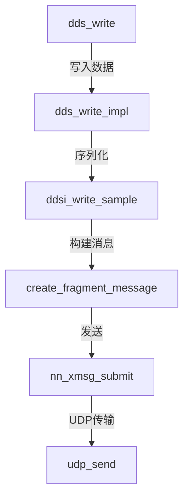

# cyclonedds-trace - 代码追踪

追踪 CycloneDDS 源码中的函数调用链和数据结构。

## 参数

```
/cyclonedds-trace <target>
```

- `target`：函数名、结构体名或源码文件路径
- 示例：`/cyclonedds-trace dds_write`、`/cyclonedds-trace ddsi_writer`

## 执行步骤

### 1. 定位目标（使用 LSP）

**如果是函数名**：
1. 使用 Read 工具读取包含该函数的源文件
2. 利用 Claude Code 的 LSP 能力定位精确定义
3. 获取函数签名、参数、返回值

**如果是结构体名**：
1. 使用 Read 工具读取结构体定义
2. 分析字段类型和用途
3. 查找使用该结构体的函数

**如果是文件路径**：
1. 直接读取文件内容
2. 分析文件中的关键函数和数据结构

### 2. 追踪调用链（构建 Mermaid 图）

从目标函数出发：
1. 读取函数实现，识别内部调用
2. 递归追踪关键函数（深度 3-5 层）
3. 构建 Mermaid 流程图：



### 3. 识别关键数据结构

在调用链中：
1. 提取所有使用的结构体类型
2. 使用 Read 定位结构体定义
3. 解释关键字段含义和作用

### 4. 关联规范章节

使用 Grep 在 `dds-standards/` 中搜索：
1. 函数对应的规范操作
2. 数据结构对应的规范模型
3. 协议行为对应的规范描述

### 5. 生成 Markdown 文件

创建 `traces/YYYY-MM-DD-[函数名].md`，包含：

**文件结构**：
```markdown
# 代码追踪：[函数名]

## 定义位置
[函数名](file:///绝对路径/file.c#L123) （阅读 L123-L145）

## 调用链


## 关键函数详解

### 函数1
- **位置**：[函数名](file:///path#L100) （阅读 L100-L120）
- **作用**：...
- **关键逻辑**：...

### 函数2
...

## 关键数据结构

### struct dds_writer
- **定义**：[dds_writer](file:///path#L50) （阅读 L50-L80）
- **字段**：
  - `field1`: 类型 - 用途
  - `field2`: 类型 - 用途

## 规范对应
- DDS 规范 2.2.2.4.2.11: write 操作
- RTPS 规范 8.3.7.2: DATA 消息

## 下一步建议
1. 深入 [函数] 了解 [机制]
2. 使用 /cyclonedds-compare [概念] 对照规范
```

**超链接格式**：
- `[函数名](file:///绝对路径#L行号)` - 跳转到定义行
- 在链接后标注：`（阅读 L起始-L结束）`

### 6. 输出摘要并更新知识图谱

在聊天中输出：
```
🔍 代码追踪完成：[函数名]

📄 已生成追踪文档：
   traces/YYYY-MM-DD-[函数名].md

📊 调用链深度：X 层
📦 涉及数据结构：X 个
📖 关联规范章节：X 个

💡 打开文档查看详细分析和源码超链接
```

将追踪结果添加到 `.claude/memory/knowledge-map.md` 的"已追踪"部分。

## 关键文件

- `cyclonedds/src/core/ddsc/src/`: DCPS 层实现
- `cyclonedds/src/core/ddsi/src/`: DDSI/RTPS 层实现
- `cyclonedds/src/core/ddsc/include/`: 公共 API 头文件
- `dds-standards/`: 规范文档
- `.claude/memory/knowledge-map.md`: 知识图谱
- `traces/`: 追踪文档输出目录
