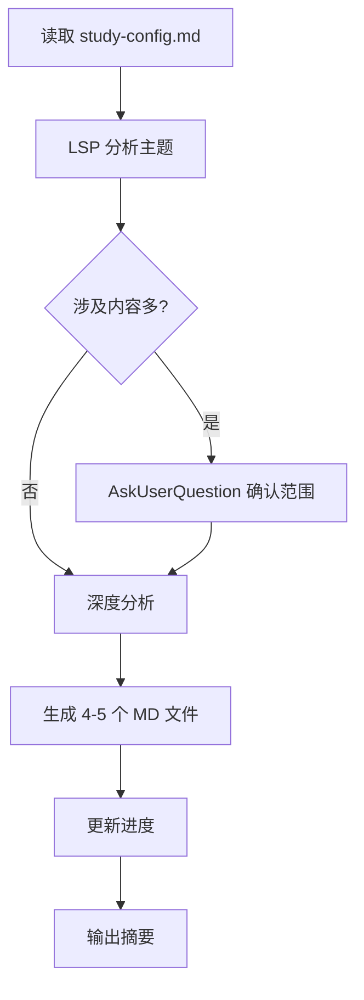
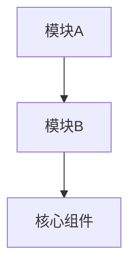
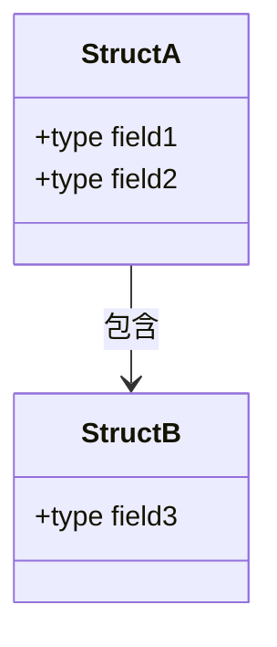
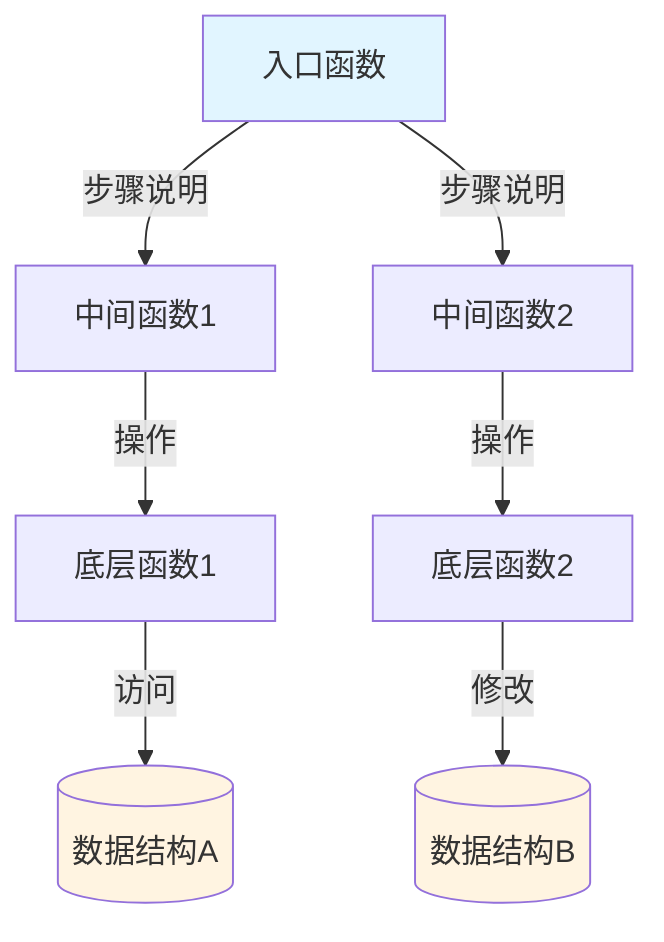
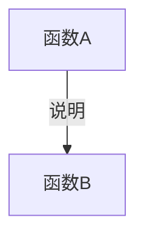
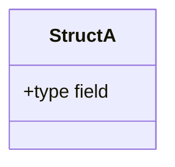

# study-plan Skill 设计文档

## 1. 概述

### 1.1 目标

创建一个新的 `study-plan` skill，用于生成代码主题的完整学习计划文档。给定一个主题（如"rbuf 内存模型"），自动分析相关代码，生成包含前置知识、数据结构、函数详解、调用链图的完整学习文档集。

### 1.2 核心特性

- **单命令执行**：`/study-plan <topic>` 一气呵成
- **LSP 代码智能**：利用 LSP 进行精确的代码导航和分析
- **交互式范围确认**：当涉及内容较多时，通过选择题让用户确认分析范围
- **结构化输出**：生成多个 MD 文件，组织为目录结构
- **代码超链接**：所有代码引用带 `file://` 超链接和阅读范围标注
- **Mermaid 可视化**：调用链、数据结构关系、数据流向均用图表展示

### 1.3 与现有 skill 的关系

- **独立新建**：不修改现有的 6 个 study-* skill
- **互补使用**：
  - `study-plan`：生成完整学习计划文档
  - `study-trace`：单个函数的快速追踪
  - `study-session`：结束会话时仍可使用

---

## 2. 命令接口

### 2.1 命令格式

```
/study-plan <topic>
```

### 2.2 参数说明

- `topic`：主题名称，支持中文和空格
  - 示例：`/study-plan rbuf 内存模型`
  - 示例：`/study-plan dds_write 写路径`
  - 示例：`/study-plan SPDP 发现协议`

### 2.3 参数处理

自动合并所有参数为完整主题名，无需引号。

---

## 3. 输出结构

### 3.1 目录结构

```
study/plans/<主题名称>/
  ├── 00-overview.md           # 总览：前置知识、架构、学习路径
  ├── 01-数据结构.md           # 结构体详解 + 关系图
  ├── 02-核心函数.md           # 函数详解 + 调用关系
  ├── 03-调用链.md             # 完整调用链图 + 数据流向
  └── 04-规范对应.md           # 规范对照（仅当有规范路径时）
```

### 3.2 文件命名规则

主题名称处理：
- 保留中文、英文、数字、连字符
- 空格替换为连字符
- 示例：`rbuf 内存模型` → `rbuf-内存模型`

---

## 4. 执行流程

### 4.1 流程图



### 4.2 详细步骤

#### 步骤 1：读取配置

- 使用 `Read` 读取 `.claude/memory/study-config.md`
- 获取源码路径、规范路径、模块映射
- 如果配置不存在，提示先运行 `/study-start` 初始化

#### 步骤 2：分析主题（LSP 优先）

**2.1 定位代码元素**
- 利用 LSP Go to Definition 定位函数、结构体、类型
- 降级策略：LSP 无法覆盖时使用 Grep

**2.2 构建初步清单**
- 收集相关文件、结构体、函数列表

**2.3 扩展分析**
- 利用 LSP Call Hierarchy 获取调用链
- 利用 LSP Find References 获取引用位置
- 识别函数使用的数据结构

#### 步骤 3：范围确认（条件触发）

**触发条件**：
- 函数数量 > 15 个，或
- 文件数量 > 10 个

**确认方式**：
使用 `AskUserQuestion`，multiSelect 选择题：
- 核心函数组 A（列出代表函数）
- 辅助函数组 B（列出代表函数）
- 数据结构组 C（列出代表结构体）
- 相关模块 D（列出模块名）

根据用户选择过滤分析范围。

#### 步骤 4：深度分析

**4.1 分析数据结构**
- 读取结构体定义
- 分析字段类型和用途
- 利用 LSP Find References 查找使用位置
- 构建结构体关系图数据

**4.2 分析函数**
- 读取函数实现
- 提取签名、参数、返回值
- 分析关键逻辑
- 利用 LSP Call Hierarchy 获取调用链
- 识别访问的数据结构

**4.3 构建调用链**
- 识别入口函数
- 构建多层调用关系（深度 3-5 层）
- 标注数据流向
- 生成 Mermaid 图数据

**4.4 关联规范（可选）**
- 如果有规范路径，使用 Grep 搜索规范文件
- 建立规范与源码的对应关系

#### 步骤 5：生成文档

**5.1 创建目录**
```bash
mkdir -p "study/plans/<主题>"
```

**5.2-5.6 生成各 MD 文件**
- 使用 `Write` 工具创建文件
- 按照 Section 5 的模板填充内容
- 所有代码引用使用 `file:///绝对路径#L行号` 格式
- 标注阅读范围：`（阅读 L起始-L结束）`

#### 步骤 6：更新进度与输出

- 使用 `Edit` 更新 `study-progress.md`
- 使用 `Edit` 更新 `knowledge-map.md`
- 输出统计摘要

---

## 5. 文档模板

### 5.1 00-overview.md

```markdown
# [主题名称] - 学习计划总览

## 前置知识

列出理解本主题需要的前置概念：
- 概念1：简要说明
- 概念2：简要说明

## 架构概览



## 核心问题

本主题要回答的关键问题：
1. [主题] 的作用是什么？
2. 它如何与其他模块交互？
3. 关键设计决策是什么？

## 学习路径

- [数据结构详解](./01-数据结构.md)
- [核心函数详解](./02-核心函数.md)
- [调用链与架构](./03-调用链.md)
- [规范对应](./04-规范对应.md)（如有）

## 涉及文件

| 文件 | 说明 |
|------|------|
| [file.c](file:///path#L1) | 文件作用 |
```

### 5.2 01-数据结构.md

```markdown
# [主题] - 数据结构详解

## 结构体关系图



## 核心结构体

### struct xxx

**定义位置**：[struct xxx](file:///绝对路径/file.h#L123)（阅读 L123-L145）

**作用**：简要说明这个结构体的用途

**字段详解**：

| 字段名 | 类型 | 说明 |
|--------|------|------|
| field1 | type | 字段用途和含义 |
| field2 | type | 字段用途和含义 |

**关键设计**：
- 设计要点1
- 设计要点2
```

### 5.3 02-核心函数.md

```markdown
# [主题] - 核心函数详解

## 函数列表

| 函数名 | 文件 | 作用 |
|--------|------|------|
| [func1](file:///path#L100) | file.c | 简要说明 |

## 详细解析

### func1

**定义位置**：[func1](file:///绝对路径/file.c#L100)（阅读 L100-L150）

**函数签名**：
```c
return_type func1(param1_type param1, param2_type param2);
```

**作用**：函数的核心职责

**参数说明**：
- `param1`：参数含义
- `param2`：参数含义

**返回值**：返回值含义

**关键逻辑**：
1. 步骤1：做什么
2. 步骤2：做什么
3. 步骤3：做什么

**调用的函数**：
- [sub_func1](file:///path#L200)：子函数作用
- [sub_func2](file:///path#L300)：子函数作用

**被调用位置**：
- [caller1](file:///path#L400)：调用场景
- [caller2](file:///path#L500)：调用场景
```

### 5.4 03-调用链.md

```markdown
# [主题] - 调用链与架构

## 完整调用链图



## 数据流向图


## 调用层次详解

### 第 1 层：入口函数

- [func_entry](file:///path#L100)（阅读 L100-L120）
  - 职责：接收外部调用，参数校验
  - 调用：func_process

### 第 2 层：核心处理

- [func_process](file:///path#L200)（阅读 L200-L250）
  - 职责：核心业务逻辑
  - 调用：func_helper1, func_helper2

## 关键路径分析

**正常流程**：
```
入口 → 验证 → 处理 → 存储 → 返回
```

**错误处理**：
```
入口 → 验证失败 → 清理 → 返回错误码
```
```

### 5.5 04-规范对应.md（条件生成）

```markdown
# [主题] - 规范对应

## 规范章节

**相关规范**：[规范文件名]

**章节**：
- 章节 X.Y：[标题] - 定义了 [概念]
- 章节 X.Z：[标题] - 规定了 [行为]

## 规范要求 vs 源码实现

### 数据模型对照

| 规范定义 | 规范字段 | 源码实现 | 源码字段 | 状态 |
|---------|---------|---------|---------|------|
| Entity | guid | struct ddsi_guid | guid | ✓ 完全对应 |
| Entity | qos | struct dds_qos | qos | ✓ 完全对应 |

### 行为对照

| 规范操作 | 规范描述 | 源码函数 | 实现说明 | 状态 |
|---------|---------|---------|---------|------|
| create_entity | 创建实体 | [dds_create_xxx](file:///path#L100) | 完整实现 | ✓ 符合 |

## 源码扩展功能

1. **扩展功能1**：说明
   - 实现位置：[func](file:///path#L300)
   - 用途：为什么需要这个扩展

## 设计决策分析

**为什么源码这样实现**：
- 决策1：规范要求 X，源码采用 Y 方式，原因是...
```

---

## 6. 关键实现要点

### 6.1 LSP 代码智能使用

**优先使用 LSP 功能**：
- Go to Definition：定位函数、结构体、类型定义
- Find References：查找所有引用位置
- Call Hierarchy：构建调用链

**降级策略**：
- 当 LSP 无法覆盖时（如宏定义、注释中的引用），使用 Grep
- Grep 作为补充手段，不作为主要分析工具

### 6.2 超链接格式规范

**格式**：`[符号名](file:///绝对路径#L行号)`

**示例**：
```markdown
[dds_write](file:///Users/user/project/cyclonedds/src/core/ddsc/src/dds_write.c#L123)（阅读 L123-L156）
```

**要点**：
- 使用绝对路径，不使用相对路径
- 行号指向定义的起始行
- 在超链接后标注完整的阅读范围

### 6.3 Mermaid 图表规范

**调用链图**：使用 `graph TD`（自上而下）


**数据流向图**：使用 `flowchart LR`（从左到右）


**结构体关系图**：使用 `classDiagram`


### 6.4 范围确认交互设计

**触发条件**：
- 函数数量 > 15 个
- 文件数量 > 10 个

**问题设计**：
```
检测到以下相关内容，请选择要深入分析的部分：

□ 核心函数组 A：func1, func2, func3...
□ 辅助函数组 B：helper1, helper2...
□ 数据结构组 C：struct1, struct2...
□ 相关模块 D：module_name
```

**multiSelect: true**，允许多选。

---

## 7. 与现有 Skill 的集成

### 7.1 配置文件依赖

**依赖**：`.claude/memory/study-config.md`

**读取内容**：
- 源码路径
- 规范路径（可选）
- 源码模块映射
- 规范-源码映射

### 7.2 进度文件更新

**更新文件**：
- `.claude/memory/study-progress.md`：标记主题为「进行中」或「已完成」
- `.claude/memory/knowledge-map.md`：添加已追踪函数和已学习概念

### 7.3 与其他 Skill 的协作

- `study-start`：初始化配置后可使用 `study-plan`
- `study-trace`：仍可独立使用，快速追踪单个函数
- `study-session`：结束学习会话时，可汇总 `study-plan` 生成的文档

---

## 8. 输出示例

### 8.1 命令执行

```
用户输入：/study-plan rbuf 内存模型

输出：
📚 学习计划生成完成：rbuf 内存模型

📊 分析统计：
  · 涉及文件：5 个
  · 数据结构：3 个
  · 核心函数：8 个
  · 调用链深度：4 层
  · 规范章节：2 个

📁 已生成文档：
  study/plans/rbuf-内存模型/
    ├── 00-overview.md
    ├── 01-数据结构.md
    ├── 02-核心函数.md
    ├── 03-调用链.md
    └── 04-规范对应.md

💡 打开 00-overview.md 开始学习
   使用 /study-session 结束会话并保存笔记
```

---

## 9. 实现注意事项

### 9.1 性能考虑

- LSP 操作可能较慢，需要合理控制查询次数
- 对于大型函数（>500 行），只分析关键逻辑，不逐行解释
- Mermaid 图节点数量控制在 20 个以内，避免过于复杂

### 9.2 错误处理

- LSP 查询失败时，降级使用 Grep
- 文件读取失败时，跳过该文件并记录
- 规范文件不存在时，跳过 04-规范对应.md 生成

### 9.3 代码质量

- 所有超链接必须使用绝对路径
- 所有代码引用必须标注阅读范围
- Mermaid 图必须语法正确，可渲染

---

## 10. 后续扩展

### 10.1 可能的增强

- 支持增量更新：已有学习计划时，只更新变化部分
- 支持导出为 PDF：将 MD 文档转换为 PDF
- 支持学习笔记：在文档中添加用户笔记区域

### 10.2 与其他工具集成

- 与 IDE 集成：点击超链接直接跳转到代码
- 与 Git 集成：追踪代码变更对学习计划的影响

---

## 11. 总结

`study-plan` skill 提供了一个完整的代码主题学习计划生成方案，通过 LSP 代码智能、交互式范围确认、结构化文档输出，帮助用户系统性地学习复杂代码库。

**核心优势**：
- 单命令执行，自动化程度高
- LSP 精确分析，超链接准确
- Mermaid 可视化，易于理解
- 结构化输出，便于查阅

**设计日期**：2026-03-10
**版本**：v1.0
