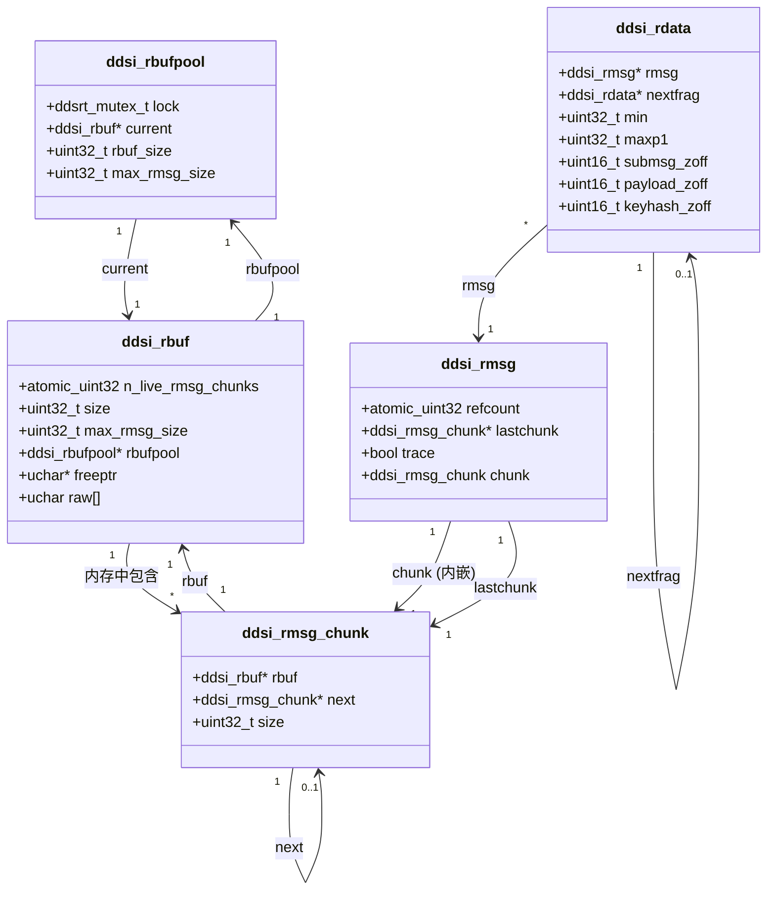
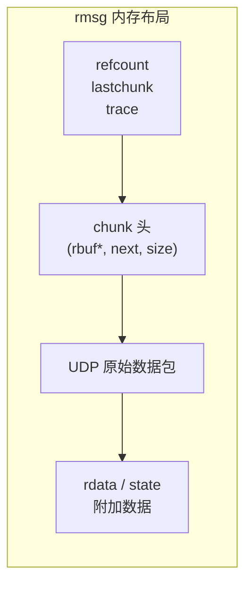

# rbuf 内存模型 — 数据结构

## 结构体关系图



> **图 1** rbuf 内存模型核心结构体关系图

---

## 1. `struct ddsi_rbufpool`

> 📍 源码：[ddsi_radmin.c:264-288](../../../cyclonedds/src/core/ddsi/src/ddsi_radmin.c#L264)

接收缓冲池，每个接收线程拥有一个。负责管理一组 `ddsi_rbuf` 缓冲区，当前只维护一个活跃 rbuf（`current`），当 rbuf 空间不足时分配新的。

### 源码定义

```c
struct ddsi_rbufpool {
  /* An rbuf pool is owned by a receive thread, and that thread is the
     only allocating rmsgs from the rbufs in the pool. Any thread may
     be releasing buffers to the pool as they become empty.

     Currently, we only have maintain a current rbuf, which gets
     replaced when allocating a new one from it fails. Any rbufs that
     are released are freed completely if different from the current
     one.

     Could trivially be done lockless, except that it requires
     compare-and-swap, and we don't have that. But it hardly ever
     happens anyway. */
  ddsrt_mutex_t lock;
  struct ddsi_rbuf *current;
  uint32_t rbuf_size;
  uint32_t max_rmsg_size;
  const struct ddsrt_log_cfg *logcfg;
  bool trace;
#ifndef NDEBUG
  /* Thread that owns this pool, so we can check that no other thread
     is calling functions only the owner may use. */
  ddsrt_thread_t owner_tid;
#endif
};
```

### 字段详解

> **图 2** `ddsi_rbufpool` 字段详解

| 字段 | 类型 | 说明 |
|------|------|------|
| `lock` | `ddsrt_mutex_t` | 保护 `current` 指针的互斥锁，仅在 rbuf 替换时使用 |
| `current` | [ddsi_rbuf](./01-数据结构.md#2-struct-ddsi_rbuf)* | 当前活跃的 rbuf，所有新分配从此 rbuf 中进行 |
| `rbuf_size` | `uint32_t` | 每个 rbuf 的总大小（默认约 1MB） |
| `max_rmsg_size` | `uint32_t` | 单条 rmsg 的最大载荷大小（默认约 128KB） |
| `logcfg` | `const struct ddsrt_log_cfg*` | 日志配置指针 |
| `trace` | `bool` | 是否启用 `DDS_LC_RADMIN` 级别日志 |
| `owner_tid` | `ddsrt_thread_t` | （仅 Debug）拥有者线程 ID，用于断言检查 |

### 关键设计说明

- **单线程拥有**：只有拥有者线程（接收线程）可以从池中分配内存和增加引用计数；任意线程可以释放/减少引用计数
- **锁的用途极窄**：锁仅保护 `current` 指针在 rbuf 替换时的一致性，正常分配路径无锁
- `rbuf_size` 会被自动提升到不低于 `max_rmsg_size_w_hdr(max_rmsg_size)` 的值

---

## 2. `struct ddsi_rbuf`

> 📍 源码：[ddsi_radmin.c:403-425](../../../cyclonedds/src/core/ddsi/src/ddsi_radmin.c#L403)

大块接收缓冲区，包含一个柔性数组 `raw[]` 作为实际存储空间。多个 `ddsi_rmsg` 顺序分配在 `raw[]` 中。

### 源码定义

```c
struct ddsi_rbuf {
  ddsrt_atomic_uint32_t n_live_rmsg_chunks;
  uint32_t size;
  uint32_t max_rmsg_size;
  struct ddsi_rbufpool *rbufpool;
  bool trace;

  /* Allocating sequentially, releasing in random order, not bothering
     to reuse memory as soon as it becomes available again. I think
     this will have to change eventually, but this is the easiest
     approach.  Changes would be confined rmsg_new and rmsg_free. */
  unsigned char *freeptr;

  /* to ensure reasonable alignment of raw[] */
  union {
    int64_t l;
    double d;
    void *p;
  } u;

  /* raw data array, ddsi_rbuf::size bytes long in reality */
  unsigned char raw[];
};
```

### 字段详解

> **图 3** `ddsi_rbuf` 字段详解

| 字段 | 类型 | 说明 |
|------|------|------|
| `n_live_rmsg_chunks` | `ddsrt_atomic_uint32_t` | 引用此 rbuf 的存活 rmsg_chunk 数量（含自身引用，初始为 1） |
| `size` | `uint32_t` | `raw[]` 数组的实际大小（等于 `rbufpool->rbuf_size`） |
| `max_rmsg_size` | `uint32_t` | 单条 rmsg 最大载荷大小（从 pool 复制） |
| `rbufpool` | [ddsi_rbufpool](./01-数据结构.md#1-struct-ddsi_rbufpool)* | 所属缓冲池的反向指针 |
| `trace` | `bool` | 是否启用日志 |
| `freeptr` | `unsigned char*` | 空闲指针，指向 `raw[]` 中下一个可分配位置 |
| `u` | `union` | 对齐填充，确保 `raw[]` 起始地址满足最严格对齐要求 |
| `raw[]` | `unsigned char[]` | C99 柔性数组成员，实际内存存储区 |

### 关键设计说明

- **顺序分配**：`freeptr` 只向前推进，不回退复用已释放空间（代码注释称未来可能改进）
- **引用计数**：`n_live_rmsg_chunks` 跟踪有多少 chunk 还在使用此 rbuf。初始值为 1（代表 pool 对它的引用）；每创建一个 chunk 加 1，每释放一个 chunk 减 1；归零时释放 rbuf 本身
- **内存布局**：`sizeof(ddsi_rbuf) + rbuf_size` 一次性 malloc，`raw[]` 紧跟结构体之后

---

## 3. `struct ddsi_rmsg`

> 📍 源码：[ddsi_radmin.h:53-92](../../../cyclonedds/src/core/ddsi/include/dds/ddsi/ddsi_radmin.h#L53)

一条接收消息。布局为：rmsg 头 + 原始 UDP 数据包 + 解码附加数据（rdata、receiver_state 等）。一个 rbuf 可包含多条 rmsg。

### 源码定义

```c
struct ddsi_rmsg {
  /* Reference count: all references to rdatas of this message are
     counted. The rdatas themselves do not have a reference count.

     The refcount is biased by RMSG_REFCOUNT_UNCOMMITED_BIAS while
     still being inserted to allow verifying it is still uncommitted
     when allocating memory, increasing refcounts, &c.

     Each rdata adds RMS_REFCOUNT_RDATA_BIAS when it leaves
     defragmentation until it has been rejected by reordering or has
     been scheduled for delivery.  This allows delaying the
     decrementing of refcounts until after a sample has been added to
     all radmins even though be delivery of it may take place in
     concurrently. */
  ddsrt_atomic_uint32_t refcount;

  /* Worst-case memory requirement is gigantic (64kB UDP packet, only
     1-byte final fragments, each of one a new interval, or maybe 1
     byte messages, destined for many readers and in each case
     introducing a new interval, with receiver state changes in
     between, &c.), so we can either:

     - allocate a _lot_ and cover the worst case

     - allocate enough for all "reasonable" cases, discarding data when that limit is hit

     - dynamically add chunks of memory, and even entire receive buffers.

     The latter seems the best approach, especially because it also
     covers the second one.  We treat the other chunks specially,
     which is not strictly required but also not entirely
     unreasonable, considering that the first chunk has the refcount &
     the real packet. */
  struct ddsi_rmsg_chunk *lastchunk;

  /* whether to log */
  bool trace;

  struct ddsi_rmsg_chunk chunk;
};
DDSRT_STATIC_ASSERT (sizeof (struct ddsi_rmsg) == offsetof (struct ddsi_rmsg, chunk) + sizeof (struct ddsi_rmsg_chunk));
```

### 字段详解

> **图 4** `ddsi_rmsg` 字段详解

| 字段 | 类型 | 说明 |
|------|------|------|
| `refcount` | `ddsrt_atomic_uint32_t` | 原子引用计数，跟踪所有 rdata 的引用。含两级偏置 |
| `lastchunk` | [ddsi_rmsg_chunk](./01-数据结构.md#4-struct-ddsi_rmsg_chunk)* | 指向当前链的最后一个 chunk，用于追加分配 |
| `trace` | `bool` | 是否启用日志 |
| `chunk` | [ddsi_rmsg_chunk](./01-数据结构.md#4-struct-ddsi_rmsg_chunk) | 内嵌的第一个 chunk（不是指针，是值） |

### 引用计数机制

引用计数使用两级偏置（bias）设计：

| 常量 | 值 | 用途 |
|------|-----|------|
| `RMSG_REFCOUNT_UNCOMMITTED_BIAS` | 2^31 | 标记 rmsg 尚未提交，同步处理阶段始终存在 |
| `RMSG_REFCOUNT_RDATA_BIAS` | 2^20 | 每个 rdata 离开 defrag 时加此偏置，延迟真实引用计数结算 |

**生命周期**：
1. `ddsi_rmsg_new`：refcount = `UNCOMMITTED_BIAS`
2. 处理 submessage 时：每个 rdata 加 `RDATA_BIAS`
3. 所有 reorder admin 处理完后：减去 `RDATA_BIAS`，加上实际引用数
4. `ddsi_rmsg_commit`：减去 `UNCOMMITTED_BIAS`；若归零则立即释放

### 内存布局



> **图 5** 一条 rmsg 在 rbuf 中的内存布局——头部信息、内嵌 chunk 头、UDP 原始数据和解码附加数据连续存放

---

## 4. `struct ddsi_rmsg_chunk`

> 📍 源码：[ddsi_radmin.h:34-51](../../../cyclonedds/src/core/ddsi/include/dds/ddsi/ddsi_radmin.h#L34)

rmsg 的内存块单元。第一个 chunk 内嵌在 `ddsi_rmsg` 中，后续 chunk 通过链表连接，实现动态扩展。

### 源码定义

```c
struct ddsi_rmsg_chunk {
  struct ddsi_rbuf *rbuf;
  struct ddsi_rmsg_chunk *next;

  /* Size is 0 after initial allocation, must be set with
     ddsi_rmsg_setsize after receiving a packet from the kernel and
     before processing it.  */
  union {
    uint32_t size;

    /* to ensure reasonable alignment of payload */
    int64_t l;
    double d;
    void *p;
  } u;

  /* unsigned char payload[] -- disallowed by C99 because of nesting */
};
```

### 字段详解

> **图 6** `ddsi_rmsg_chunk` 字段详解

| 字段 | 类型 | 说明 |
|------|------|------|
| `rbuf` | [ddsi_rbuf](./01-数据结构.md#2-struct-ddsi_rbuf)* | 此 chunk 分配自的 rbuf |
| `next` | [ddsi_rmsg_chunk](./01-数据结构.md#4-struct-ddsi_rmsg_chunk)* | 链表中的下一个 chunk（NULL 表示末尾） |
| `u.size` | `uint32_t` | 此 chunk 中已使用的载荷大小（8 字节对齐） |
| `u` | `union` | 用 union 确保载荷区域至少 8 字节对齐 |

### 关键设计说明

- **内嵌 vs 链式**：`ddsi_rmsg.chunk` 是内嵌的第一个 chunk，包含 UDP 原始数据。后续 chunk 在当前 chunk 的 `max_rmsg_size` 空间用完后，通过 `ddsi_rmsg_alloc` 动态分配
- `size` 初始为 0，由 `ddsi_rmsg_setsize` 设置为实际接收的数据包大小（8 字节对齐后的值）
- 不同 chunk 可能来自不同的 rbuf（当前 rbuf 写满时会分配新 rbuf）

---

## 5. `struct ddsi_rdata`

> 📍 源码：[ddsi_radmin.h:98-108](../../../cyclonedds/src/core/ddsi/include/dds/ddsi/ddsi_radmin.h#L98)

描述一个 Data 或 DataFrag 子消息。不含自身引用计数，而是通过所属 `ddsi_rmsg` 的 `refcount` 统一管理。

### 源码定义

```c
struct ddsi_rdata {
  struct ddsi_rmsg *rmsg;         /* received (and refcounted) in rmsg */
  struct ddsi_rdata *nextfrag;    /* fragment chain */
  uint32_t min, maxp1;          /* fragment as byte offsets */
  uint16_t submsg_zoff;         /* offset to submessage from packet start, or 0 */
  uint16_t payload_zoff;        /* offset to payload from packet start */
  uint16_t keyhash_zoff;        /* offset to keyhash from packet start, or 0 */
#ifndef NDEBUG
  ddsrt_atomic_uint32_t refcount_bias_added;
#endif
};
```

### 字段详解

> **图 7** `ddsi_rdata` 字段详解

| 字段 | 类型 | 说明 |
|------|------|------|
| `rmsg` | [ddsi_rmsg](./01-数据结构.md#3-struct-ddsi_rmsg)* | 所属 rmsg 指针，引用计数在 rmsg 级别 |
| `nextfrag` | [ddsi_rdata](./01-数据结构.md#5-struct-ddsi_rdata)* | fragment 链的下一个节点 |
| `min` | `uint32_t` | 此 fragment 在原始样本中的起始字节偏移 |
| `maxp1` | `uint32_t` | 此 fragment 的结束字节偏移（不含，即 [min, maxp1)） |
| `submsg_zoff` | `uint16_t` | 子消息头相对数据包起始的偏移（0 表示无） |
| `payload_zoff` | `uint16_t` | 载荷数据相对数据包起始的偏移 |
| `keyhash_zoff` | `uint16_t` | keyhash 相对数据包起始的偏移（0 表示无） |
| `refcount_bias_added` | `ddsrt_atomic_uint32_t` | （仅 Debug）跟踪 bias 是否已添加，防止重复 |

### 关键设计说明

- **零拷贝**：rdata 不拷贝数据，而是通过偏移量（`submsg_zoff`、`payload_zoff`）引用 rmsg 中的原始数据
- **通过宏访问**：`DDSI_RMSG_PAYLOADOFF(rmsg, DDSI_RDATA_PAYLOAD_OFF(rdata))` 获取实际数据指针
- `min`/`maxp1` 描述此 fragment 覆盖的字节范围，用于 defragmentation 的区间树索引
- Gap（间隙通知）也用 rdata 表示，此时 `min == maxp1`（长度为 0）
