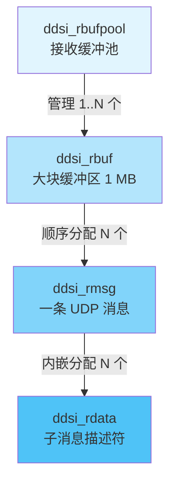
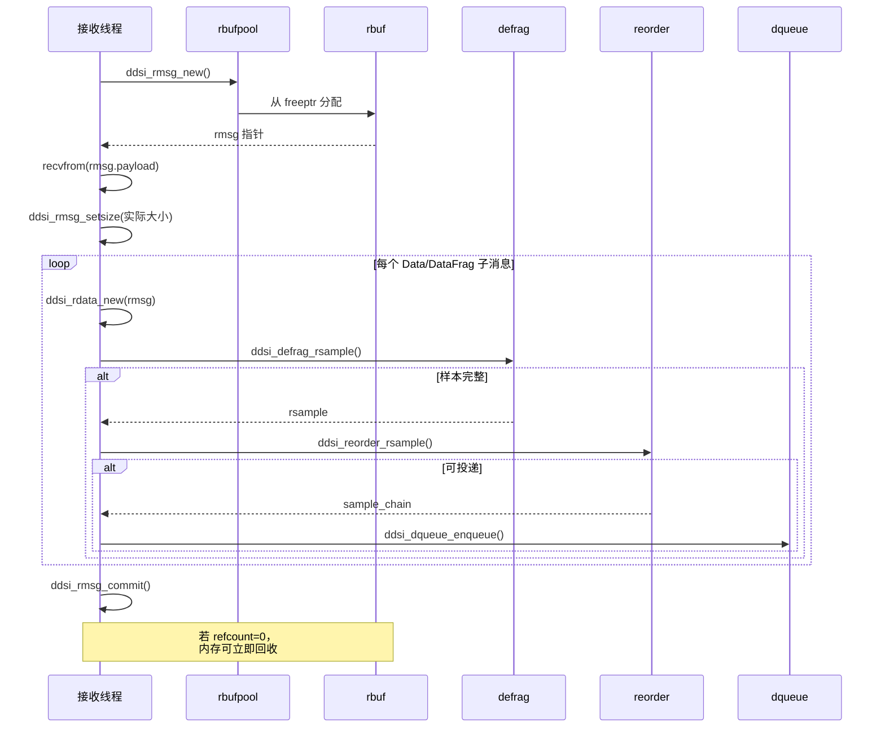
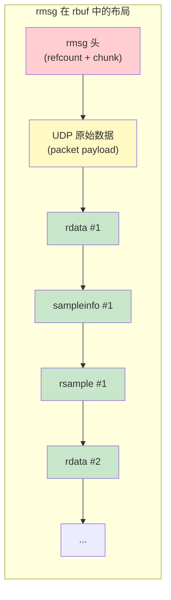
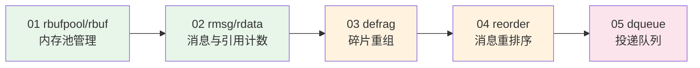

# rbuf 内存模型总览

## 1. 背景与目标

Cyclone DDS 的接收路径（receive path）需要在高吞吐量场景下完成以下任务：

1. 从 UDP 套接字接收原始数据包
2. 解析 RTPS 协议子消息
3. 将分片数据重组为完整样本
4. 将乱序到达的样本重新排列
5. 将有序样本投递给上层 DDS reader

为了在上述流程中**最小化动态内存分配**并实现**零拷贝**语义，Cyclone DDS 设计了一套精巧的四层内存管理体系，即 **rbuf 内存模型**。其核心思想是：

- 使用大块预分配缓冲区（rbuf）进行顺序分配
- 所有解码信息、索引结构都**紧邻原始数据包**存放在同一块内存中
- 通过引用计数管理整个消息的生命周期，而非单独管理每个子结构
- 利用"单一所有者线程"约束简化并发控制

## 2. 核心概念速览

| 概念 | 含义 |
|------|------|
| [ddsi_rbufpool](./01-rbufpool-rbuf.md#struct-ddsi_rbufpool) | 接收缓冲池，每个接收线程拥有一个 |
| [ddsi_rbuf](./01-rbufpool-rbuf.md#struct-ddsi_rbuf) | 大块连续内存缓冲区（默认 1 MB），用于顺序分配 |
| [ddsi_rmsg](./02-rmsg-rdata.md#struct-ddsi_rmsg) | 一条接收消息，包含引用计数和内嵌 chunk |
| [ddsi_rmsg_chunk](./02-rmsg-rdata.md#struct-ddsi_rmsg_chunk) | rmsg 的内存块，可动态链接多个 chunk |
| [ddsi_rdata](./02-rmsg-rdata.md#struct-ddsi_rdata) | 一个 Data/DataFrag 子消息的描述符 |
| [ddsi_defrag](./03-defrag.md#struct-ddsi_defrag) | 碎片重组器，基于区间树跟踪已收到的片段 |
| [ddsi_reorder](./04-reorder.md#struct-ddsi_reorder) | 重排序器，将乱序样本按序列号排列 |
| [ddsi_dqueue](./05-dqueue.md#struct-ddsi_dqueue) | 投递队列，将有序样本链从接收线程传递给处理线程 |

## 3. 四层存储层次

rbuf 内存模型的存储层次如下：



**层次关系说明：**

- **rbufpool** 是最顶层容器，每个接收线程独占一个。它维护一个"当前 rbuf"指针
- **rbuf** 是一块大内存（默认 1 MB），通过 `freeptr` 做顺序分配（bump allocator）
- **rmsg** 是 rbuf 中分配的一条消息，包含原始 UDP 数据包和所有派生的管理数据
- **rdata** 是 rmsg 内部分配的子消息描述符，指向原始数据的特定区域

## 4. 典型接收场景剖析

### 4.1 正常接收流程

以接收一个 UDP 数据包为例，追踪完整的处理路径：



这段流程对应源码中的伪代码（见 [ddsi_radmin.c:169-218](../../source/cyclonedds/src/core/ddsi/src/ddsi_radmin.c#L169)）：

```c
// 接收线程主循环
while (running) {
    rmsg = ddsi_rmsg_new(rbpool);          // 从缓冲池分配
    sz = recvfrom(RMSG_PAYLOAD(rmsg), 64K); // 接收 UDP 数据包
    ddsi_rmsg_setsize(rmsg, sz);           // 设置实际大小

    // 处理消息中的每个子消息
    for (rdata in each Data/DataFrag) {
        sample = ddsi_defrag_rsample(pwr->defrag, rdata, &sampleinfo);
        if (sample) {
            reorder_result = ddsi_reorder_rsample(&sc, pwr->reorder, sample, &adjust);
            if (reorder_result == DELIVER)
                ddsi_dqueue_enqueue(dq, &sc, reorder_result);
            ddsi_fragchain_adjust_refcount(fragchain, adjust);
        }
    }

    ddsi_rmsg_commit(rmsg);  // 提交或丢弃消息
}
```

### 4.2 内存布局示意

一条 rmsg 在 rbuf 中的内存布局（所有数据紧密相邻）：



关键要点：**所有管理结构都分配在同一个 rmsg 内部**，通过 [ddsi_rmsg_alloc](./02-rmsg-rdata.md#struct-ddsi_rmsg) 从当前 chunk 的末尾顺序分配。这意味着当 rmsg 的引用计数归零时，所有相关数据可以一次性释放。

## 5. 系统初始化

rbufpool 在 DDSI 初始化时创建，每个接收线程一个。默认配置参数：

| 参数 | 默认值 | 含义 |
|------|--------|------|
| `rbuf_size` | 1,048,576 (1 MB) | 单个 rbuf 的大小 |
| `rmsg_chunk_size` | 131,072 (128 KB) | 单条消息的最大 payload 大小 |

初始化代码位于 [ddsi_init.c:918](../../source/cyclonedds/src/core/ddsi/src/ddsi_init.c#L918)：

```c
gv->recv_threads[i].arg.rbpool =
    ddsi_rbufpool_new(&gv->logconfig, gv->config.rbuf_size,
                      gv->config.rmsg_chunk_size);
```

接收线程在启动时通过 [ddsi_rbufpool_setowner](./01-rbufpool-rbuf.md#struct-ddsi_rbufpool) 设置自身为缓冲池的所有者。

## 6. 设计决策亮点

1. **顺序分配器（Bump Allocator）**：rbuf 使用简单的 `freeptr` 递增分配，分配开销为 $O(1)$，无碎片化问题

2. **集中引用计数**：不为每个 rdata 单独计数，而是在 rmsg 级别统一计数。这大幅减少了原子操作的次数

3. **偏置引用计数（Biased Refcount）**：
   - 未提交时加 $2^{31}$ 偏置，用于检测非法操作
   - 每个 rdata 进入 defrag 时加 $2^{20}$ 偏置，延迟到所有 reorder admin 处理完后再统一调整

4. **单所有者约束**：只有拥有 rbufpool 的接收线程可以分配内存和增加引用计数，其他线程只能减少引用计数并释放。这消除了分配路径上的锁竞争

5. **动态 chunk 链接**：当一条消息需要的管理数据超过单个 chunk 容量时，可以动态链接新的 chunk，避免预设固定上限

## 7. 学习路线图

建议按以下顺序学习各章节：



| 章节 | 内容 | 关键问题 |
|------|------|----------|
| [01-rbufpool-rbuf](./01-rbufpool-rbuf.md) | 内存池与缓冲区管理 | rbuf 如何分配和回收？ |
| [02-rmsg-rdata](./02-rmsg-rdata.md) | 消息结构与引用计数 | 引用计数偏置机制如何工作？ |
| [03-defrag](./03-defrag.md) | 碎片重组 | 区间树如何高效合并片段？ |
| [04-reorder](./04-reorder.md) | 消息重排序 | 三种 reorder 模式有何区别？ |
| [05-dqueue](./05-dqueue.md) | 投递队列 | bubble 机制如何实现跨线程控制？ |

📝 **本章小结**
1. rbuf 内存模型由 rbufpool → rbuf → rmsg → rdata 四层构成
2. 采用顺序分配 + 集中引用计数，实现高效零拷贝接收
3. 单所有者约束消除了分配路径的锁竞争
4. 数据从接收到投递经过 defrag → reorder → dqueue 三级流水线
5. 偏置引用计数是本模块最精巧的设计之一

🤔 **思考题**
1. 为什么 rbuf 选择顺序分配（bump allocator）而不是空闲链表？在什么场景下这种选择可能不是最优的？
2. 如果一个 UDP 包中包含多个 Data 子消息，它们的 rdata 如何共享同一个 rmsg 的引用计数？当部分 rdata 被投递、部分仍在 reorder 中时，内存何时释放？
3. 为什么偏置引用计数分为 $2^{31}$（未提交偏置）和 $2^{20}$（rdata 偏置）两级？如果合并为一级会有什么问题？
