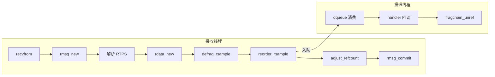
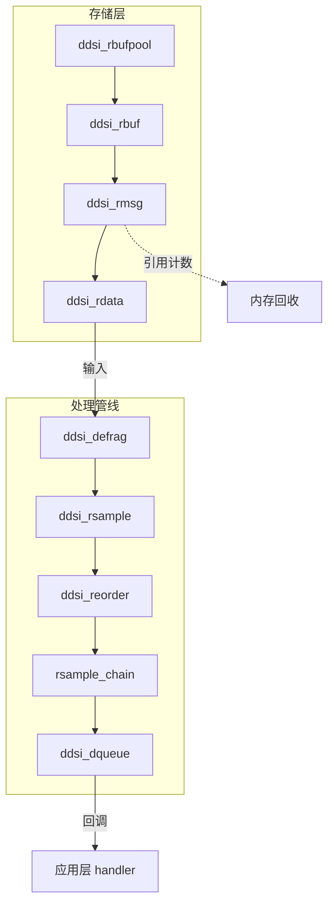
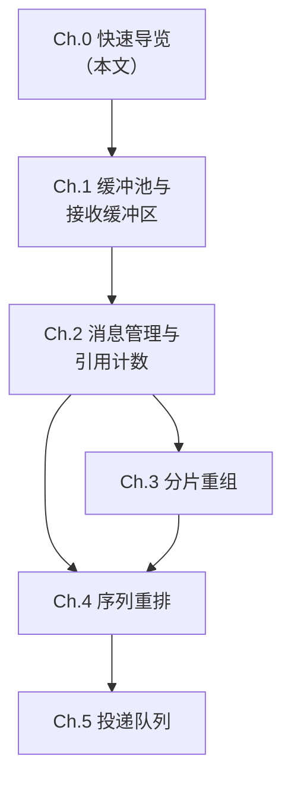

# 快速导览：rbuf 接收缓冲区内存模型

## 1. 项目简介

Cyclone DDS 的 **接收路径**（receive path）需要在高吞吐量、低延迟条件下完成以下工作：从 UDP socket 收包、解码 RTPS 协议、将分片重组为完整样本、按序列号排序、最终投递给上层读者。这一切都依赖于一套精心设计的 **接收缓冲区内存模型**——即本系列所研究的 `radmin`（Receive Administration）子系统。

该子系统的核心设计目标：

- **零拷贝**：接收到的 UDP 数据包与所有解码/索引信息存储在同一块连续内存中，避免额外的 `memcpy`
- **单线程分配、多线程释放**：每个接收线程独占自己的缓冲池进行分配，任意线程可通过原子引用计数释放
- **自适应内存管理**：顺序分配策略最小化碎片，引用计数归零后自动回收整块缓冲区
- **流水线处理**：分片重组（defrag）、序列重排（reorder）、异步投递（dqueue）形成三级管线

> 📍 源码：[ddsi_radmin.c:40-260](../../src/cyclonedds/src/core/ddsi/src/ddsi_radmin.c#L40)（OVERVIEW 注释，包含完整设计理念）

## 2. 核心概念速览

### 2.1 四层存储体系

rbuf 内存模型采用四层层级结构，从粗粒度到细粒度依次为：

> **图 1** 四层存储体系——从缓冲池到子消息数据

| 层级 | 结构体 | 职责 | 生命周期管理 |
|:--|:--|:--|:--|
| L1 缓冲池 | `ddsi_rbufpool` | 管理一组 rbuf，每个接收线程拥有一个池 | 线程启动时创建，线程退出时销毁 |
| L2 接收缓冲区 | `ddsi_rbuf` | 大块连续内存（默认 1MB），容纳多个 rmsg | 原子引用计数，归零时 free |
| L3 消息 | `ddsi_rmsg` | 对应一个 UDP 包及其解码数据 | 双偏置引用计数（$2^{31}$ + $N \times 2^{20}$） |
| L4 子消息数据 | `ddsi_rdata` | 对应一个 Data/DataFrag 子消息 | 不独立计数，贡献到所属 rmsg |

### 2.2 三级处理管线

接收到的数据经过三级处理后到达应用层：

| 管线阶段 | 结构体 | 输入 | 输出 | 核心算法 |
|:--|:--|:--|:--|:--|
| 分片重组 | `ddsi_defrag` | `ddsi_rdata`（单个分片） | `ddsi_rsample`（完整样本） | AVL 树区间合并 |
| 序列重排 | `ddsi_reorder` | `ddsi_rsample`（乱序样本） | `ddsi_rsample_chain`（有序链） | 序列号区间树 |
| 异步投递 | `ddsi_dqueue` | `ddsi_rsample_chain` | 回调给上层 handler | 生产者-消费者队列 |

### 2.3 关键设计理念

**双偏置引用计数**：rmsg 的引用计数使用两级偏置（bias）来区分处理阶段：

- **未提交偏置**（$2^{31}$）：消息在同步处理期间，refcount 包含此偏置，用于检测非法操作
- **rdata 偏置**（$2^{20}$）：每个 rdata 被 defrag 接受后加上此偏置，延迟实际引用计数的更新，避免在多个 reorder admin 之间反复调整

> 📍 源码：[ddsi_radmin.c:152-158](../../src/cyclonedds/src/core/ddsi/src/ddsi_radmin.c#L152)（偏置设计说明）

**union 双态复用**：`ddsi_rsample` 使用 union 在 defrag 和 reorder 两个阶段复用同一块内存，通过 `rsample_convert_defrag_to_reorder` 完成状态切换。

> 📍 源码：[ddsi_radmin.c:836-852](../../src/cyclonedds/src/core/ddsi/src/ddsi_radmin.c#L836)（union 定义）

## 3. 典型场景剖析：UDP 包接收到投递

下面以一个完整的 UDP 数据包（包含一个 Data 子消息，无分片）从网卡到达到最终投递给应用层为例，追踪完整的执行路径。

### 3.1 阶段一：接收线程分配缓冲区

接收线程从自己的 `ddsi_rbufpool` 中分配消息空间：

```c
// 伪代码：接收线程主循环（ddsi_radmin.c:171-187 OVERVIEW 注释）
rbpool = ddsi_rbufpool_new(logcfg, 1MB, 128KB);

while (running) {
    rmsg = ddsi_rmsg_new(rbpool);       // 从 rbuf 顺序分配
    actualsize = recvfrom(sock, DDSI_RMSG_PAYLOAD(rmsg), 64KB);
    ddsi_rmsg_setsize(rmsg, actualsize); // 记录实际大小
    process(rmsg);                       // 同步处理
    ddsi_rmsg_commit(rmsg);              // 提交或释放
}
```

**关键细节**：

- `ddsi_rmsg_new` 在当前 rbuf 的 `freeptr` 位置顺序分配，初始 refcount 为 $2^{31}$（未提交偏置）
- 若当前 rbuf 剩余空间不足，自动分配新的 rbuf 替换
- 接收到的 UDP 数据紧跟在 `ddsi_rmsg` 结构体之后（通过 `DDSI_RMSG_PAYLOAD` 宏访问）

> 📍 源码：[ddsi_radmin.c:491-518](../../src/cyclonedds/src/core/ddsi/src/ddsi_radmin.c#L491)（`ddsi_rbuf_alloc` 顺序分配逻辑）

### 3.2 阶段二：解析子消息并创建 rdata

接收线程解析 RTPS 包，为每个 Data/DataFrag 子消息创建 `ddsi_rdata`：

```c
// 伪代码：为子消息创建 rdata
rdata = ddsi_rdata_new(rmsg, start, endp1,
                       submsg_offset, payload_offset,
                       keyhash_offset);
```

`ddsi_rdata` 不拷贝数据，仅记录偏移量指向 rmsg 中的原始数据：

- `min` / `maxp1`：分片字节范围 `[min, maxp1)`
- `submsg_zoff`：子消息头相对包起始的偏移
- `payload_zoff`：载荷数据相对包起始的偏移

> 📍 源码：[ddsi_radmin.h:98-108](../../src/cyclonedds/src/core/ddsi/include/dds/ddsi/ddsi_radmin.h#L98)（`ddsi_rdata` 结构体定义）

### 3.3 阶段三：分片重组（defrag）

rdata 被送入对应 proxy writer 的 defrag 实例：

```c
// 伪代码：分片重组
sample = ddsi_defrag_rsample(pwr->defrag, rdata, &sampleinfo);
```

- **无分片场景**（本例）：defrag 发现 rdata 已覆盖完整样本范围，立即返回完整的 `ddsi_rsample`
- **有分片场景**：defrag 将 rdata 插入 AVL 树索引的区间集合，尝试与相邻区间合并，直到所有分片齐全

当 defrag 决定保留 rdata 时，调用 `ddsi_rmsg_addbias` 为 rmsg 的 refcount 加上 $2^{20}$ 的偏置。

返回完整样本后，调用 `rsample_convert_defrag_to_reorder` 将 `ddsi_rsample` 的 union 从 defrag 态切换为 reorder 态。

> 📍 源码：[ddsi_radmin.c:1324-1445](../../src/cyclonedds/src/core/ddsi/src/ddsi_radmin.c#L1324)（`ddsi_defrag_rsample` 主逻辑）

### 3.4 阶段四：序列重排（reorder）

完整样本送入 reorder 进行序列号排序：

```c
// 伪代码：序列重排
refcount_adjust = 0;
result = ddsi_reorder_rsample(&sc, pwr->reorder,
                              sample, &refcount_adjust);
if (result > 0) {
    // sc 中包含 result 个连续样本，可以投递
}
```

**三种重排模式**：

| 模式 | 行为 | 适用场景 |
|:--|:--|:--|
| `NORMAL` | 严格按序列号排序，有空洞则缓存 | 可靠通信（默认） |
| `MONOTONICALLY_INCREASING` | 只要比上次大就接受 | 单调递增保证 |
| `ALWAYS_DELIVER` | 立即投递，不做排序 | 尽力交付 |

reorder 返回 `DDSI_REORDER_DELIVER`（正数）时，输出参数 `sc` 中包含一条有序的 `ddsi_rsample_chain`，其中的样本数量等于返回值。

> 📍 源码：[ddsi_radmin.c:1895-2220](../../src/cyclonedds/src/core/ddsi/src/ddsi_radmin.c#L1895)（`ddsi_reorder_rsample` 主逻辑）

### 3.5 阶段五：引用计数调整

在遍历所有 reorder admin 之后，统一调整 rdata 的引用计数：

```c
// 伪代码：批量调整引用计数
ddsi_fragchain_adjust_refcount(fragchain, refcount_adjust);
```

这一步将每个 rdata 所属 rmsg 的 refcount 减去 $2^{20}$（移除 rdata 偏置），同时加上实际被 reorder 接受的引用数。批量操作的好处是避免在多个 reorder admin 逐一处理时反复修改原子变量。

> 📍 源码：[ddsi_radmin.c:649-670](../../src/cyclonedds/src/core/ddsi/src/ddsi_radmin.c#L649)（`ddsi_rmsg_rmbias_and_adjust`）

### 3.6 阶段六：异步投递（dqueue）

有序样本链入队到投递队列，由专用线程消费：

```c
// 伪代码：入队投递
ddsi_dqueue_enqueue(dqueue, &sc, result);
```

投递队列（`ddsi_dqueue`）的消费线程从队列中取出样本链，逐个调用 handler 回调函数处理，最后通过 `ddsi_fragchain_unref` 释放 rdata 引用。当 rmsg 的 refcount 降至 0 时，该消息占用的 rbuf 空间即可被回收。

dqueue 还支持三种特殊的 **bubble** 控制信号：

| Bubble 类型 | 用途 |
|:--|:--|
| `DDSI_DQBK_STOP` | 通知消费线程退出 |
| `DDSI_DQBK_CALLBACK` | 在消费线程中执行回调 |
| `DDSI_DQBK_RDGUID` | 切换当前处理的目标 reader |

> 📍 源码：[ddsi_radmin.c:2494-2548](../../src/cyclonedds/src/core/ddsi/src/ddsi_radmin.c#L2494)（dqueue 结构体与 bubble 定义）

### 3.7 阶段七：消息提交与内存回收

接收线程处理完一个 UDP 包的所有子消息后，调用 `ddsi_rmsg_commit`：

```c
ddsi_rmsg_commit(rmsg);
```

commit 操作移除 $2^{31}$ 的未提交偏置。如果此时 refcount 恰好为 0（所有 rdata 已被投递或丢弃），rmsg 所占空间可立即复用——rbuf 的 `freeptr` 无需更新，下一次 `ddsi_rmsg_new` 会覆盖相同位置。

> 📍 源码：[ddsi_radmin.c:603-633](../../src/cyclonedds/src/core/ddsi/src/ddsi_radmin.c#L603)（`ddsi_rmsg_commit` 实现）

### 3.8 完整执行路径总结



> **图 2** UDP 包接收到投递的完整执行路径

## 4. 架构全景图



> **图 3** rbuf 内存模型架构全景——存储层提供零拷贝内存基础，处理管线完成从原始分片到有序样本的转换

### 4.1 源码文件导航

> **图 4** 核心源码文件一览

| 文件 | 职责 | 代码量 |
|:--|:--|:--|
| [ddsi_radmin.h](../../src/cyclonedds/src/core/ddsi/include/dds/ddsi/ddsi_radmin.h#L1) | 公共数据结构（rmsg_chunk, rmsg, rdata） | 135 行 |
| [ddsi__radmin.h](../../src/cyclonedds/src/core/ddsi/src/ddsi__radmin.h#L1) | 内部 API 声明（全部模块的函数原型） | 262 行 |
| [ddsi_radmin.c](../../src/cyclonedds/src/core/ddsi/src/ddsi_radmin.c#L1) | 全部实现（rbufpool/rbuf/rmsg/defrag/reorder/dqueue） | ~2900 行 |
| [ddsi_receive.c](../../src/cyclonedds/src/core/ddsi/src/ddsi_receive.c#L1) | 接收路径（调用 radmin API 的消费者） | — |

## 5. 学习路线图

建议按以下顺序阅读后续章节，遵循 **先整体后局部、先接口后实现** 的原则：



> **图 5** 推荐学习路线——实线箭头表示前置依赖

### 5.1 各章节内容概要

| 章节 | 文件 | 核心内容 | 前置知识 |
|:--|:--|:--|:--|
| Ch.1 | [01-rbufpool-rbuf.md](./01-rbufpool-rbuf.md) | 池化管理、线程所有权、顺序分配策略、rbuf 引用计数 | 本章 |
| Ch.2 | [02-rmsg-rdata.md](./02-rmsg-rdata.md) | rmsg_chunk 链式扩展、双偏置引用计数、commit 语义、rdata 零拷贝 | Ch.1 |
| Ch.3 | [03-defrag.md](./03-defrag.md) | AVL 树索引、区间合并算法、rsample 双态 union、丢弃策略 | Ch.2 |
| Ch.4 | [04-reorder.md](./04-reorder.md) | 序列号区间树、三种模式、gap 处理、refcount 调整协议 | Ch.2, Ch.3 |
| Ch.5 | [05-dqueue.md](./05-dqueue.md) | bubble 机制、背压控制、deaf 模式、线程模型 | Ch.4 |

### 5.2 学习建议

1. **先通读本章**，建立对整体架构和数据流的全局认知
2. **Ch.1-Ch.2 是基础**，理解内存布局和引用计数机制后，后续章节才能理解为什么 defrag/reorder 中需要做各种 refcount 操作
3. **Ch.3 和 Ch.4 可以交叉阅读**，两者都使用 AVL 树做区间管理，但解决的问题不同（字节级分片 vs 序列号级排序）
4. **Ch.5 相对独立**，主要关注线程间协作模型，可在理解前四章后独立阅读

---

> 📝 **文档信息**：本文档基于 Cyclone DDS 源码分析生成，源码版本对应 [ddsi_radmin.c](../../src/cyclonedds/src/core/ddsi/src/ddsi_radmin.c#L1) 的最新主线版本。
