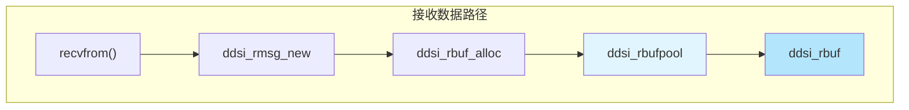
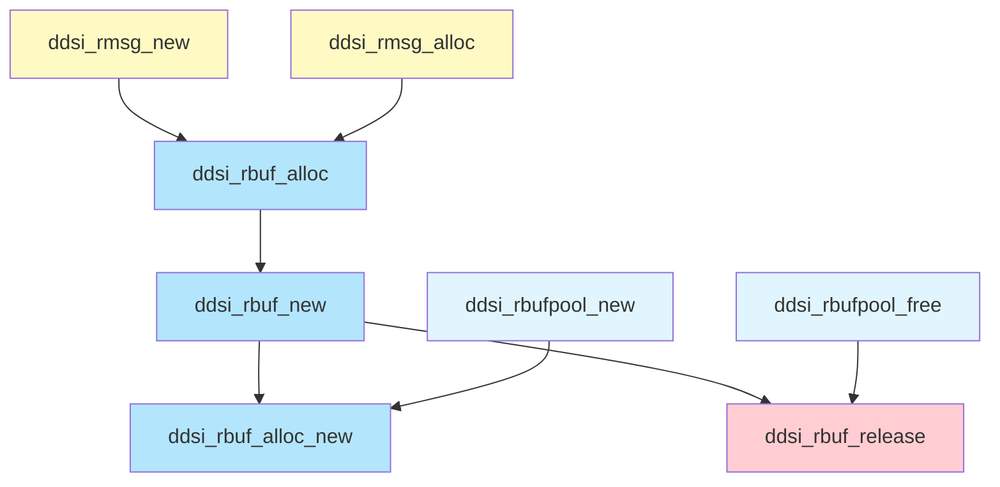
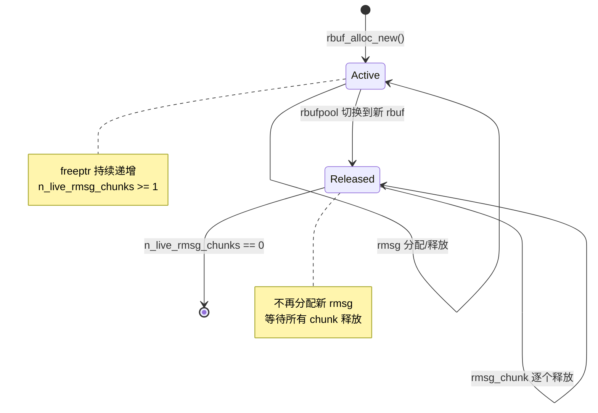

# rbufpool 与 rbuf：内存池管理

## 1. 模块概述

rbufpool 和 rbuf 构成了 rbuf 内存模型的**底层存储基础**。它们的职责是：

- **rbufpool**：管理一组 rbuf，为接收线程提供内存分配入口
- **rbuf**：大块连续内存缓冲区，使用顺序分配策略（bump allocator）

在整个接收路径中，rbufpool 和 rbuf 位于最底层，直接服务于上层的 [rmsg](./02-rmsg-rdata.md#struct-ddsi_rmsg) 和 [rdata](./02-rmsg-rdata.md#struct-ddsi_rdata) 分配。



**所有者模型**：一个 rbufpool 严格归属于一个接收线程。只有所有者线程可以分配内存，任何线程都可以释放（减少引用计数）。这一约束通过 `ASSERT_RBUFPOOL_OWNER` 宏在调试模式下强制检查。

## 2. API Signatures

```c
// === rbufpool 接口 ===
// 创建缓冲池，指定 rbuf 大小和单条消息最大大小
struct ddsi_rbufpool *ddsi_rbufpool_new (const struct ddsrt_log_cfg *logcfg,
                                         uint32_t rbuf_size,
                                         uint32_t max_rmsg_size);

// 设置缓冲池所有者线程（仅调试模式有效）
void ddsi_rbufpool_setowner (struct ddsi_rbufpool *rbp, ddsrt_thread_t tid);

// 释放缓冲池及其当前 rbuf
void ddsi_rbufpool_free (struct ddsi_rbufpool *rbp);

// === rbuf 内部接口（static 函数）===
// 分配一个新的 rbuf
static struct ddsi_rbuf *ddsi_rbuf_alloc_new (struct ddsi_rbufpool *rbp);

// 创建新 rbuf 并替换当前 rbuf
static struct ddsi_rbuf *ddsi_rbuf_new (struct ddsi_rbufpool *rbp);

// 释放 rbuf（引用计数归零时调用）
static void ddsi_rbuf_release (struct ddsi_rbuf *rbuf);

// 从当前 rbuf 分配一块内存（给 rmsg 使用）
static void *ddsi_rbuf_alloc (struct ddsi_rbufpool *rbp);
```

## 3. 多层次代码展示

### 3.1 调用关系



### 3.2 rbuf 顺序分配机制

rbuf 的分配策略非常简单：维护一个 `freeptr` 指针，每次分配时向前推进。

```c
// 伪代码：rbuf 分配
void *ddsi_rbuf_alloc(rbufpool *rbp) {
    asize = max_rmsg_size_w_hdr(rbp->max_rmsg_size);  // 计算对齐后大小
    rbuf = rbp->current;

    if (rbuf 剩余空间 < asize) {
        rbuf = ddsi_rbuf_new(rbp);  // 空间不足，分配新 rbuf
    }

    return rbuf->freeptr;  // 返回当前空闲位置（不递增 freeptr！）
}
```

注意一个关键细节：`ddsi_rbuf_alloc` **不推进 `freeptr`**。`freeptr` 的推进发生在 [ddsi_rmsg_commit](./02-rmsg-rdata.md#struct-ddsi_rmsg) 中（通过 `commit_rmsg_chunk`）。这意味着：如果消息最终未被引用，`freeptr` 保持不变，内存自动"回收"。

实际源码（[ddsi_radmin.c:491-518](../../source/cyclonedds/src/core/ddsi/src/ddsi_radmin.c#L491)）：

```c
static void *ddsi_rbuf_alloc (struct ddsi_rbufpool *rbp)
{
  uint32_t asize = max_rmsg_size_w_hdr (rbp->max_rmsg_size);
  struct ddsi_rbuf *rb;
  ASSERT_RBUFPOOL_OWNER (rbp);
  rb = rbp->current;

  if ((uint32_t) (rb->raw + rb->size - rb->freeptr) < asize)
  {
    // 空间不足，分配新的 rbuf 替换当前的
    if ((rb = ddsi_rbuf_new (rbp)) == NULL)
      return NULL;
    assert ((uint32_t) (rb->raw + rb->size - rb->freeptr) >= asize);
  }

  return rb->freeptr;  // 返回但不推进 freeptr
}
```

### 3.3 rbuf 替换流程

当 rbuf 空间不足时，`ddsi_rbuf_new` 分配新 rbuf 并替换当前的：

```c
static struct ddsi_rbuf *ddsi_rbuf_new (struct ddsi_rbufpool *rbp)
{
  struct ddsi_rbuf *rb;
  if ((rb = ddsi_rbuf_alloc_new (rbp)) != NULL)
  {
    ddsrt_mutex_lock (&rbp->lock);
    ddsi_rbuf_release (rbp->current);  // 释放旧 rbuf 的池引用
    rbp->current = rb;                  // 切换到新 rbuf
    ddsrt_mutex_unlock (&rbp->lock);
  }
  return rb;
}
```

> 📍 源码：[ddsi_radmin.c:448-461](../../source/cyclonedds/src/core/ddsi/src/ddsi_radmin.c#L448)

这里需要加锁是因为：虽然只有所有者线程分配，但其他线程可能正在通过 [ddsi_rmsg_free](./02-rmsg-rdata.md#struct-ddsi_rmsg) 释放该 rbuf 中的消息，进而调用 `ddsi_rbuf_release`。

## 4. 数据结构深度解析

### struct ddsi_rbufpool

> 📍 源码：[ddsi_radmin.c:264-288](../../source/cyclonedds/src/core/ddsi/src/ddsi_radmin.c#L264)

```c
struct ddsi_rbufpool {
  ddsrt_mutex_t lock;               // 保护 current 指针的互斥锁
  struct ddsi_rbuf *current;        // 当前活跃的 rbuf
  uint32_t rbuf_size;               // 每个 rbuf 的大小（默认 1 MB）
  uint32_t max_rmsg_size;           // 单条消息最大 payload 大小（默认 128 KB）
  const struct ddsrt_log_cfg *logcfg; // 日志配置
  bool trace;                       // 是否启用 RADMIN 跟踪日志
#ifndef NDEBUG
  ddsrt_thread_t owner_tid;         // 所有者线程 ID（仅调试模式）
#endif
};
```

**字段解析：**

| 字段 | 类型 | 生命周期 | 含义 |
|------|------|----------|------|
| `lock` | mutex | 池存续期间 | 保护 `current` 的并发访问 |
| `current` | 指针 | 动态变化 | 当前正在使用的 rbuf |
| `rbuf_size` | uint32 | 不变 | 每个 rbuf 的字节大小 |
| `max_rmsg_size` | uint32 | 不变 | 单条消息最大 payload |
| `owner_tid` | thread_t | 可更新 | 通过 `setowner` 变更 |

### struct ddsi_rbuf

> 📍 源码：[ddsi_radmin.c:403-425](../../source/cyclonedds/src/core/ddsi/src/ddsi_radmin.c#L403)

```c
struct ddsi_rbuf {
  ddsrt_atomic_uint32_t n_live_rmsg_chunks; // 活跃 rmsg_chunk 计数
  uint32_t size;                            // raw[] 数组的大小
  uint32_t max_rmsg_size;                   // 冗余存储，避免回溯到 pool
  struct ddsi_rbufpool *rbufpool;           // 所属的 rbufpool
  bool trace;                               // 跟踪日志开关

  unsigned char *freeptr;                   // 下一次分配的起始位置

  union {                                   // 对齐填充
    int64_t l;
    double d;
    void *p;
  } u;

  unsigned char raw[];                      // 柔性数组，实际存储区
};
```

**关键字段详解：**

- **`n_live_rmsg_chunks`**：原子计数器，初始值为 1（代表 rbufpool 持有的引用）。每当一个 [rmsg_chunk](./02-rmsg-rdata.md#struct-ddsi_rmsg_chunk) 引用此 rbuf 时加 1，chunk 释放时减 1。归零时 rbuf 被 `free`
- **`freeptr`**：指向 `raw[]` 中下一个可分配位置。初始化时 `freeptr = raw`，分配时由 `commit_rmsg_chunk` 推进
- **`raw[]`**：C99 柔性数组成员。实际大小为 `rbuf_size`，通过 `malloc(sizeof(ddsi_rbuf) + rbuf_size)` 分配
- **对齐联合体 `u`**：确保 `raw[]` 起始地址满足 8 字节对齐要求

### rbuf 的生命周期



一个 rbuf 的完整生命周期：

1. **创建**：`ddsi_rbuf_alloc_new` 分配内存，`n_live_rmsg_chunks = 1`
2. **使用**：作为 `rbufpool->current`，接收线程从中分配 rmsg
3. **替换**：空间不足时被新 rbuf 替换，`ddsi_rbuf_release` 减少引用
4. **消亡**：当所有引用该 rbuf 的 rmsg_chunk 都释放后，`n_live_rmsg_chunks` 归零，rbuf 被 `free`

## 5. 关键算法剖析

### 5.1 对齐计算

所有分配都需要满足 `DDSI_ALIGNOF_RMSG`（至少 8 字节）对齐：

```c
#define DDSI_ALIGNOF_RMSG (dds_alignof(struct ddsi_rmsg) > 8 \
    ? dds_alignof(struct ddsi_rmsg) : 8)

static uint32_t align_rmsg (uint32_t x)
{
  x += (uint32_t) DDSI_ALIGNOF_RMSG - 1;
  x -= x % (uint32_t) DDSI_ALIGNOF_RMSG;
  return x;
}
```

> 📍 源码：[ddsi_radmin.c:300-305](../../source/cyclonedds/src/core/ddsi/src/ddsi_radmin.c#L300)

这是标准的向上对齐公式。对齐到 $N$ 字节的公式为 $\text{aligned}(x) = \lfloor (x + N - 1) / N \rfloor \times N$。

### 5.2 max_rmsg_size_w_hdr 计算

分配空间时需要考虑 rmsg/chunk 头部的大小：

```c
static uint32_t max_rmsg_size_w_hdr (uint32_t max_rmsg_size)
{
  return max_uint32 (
    (uint32_t)(offsetof(struct ddsi_rmsg, chunk) + sizeof(struct ddsi_rmsg_chunk)),
    (uint32_t) sizeof(struct ddsi_rmsg_chunk)
  ) + max_rmsg_size;
}
```

> 📍 源码：[ddsi_radmin.c:318-331](../../source/cyclonedds/src/core/ddsi/src/ddsi_radmin.c#L318)

这里取两个头部大小的最大值：第一个 chunk 嵌入 rmsg 因此头部更大，后续 chunk 单独分配头部较小。`max_rmsg_size` 实际上是 **payload** 的最大大小，加上头部后才是每次分配的总大小。

### 5.3 rbufpool 初始化的尺寸校正

```c
if (rbuf_size < max_rmsg_size_w_hdr(max_rmsg_size))
    rbuf_size = max_rmsg_size_w_hdr(max_rmsg_size);
```

> 📍 源码：[ddsi_radmin.c:343-344](../../source/cyclonedds/src/core/ddsi/src/ddsi_radmin.c#L343)

自动将 `rbuf_size` 提升到至少能容纳一条消息的大小。这避免了用户配置不当导致的崩溃。

## 6. 设计决策分析

### 6.1 为什么使用顺序分配器？

**选择理由：**
- 分配开销为 $O(1)$，仅需一次指针比较和推进
- 无碎片化问题：所有分配按顺序排列
- 释放时无需逐块 free：整个 rbuf 作为一个整体被释放

**替代方案：**
- **空闲链表**：支持任意顺序释放，但分配开销更高，有碎片化风险
- **环形缓冲区**：源码注释提到过这种可能性（[ddsi_radmin.c:131-133](../../source/cyclonedds/src/core/ddsi/src/ddsi_radmin.c#L131)），可以更好地复用空间，但实现复杂度更高

**当前设计的代价**：如果 rbuf 中的某条消息被长时间引用（例如在 reorder 中等待缺失的消息），整个 rbuf 都无法释放。不过在实践中，消息通常很快被处理和释放。

### 6.2 为什么 freeptr 延迟推进？

`ddsi_rbuf_alloc` 返回 `freeptr` 但不推进它。推进发生在 `commit_rmsg_chunk` 中。这个设计使得**丢弃消息零成本**：如果消息处理过程中发现无效（如校验失败），直接 `ddsi_rmsg_commit` 即可——若无外部引用，refcount 归零，rmsg 被 free，而 freeptr 未变，下次分配会覆盖同一位置。

### 6.3 rbuf 的引用计数为什么不直接计算 rmsg？

rbuf 使用 `n_live_rmsg_chunks` 而非 "n_live_rmsgs" 计数。这是因为一条 rmsg 可能跨越多个 chunk（当管理数据超过单个 chunk 容量时），每个 chunk 可能引用不同的 rbuf。因此以 chunk 为粒度计数更准确。

## 7. 学习检查点

📝 **本章小结**
1. rbufpool 是每个接收线程的内存入口，维护一个"当前 rbuf"
2. rbuf 使用 bump allocator（freeptr 递增）实现 $O(1)$ 分配
3. freeptr 延迟推进至 commit 阶段，使无效消息的丢弃零成本
4. rbuf 通过 `n_live_rmsg_chunks` 原子计数管理生命周期
5. 池的锁仅在 rbuf 切换时使用，分配路径完全无锁

🤔 **思考题**
1. 如果一个 rbuf 中只剩一条消息未释放（例如正在等待重传的碎片），而接收线程已经切换到新 rbuf，旧 rbuf 何时被释放？这会导致内存浪费吗？
2. `ddsi_rbuf_new` 在分配新 rbuf 后立即 `ddsi_rbuf_release(rbp->current)`。如果此时旧 rbuf 的 `n_live_rmsg_chunks` 不为 1（即还有活跃消息），会发生什么？
3. Valgrind 集成（`USE_VALGRIND` 宏）在 rbuf 分配中起什么作用？为什么需要 `MAKE_MEM_NOACCESS` 和 `MEMPOOL_ALLOC`？
