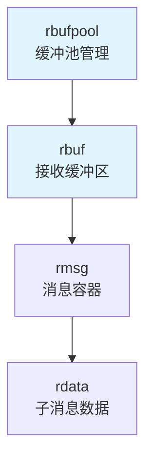
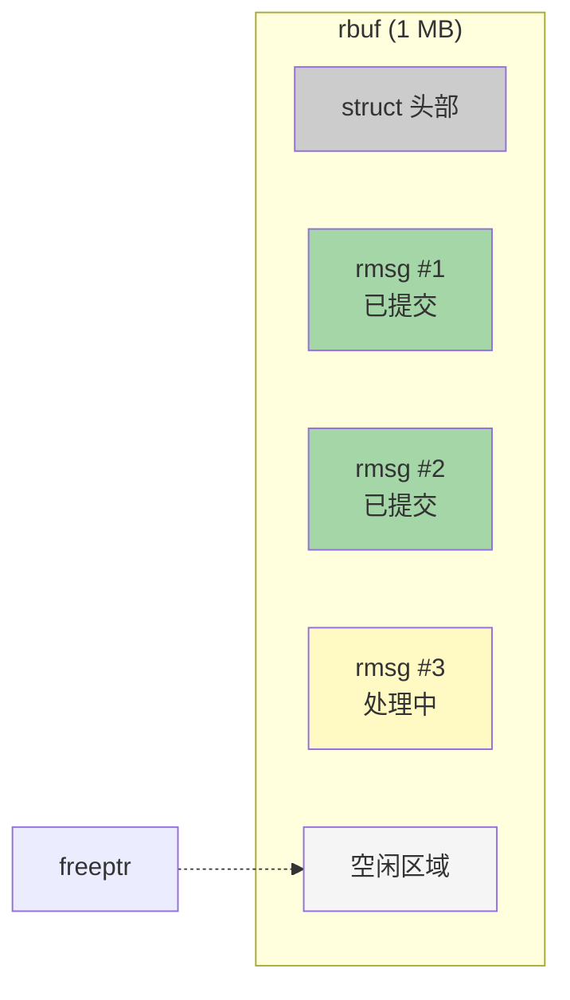
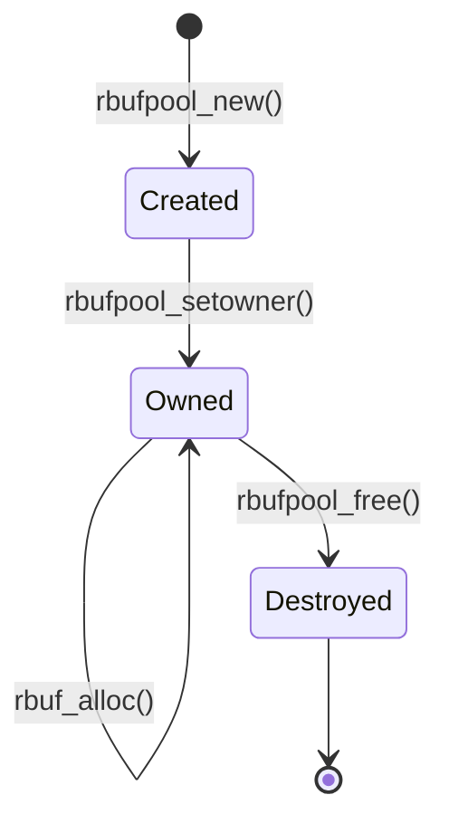
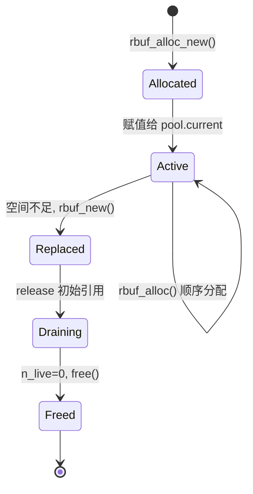
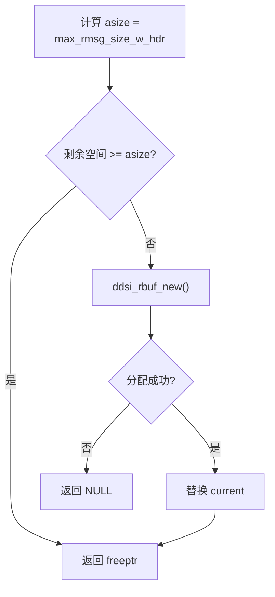
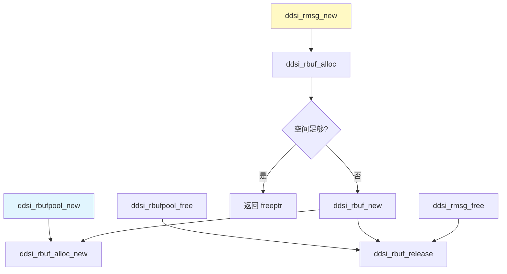

# 第 1 章 缓冲池与接收缓冲区

## 1.1 模块概述

### 1.1.1 职责定位

`ddsi_rbufpool` 和 `ddsi_rbuf` 构成了 Cyclone DDS 接收路径的**最底层内存管理**。它们的核心任务是：

1. **为接收线程提供高效的内存分配**——每次 `recvfrom()` 拿到 UDP 报文后，需要一块内存存放原始数据及后续解码产生的元数据。
2. **消除 malloc/free 热路径开销**——通过大块预分配缓冲区（rbuf）内的顺序分配（bump allocator），将分配成本降至指针递增。
3. **支持多线程安全释放**——分配只由所有者线程执行（单线程写），而释放可由任意线程执行（多线程读），通过原子引用计数保证安全。

### 1.1.2 在系统中的位置

rbufpool/rbuf 位于四层内存体系的第一、二层，为上层 rmsg/rdata 提供原始存储空间：



### 1.1.3 源码文件

> **图 1** 相关源码文件一览

| 文件 | 角色 |
|:--|:--|
| [ddsi_radmin.c:264-518](../../src/cyclonedds/src/core/ddsi/src/ddsi_radmin.c#L264) | rbufpool + rbuf 完整实现 |
| [ddsi_radmin.h](../../src/cyclonedds/src/core/ddsi/include/dds/ddsi/ddsi_radmin.h#L1) | 公共声明（rmsg_chunk、rmsg 结构体） |
| [ddsi__radmin.h:122-129](../../src/cyclonedds/src/core/ddsi/src/ddsi__radmin.h#L122) | 内部 API 声明 |
| [ddsi_config.h:378](../../src/cyclonedds/src/core/ddsi/include/dds/ddsi/ddsi_config.h#L378) | `rbuf_size` 配置项 |

---

## 1.2 数据结构详解

### 1.2.1 ddsi_rbufpool — 缓冲池

> 📍 源码：[ddsi_radmin.c:264-288](../../src/cyclonedds/src/core/ddsi/src/ddsi_radmin.c#L264)

`ddsi_rbufpool` 是接收缓冲区的**池化管理器**，每个接收线程拥有一个独立的 rbufpool 实例。

```c
struct ddsi_rbufpool {
  ddsrt_mutex_t lock;
  struct ddsi_rbuf *current;
  uint32_t rbuf_size;
  uint32_t max_rmsg_size;
  const struct ddsrt_log_cfg *logcfg;
  bool trace;
#ifndef NDEBUG
  ddsrt_thread_t owner_tid;
#endif
};
```

> **图 2** ddsi_rbufpool 字段详解

| 字段 | 类型 | 含义 |
|:--|:--|:--|
| `lock` | `ddsrt_mutex_t` | 保护 `current` 指针的互斥锁。仅在替换 rbuf 时短暂持锁 |
| `current` | `ddsi_rbuf*` | 当前活跃的 rbuf。所有新分配都从这里取空间 |
| `rbuf_size` | `uint32_t` | 每个 rbuf 的 `raw[]` 数组大小，默认 $1048576$（1 MB） |
| `max_rmsg_size` | `uint32_t` | 单条 rmsg 的最大载荷，默认 $131072$（128 KB） |
| `logcfg` | `const ddsrt_log_cfg*` | 日志配置，用于 `RADMIN` 级别跟踪 |
| `trace` | `bool` | 是否启用 RADMIN 跟踪日志（从 `logcfg->c.mask` 派生） |
| `owner_tid` | `ddsrt_thread_t` | （仅 Debug）所有者线程 ID，用于断言检查 |

**线程所有权模型**：rbufpool 采用**单写多读**模型。`owner_tid` 字段记录所有者线程，宏 `ASSERT_RBUFPOOL_OWNER` 在 Debug 构建中对每次分配操作进行断言检查：

```c
#define ASSERT_RBUFPOOL_OWNER(rbp) \
  (assert (ddsrt_thread_equal (ddsrt_thread_self (), (rbp)->owner_tid)))
```

> 📍 源码：[ddsi_radmin.c:307-311](../../src/cyclonedds/src/core/ddsi/src/ddsi_radmin.c#L307)

### 1.2.2 ddsi_rbuf — 接收缓冲区

> 📍 源码：[ddsi_radmin.c:403-425](../../src/cyclonedds/src/core/ddsi/src/ddsi_radmin.c#L403)

`ddsi_rbuf` 是实际的大块内存缓冲区，通过末尾的**柔性数组** `raw[]` 持有连续内存空间。

```c
struct ddsi_rbuf {
  ddsrt_atomic_uint32_t n_live_rmsg_chunks;
  uint32_t size;
  uint32_t max_rmsg_size;
  struct ddsi_rbufpool *rbufpool;
  bool trace;
  unsigned char *freeptr;
  union { int64_t l; double d; void *p; } u;
  unsigned char raw[];
};
```

> **图 3** ddsi_rbuf 字段详解

| 字段 | 类型 | 含义 |
|:--|:--|:--|
| `n_live_rmsg_chunks` | `atomic_uint32` | 原子引用计数。初始为 1（代表 rbufpool 对它的引用），每个活跃的 rmsg_chunk 额外 +1 |
| `size` | `uint32_t` | `raw[]` 数组的字节大小（即 `rbuf_size` 配置值） |
| `max_rmsg_size` | `uint32_t` | 单条 rmsg 最大载荷（从 rbufpool 复制） |
| `rbufpool` | `ddsi_rbufpool*` | 反向引用所属的缓冲池 |
| `trace` | `bool` | 跟踪日志开关（从 rbufpool 复制） |
| `freeptr` | `unsigned char*` | **顺序分配指针**，指向 `raw[]` 中下一个可用位置，只增不减 |
| `u` | `union` | 填充联合体，确保 `raw[]` 起始地址满足 8 字节对齐 |
| `raw[]` | `unsigned char[]` | C99 柔性数组成员，实际大小为 `size` 字节 |

**关键设计：freeptr 顺序分配**

`freeptr` 是 rbuf 内存管理的核心。它始终指向下一个可分配的位置，满足以下不变量：

$$raw \leq freeptr \leq raw + size$$

分配时 `freeptr` 只会向前移动，**永不回退**。即使中间的 rmsg 被释放，该空间也不会被回收。这就是所谓的 bump allocator（碰撞指针分配器）。

**关键设计：n_live_rmsg_chunks 引用计数**

`n_live_rmsg_chunks` 追踪有多少活跃的 rmsg_chunk 引用了这个 rbuf。当一个 rmsg_chunk 被创建（通过 `init_rmsg_chunk`）时，计数原子递增；当 rmsg 被释放（通过 `ddsi_rmsg_free`）时，调用 `ddsi_rbuf_release` 原子递减。计数归零时，rbuf 自身被 `ddsrt_free` 释放。

初始值为 1 代表 rbufpool 持有的引用。当 rbufpool 替换 `current` 指针时，会对旧 rbuf 调用 `ddsi_rbuf_release`，释放这个初始引用。

### 1.2.3 内存布局示意图

下图展示了一个 rbuf 内部的内存布局，`raw[]` 区域中顺序排列了多条 rmsg：



每条 rmsg 在 `raw[]` 中的起始地址都经过 `align_rmsg()` 对齐到 $\geq 8$ 字节边界（`DDSI_ALIGNOF_RMSG`）。rmsg 之间紧密排列，没有空隙（除对齐填充外）。

> 📍 源码：[ddsi_radmin.c:300-305](../../src/cyclonedds/src/core/ddsi/src/ddsi_radmin.c#L300)

```c
static uint32_t align_rmsg (uint32_t x)
{
  x += (uint32_t) DDSI_ALIGNOF_RMSG - 1;
  x -= x % (uint32_t) DDSI_ALIGNOF_RMSG;
  return x;
}
```

其中 `DDSI_ALIGNOF_RMSG` 定义为 `max(alignof(ddsi_rmsg), 8)`：

> 📍 源码：[ddsi__radmin.h:47-48](../../src/cyclonedds/src/core/ddsi/src/ddsi__radmin.h#L47)

---

## 1.3 生命周期管理

### 1.3.1 rbufpool 生命周期

rbufpool 的创建、所有权设置和销毁构成完整的生命周期：



#### ddsi_rbufpool_new — 创建缓冲池

> 📍 源码：[ddsi_radmin.c:333-375](../../src/cyclonedds/src/core/ddsi/src/ddsi_radmin.c#L333)

**函数签名**（从 Grep 搜索头文件提取）：

```c
struct ddsi_rbufpool *ddsi_rbufpool_new (
    const struct ddsrt_log_cfg *logcfg,
    uint32_t rbuf_size,
    uint32_t max_rmsg_size);
```

**调用者**（基于 Grep 搜索）：

- [ddsi_init.c:918](../../src/cyclonedds/src/core/ddsi/src/ddsi_init.c#L918) — 域初始化时为每个接收线程创建 rbufpool
- [radmin.c:53](../../src/cyclonedds/src/core/ddsi/tests/radmin.c#L53) — 单元测试

**执行流程**：

1. **参数校验与修正**：若 `rbuf_size` 小于单条 rmsg 的最小空间需求 `max_rmsg_size_w_hdr(max_rmsg_size)`，自动提升到该值。这是一个用户友好的设计——用户无需关心 rmsg 头部的额外开销。
2. **分配 rbufpool 结构体**：`ddsrt_malloc(sizeof(*rbp))`。
3. **初始化字段**：设置 `owner_tid`（Debug）、初始化互斥锁、记录配置参数和日志选项。
4. **Valgrind 集成**：若启用，调用 `VALGRIND_CREATE_MEMPOOL(rbp, 0, 0)` 将 rbufpool 注册为自定义内存池。
5. **分配首个 rbuf**：调用 `ddsi_rbuf_alloc_new(rbp)` 创建初始缓冲区，赋值给 `rbp->current`。

**辅助函数 max_rmsg_size_w_hdr**：

> 📍 源码：[ddsi_radmin.c:318-331](../../src/cyclonedds/src/core/ddsi/src/ddsi_radmin.c#L318)

计算一条 rmsg 含头部的最大空间需求。取 `ddsi_rmsg` 首 chunk 头和独立 `ddsi_rmsg_chunk` 头中较大者，再加上 `max_rmsg_size`。这保证无论是首 chunk 还是后续追加的 chunk，都有足够空间。

```c
static uint32_t max_rmsg_size_w_hdr (uint32_t max_rmsg_size)
{
  return max_uint32 (
    (uint32_t)(offsetof(struct ddsi_rmsg, chunk) + sizeof(struct ddsi_rmsg_chunk)),
    (uint32_t) sizeof(struct ddsi_rmsg_chunk))
    + max_rmsg_size;
}
```

#### ddsi_rbufpool_setowner — 设置所有者线程

> 📍 源码：[ddsi_radmin.c:377-382](../../src/cyclonedds/src/core/ddsi/src/ddsi_radmin.c#L377)

```c
void ddsi_rbufpool_setowner (struct ddsi_rbufpool *rbp, ddsrt_thread_t tid)
{
#ifndef NDEBUG
  rbp->owner_tid = tid;
#endif
}
```

此函数仅在 Debug 构建中有效。它的存在是因为 rbufpool 通常在主线程中创建（`ddsi_init`），但实际使用者是接收线程。接收线程启动后需调用此函数将所有权转移给自己，否则后续所有 `ASSERT_RBUFPOOL_OWNER` 断言都会失败。

**调用者**（基于 Grep 搜索）：接收线程入口函数 `recv_thread` 在开始处理前调用。

#### ddsi_rbufpool_free — 释放缓冲池

> 📍 源码：[ddsi_radmin.c:384-399](../../src/cyclonedds/src/core/ddsi/src/ddsi_radmin.c#L384)

**执行流程**：

1. 对 `rbp->current` 调用 `ddsi_rbuf_release`，释放池对当前 rbuf 的引用。
2. 若启用 Valgrind，调用 `VALGRIND_DESTROY_MEMPOOL(rbp)` 注销内存池。
3. 销毁互斥锁、释放 rbufpool 结构体。

注意源码中有一段被注释掉的 `ASSERT_RBUFPOOL_OWNER` 调用，附带解释：释放操作允许任意线程执行。这是因为在关闭流程中，接收线程先停止，然后由主线程统一清理资源。

---

### 1.3.2 rbuf 生命周期



#### ddsi_rbuf_alloc_new — 分配新 rbuf

> 📍 源码：[ddsi_radmin.c:427-446](../../src/cyclonedds/src/core/ddsi/src/ddsi_radmin.c#L427)

**函数签名**（内部 static 函数，从源码提取）：

```c
static struct ddsi_rbuf *ddsi_rbuf_alloc_new (struct ddsi_rbufpool *rbp);
```

**执行流程**：

1. **断言检查**：`ASSERT_RBUFPOOL_OWNER(rbp)` 确保只有所有者线程调用。
2. **分配内存**：`ddsrt_malloc(sizeof(struct ddsi_rbuf) + rbp->rbuf_size)`。注意柔性数组 `raw[]` 的大小直接追加在结构体之后。
3. **Valgrind 标记**：将整个 `raw[]` 区域标记为不可访问（`VALGRIND_MAKE_MEM_NOACCESS`），后续每次分配时再逐步开放。
4. **初始化字段**：
   - `rbufpool` 反向指针
   - `n_live_rmsg_chunks` 原子设置为 1（代表池的引用）
   - `size` 和 `max_rmsg_size` 从池复制
   - `freeptr = raw`（指向缓冲区起始位置）
   - `trace` 从池复制

#### ddsi_rbuf_new — 替换当前 rbuf

> 📍 源码：[ddsi_radmin.c:448-461](../../src/cyclonedds/src/core/ddsi/src/ddsi_radmin.c#L448)

```c
static struct ddsi_rbuf *ddsi_rbuf_new (struct ddsi_rbufpool *rbp)
{
  struct ddsi_rbuf *rb;
  assert (rbp->current);
  ASSERT_RBUFPOOL_OWNER (rbp);
  if ((rb = ddsi_rbuf_alloc_new (rbp)) != NULL)
  {
    ddsrt_mutex_lock (&rbp->lock);
    ddsi_rbuf_release (rbp->current);
    rbp->current = rb;
    ddsrt_mutex_unlock (&rbp->lock);
  }
  return rb;
}
```

**要点分析**：

1. 先分配一个全新的 rbuf。
2. **持锁替换**：在 `rbp->lock` 保护下，先释放旧 rbuf 的引用（`ddsi_rbuf_release`），再将 `current` 指向新 rbuf。持锁是因为其他线程可能正通过 `ddsi_rmsg_free` 访问 `rbp->current`。
3. 旧 rbuf 并不会立即被释放——如果还有活跃的 rmsg_chunk 引用它，`n_live_rmsg_chunks > 0`，rbuf 会继续存活直到所有引用释放完毕。

#### ddsi_rbuf_release — 释放 rbuf 引用

> 📍 源码：[ddsi_radmin.c:463-472](../../src/cyclonedds/src/core/ddsi/src/ddsi_radmin.c#L463)

```c
static void ddsi_rbuf_release (struct ddsi_rbuf *rbuf)
{
  struct ddsi_rbufpool *rbp = rbuf->rbufpool;
  if (ddsrt_atomic_dec32_ov (&rbuf->n_live_rmsg_chunks) == 1)
  {
    ddsrt_free (rbuf);
  }
}
```

使用 `ddsrt_atomic_dec32_ov`（原子递减并返回旧值）。当旧值为 1 说明递减后为 0，此时没有任何活跃引用，可以安全释放整个 rbuf（包括 `raw[]`）。

此函数可被**任意线程**调用——这是多线程安全释放的核心。投递线程处理完消息后通过 `ddsi_rmsg_free` -> `ddsi_rbuf_release` 链路释放引用。

---

## 1.4 顺序分配算法

### 1.4.1 ddsi_rbuf_alloc — 核心分配函数

> 📍 源码：[ddsi_radmin.c:491-518](../../src/cyclonedds/src/core/ddsi/src/ddsi_radmin.c#L491)

`ddsi_rbuf_alloc` 是从 rbuf 中分配空间的入口，由 `ddsi_rmsg_new` 调用。

```c
static void *ddsi_rbuf_alloc (struct ddsi_rbufpool *rbp)
{
  uint32_t asize = max_rmsg_size_w_hdr (rbp->max_rmsg_size);
  struct ddsi_rbuf *rb;
  ASSERT_RBUFPOOL_OWNER (rbp);
  rb = rbp->current;

  if ((uint32_t)(rb->raw + rb->size - rb->freeptr) < asize)
  {
    /* 空间不足，分配新 rbuf */
    if ((rb = ddsi_rbuf_new (rbp)) == NULL)
      return NULL;
    assert ((uint32_t)(rb->raw + rb->size - rb->freeptr) >= asize);
  }

#if USE_VALGRIND
  VALGRIND_MEMPOOL_ALLOC (rbp, rb->freeptr, asize);
#endif
  return rb->freeptr;
}
```

### 1.4.2 算法流程图



### 1.4.3 算法要点

**预分配而非按需分配**：每次调用 `ddsi_rbuf_alloc` 时，分配的大小固定为 `max_rmsg_size_w_hdr(max_rmsg_size)`，这是单条 rmsg 可能占用的**最大空间**。实际使用的空间由后续 `ddsi_rmsg_setsize` 和 `commit_rmsg_chunk` 确定。

**freeptr 延迟推进**：注意 `ddsi_rbuf_alloc` 只**返回** `freeptr` 的当前值，但**并不移动**它。`freeptr` 的推进发生在 `commit_rmsg_chunk` 中：

> 📍 源码：[ddsi_radmin.c:596-601](../../src/cyclonedds/src/core/ddsi/src/ddsi_radmin.c#L596)

```c
static void commit_rmsg_chunk (struct ddsi_rmsg_chunk *chunk)
{
  struct ddsi_rbuf *rbuf = chunk->rbuf;
  rbuf->freeptr = (unsigned char *)(chunk + 1) + chunk->u.size;
}
```

这意味着：如果一条 rmsg 在 commit 之前引用计数已归零（所有异步处理完成），`ddsi_rmsg_commit` 会直接调用 `ddsi_rmsg_free` 而**不推进 freeptr**，下一次 `ddsi_rbuf_alloc` 返回**同一地址**——实现了零成本的内存"回收"。

### 1.4.4 空间利用率分析

假设 `rbuf_size = 1 MB`，`max_rmsg_size = 128 KB`：

- 每个 rbuf 理论上可以容纳约 $\frac{1048576}{131072 + \text{头部}} \approx 7$ 条 rmsg（极端最大情况）
- 实际 UDP 报文通常远小于 128 KB（典型 1.5 KB），因此一个 rbuf 可以容纳数百条消息
- 当 `freeptr` 到达尾部而前部已释放的空间无法回收时，创建新 rbuf，旧 rbuf 在所有引用释放后自动销毁

---

## 1.5 Valgrind 集成

### 1.5.1 USE_VALGRIND 宏

> 📍 源码：[ddsi_radmin.c:17-22](../../src/cyclonedds/src/core/ddsi/src/ddsi_radmin.c#L17)

```c
#if HAVE_VALGRIND && ! defined (NDEBUG)
#include <memcheck.h>
#define USE_VALGRIND 1
#else
#define USE_VALGRIND 0
#endif
```

仅在同时满足两个条件时启用：编译时检测到 Valgrind 头文件（`HAVE_VALGRIND`），且为 Debug 构建（`!NDEBUG`）。

### 1.5.2 集成点汇总

由于 rbuf 使用自定义的顺序分配器而非标准 malloc/free，Valgrind 无法自动追踪内存访问的合法性。因此源码在关键位置插入了 Valgrind 客户端请求：

> **图 4** Valgrind 集成点

| 位置 | Valgrind 操作 | 目的 |
|:--|:--|:--|
| [ddsi_radmin.c:360](../../src/cyclonedds/src/core/ddsi/src/ddsi_radmin.c#L360) | `CREATE_MEMPOOL` | 将 rbufpool 注册为自定义内存池 |
| [ddsi_radmin.c:369](../../src/cyclonedds/src/core/ddsi/src/ddsi_radmin.c#L369) | `DESTROY_MEMPOOL` | 创建失败时注销 |
| [ddsi_radmin.c:395](../../src/cyclonedds/src/core/ddsi/src/ddsi_radmin.c#L395) | `DESTROY_MEMPOOL` | 正常销毁时注销 |
| [ddsi_radmin.c:435](../../src/cyclonedds/src/core/ddsi/src/ddsi_radmin.c#L435) | `MAKE_MEM_NOACCESS` | 新 rbuf 的 `raw[]` 标记为不可访问 |
| [ddsi_radmin.c:515](../../src/cyclonedds/src/core/ddsi/src/ddsi_radmin.c#L515) | `MEMPOOL_ALLOC` | 从 rbuf 分配时标记区域为已分配 |
| [ddsi_radmin.c:562](../../src/cyclonedds/src/core/ddsi/src/ddsi_radmin.c#L562) | `MEMPOOL_CHANGE` | setsize 后调整已分配区域大小 |
| [ddsi_radmin.c:584-588](../../src/cyclonedds/src/core/ddsi/src/ddsi_radmin.c#L584) | `MEMPOOL_FREE` | rmsg 释放时标记区域为已释放 |

**工作原理**：

1. `CREATE_MEMPOOL` 告诉 Valgrind "这里有一个自定义分配器"。
2. `MAKE_MEM_NOACCESS` 将整个 `raw[]` 标为禁区。
3. 每次 `rbuf_alloc` 时，`MEMPOOL_ALLOC` 开放一块区域。
4. `rmsg_free` 时，`MEMPOOL_FREE` 再次封禁该区域。

这样 Valgrind 就能检测到对已释放 rmsg 的非法访问，即使底层 rbuf 本身尚未被释放。

---

## 1.6 设计决策分析

### 1.6.1 为什么选择顺序分配而非堆管理？

源码注释（[ddsi_radmin.c:410-413](../../src/cyclonedds/src/core/ddsi/src/ddsi_radmin.c#L410)）明确说明：

> *"Allocating sequentially, releasing in random order, not bothering to reuse memory as soon as it becomes available again."*

这一选择的理由：

> **图 5** 顺序分配 vs 堆管理对比

| 维度 | 顺序分配（bump allocator） | 通用堆管理（malloc/free） |
|:--|:--|:--|
| 分配时间复杂度 | $O(1)$，指针比较 + 返回 | $O(\log n)$ 或更差 |
| 释放复杂度 | $O(1)$，原子递减引用计数 | $O(\log n)$，合并空闲块 |
| 内存碎片 | 无碎片（顺序排列） | 可能产生外部碎片 |
| 空间利用率 | 可能浪费尾部空间 | 可立即重用释放的空间 |
| 线程安全成本 | 分配无锁（单线程），释放仅原子操作 | 需要锁或复杂的无锁结构 |
| 缓存友好性 | 极好（顺序访问） | 一般（可能跳跃访问） |

**核心洞察**：在 DDSI 接收路径中，消息处理具有强局部性——一条 UDP 报文从接收到处理完毕的时间窗口很短。大多数情况下，当 `ddsi_rmsg_commit` 被调用时，消息已经处理完毕（引用计数归零），此时 freeptr 不推进、下一条消息重用同一地址。只有需要异步投递的消息才会真正"占用"rbuf 空间。

### 1.6.2 单线程分配的性能优势

rbufpool 的 `ASSERT_RBUFPOOL_OWNER` 机制确保**只有所有者线程进行分配**。这带来三个关键优势：

1. **分配路径完全无锁**：`ddsi_rbuf_alloc` 不需要任何同步原语，仅读取 `freeptr` 和 `size` 并做比较。
2. **可以安全追加元数据**：接收线程在处理消息时，可以在 rmsg 之后连续追加解码数据（`ddsi_rmsg_alloc`），不必担心其他线程的干扰。
3. **简化了正确性推理**：`freeptr` 只被一个线程修改，不存在竞态条件。

释放操作（`ddsi_rbuf_release`）使用原子操作，可以安全地从任意线程调用。这种**非对称设计**（分配单线程、释放多线程）是针对 DDS 接收路径的工作负载特点量身定制的。

### 1.6.3 rbuf 替换策略的简洁性

当前实现只维护**一个活跃 rbuf**（`rbp->current`）。当空间不足时，直接分配新 rbuf 替换旧的。源码注释也提到这是"最简单的方式"，并指出未来可能需要改进（例如维护空闲 rbuf 列表以减少 malloc 频率）。

这种设计足够高效的原因是：以默认 1 MB rbuf 和典型 1.5 KB UDP 报文计算，一个 rbuf 可以处理约 $\frac{1048576}{1500} \approx 699$ 条消息后才需要替换。即使在极高吞吐量下，rbuf 替换也是稀少事件。

---

## 1.7 调用关系总览



> **图 6** rbufpool/rbuf 模块调用关系——展示了分配和释放两条主要路径

---

## 1.8 配置参数

rbufpool/rbuf 的行为受两个配置参数控制：

> **图 7** 配置参数

| 参数 | 配置路径 | 默认值 | 含义 |
|:--|:--|:--|:--|
| `rbuf_size` | `ddsi_config.rbuf_size` | $1048576$（1 MB） | 单个 rbuf 的 `raw[]` 大小 |
| `rmsg_chunk_size` | `ddsi_config.rmsg_chunk_size` | $131072$（128 KB） | 单条 rmsg 的最大载荷 |

> 📍 源码：[ddsi_config.h:378](../../src/cyclonedds/src/core/ddsi/include/dds/ddsi/ddsi_config.h#L378)（字段定义）、[defconfig.c:26-27](../../src/cyclonedds/src/core/ddsi/defconfig.c#L26)（默认值）

注意：这两个参数属于 `debug/test/undoc features`（调试/测试/未文档化特性），不在公共配置文档中暴露。调用时 `ddsi_rbufpool_new` 的第三个参数名为 `max_rmsg_size`，在 [ddsi_init.c:918](../../src/cyclonedds/src/core/ddsi/src/ddsi_init.c#L918) 中传入的是 `gv->config.rmsg_chunk_size`。

---

## 1.9 学习检查点

### 本章小结

1. **rbufpool 是接收线程的私有内存池**，管理一个活跃 rbuf，采用单线程分配、多线程释放的非对称模型。
2. **rbuf 使用顺序分配器（bump allocator）**，`freeptr` 只增不减，消除了分配路径上的所有锁竞争和内存碎片。
3. **rbuf 通过原子引用计数 `n_live_rmsg_chunks` 管理生命周期**，当所有 rmsg_chunk 释放完毕后自动销毁。
4. **freeptr 延迟推进机制**使得大多数消息（同步处理完毕的）可以零成本"回收"——commit 时引用为零则不推进指针。
5. **Valgrind 集成**通过自定义内存池 API，使内存检测工具能准确追踪 rbuf 内部的分配/释放行为。

### 思考题

1. **如果去掉 `ddsi_rbuf_new` 中的 `ddsrt_mutex_lock` 保护，会发生什么？** 提示：考虑 `ddsi_rmsg_free` 可能在其他线程同时访问 `rbp->current` 的场景。

2. **为什么 `ddsi_rbuf_alloc` 每次都分配 `max_rmsg_size_w_hdr` 大小的空间，而不是按实际需要分配？** 提示：考虑分配时尚未调用 `recvfrom()`，不知道实际报文大小。

3. **在什么情况下，一个 rbuf 会长时间无法被释放？这对系统内存使用有什么影响？** 提示：考虑一条 rmsg 被 defrag 或 reorder 长时间持有引用的场景。
