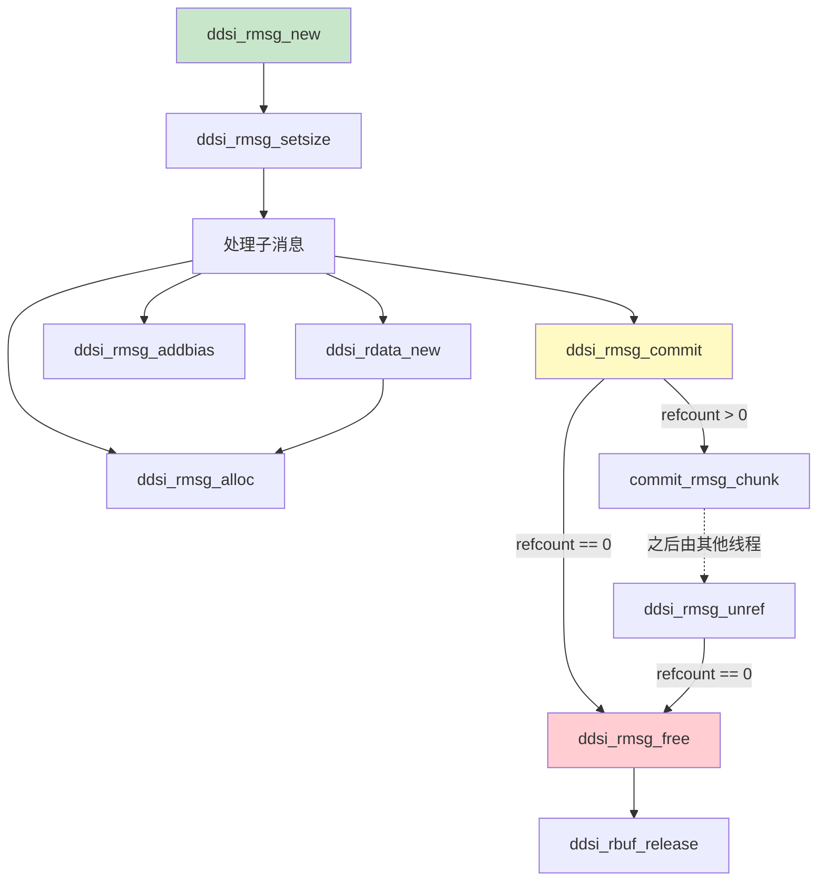
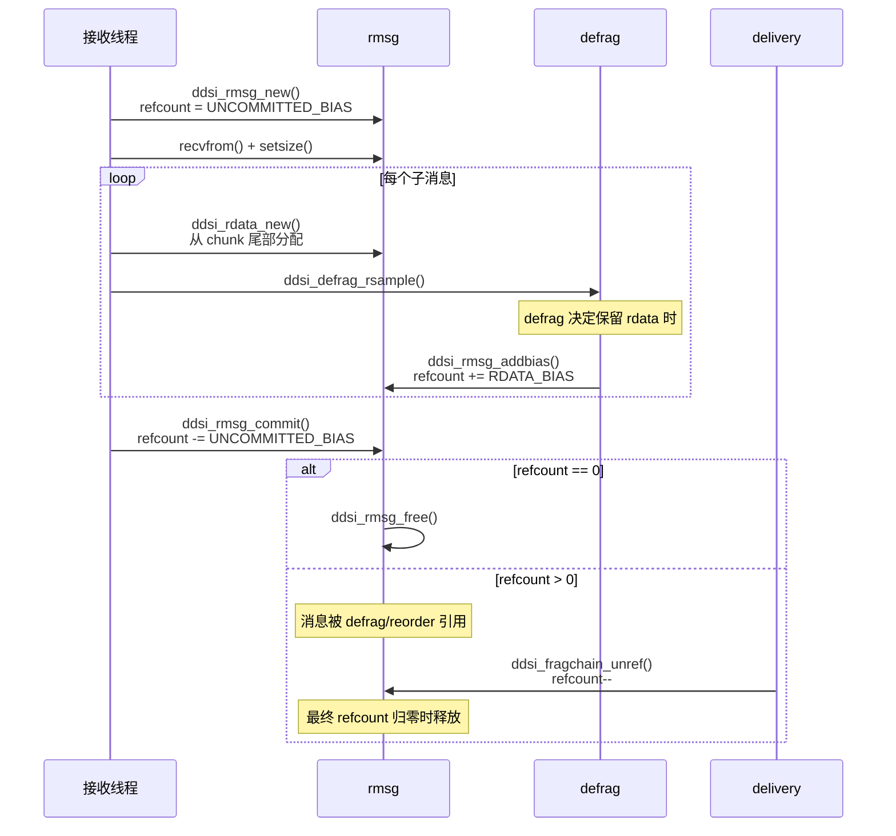
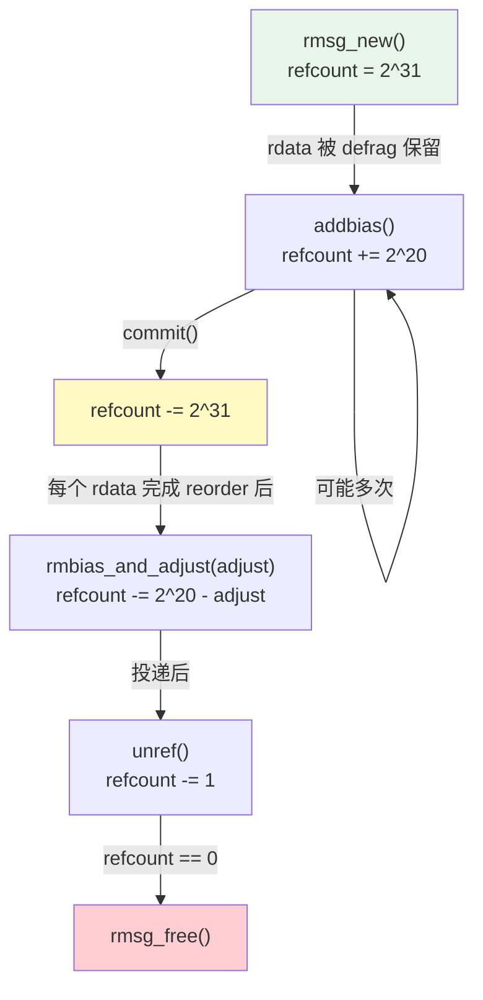

# rmsg 与 rdata：消息结构与引用计数

## 1. 模块概述

rmsg 和 rdata 构成了 rbuf 内存模型的**中间层**，是连接底层存储（[rbufpool/rbuf](./01-rbufpool-rbuf.md#struct-ddsi_rbufpool)）与上层处理（[defrag](./03-defrag.md#struct-ddsi_defrag)/[reorder](./04-reorder.md#struct-ddsi_reorder)）的桥梁。

- **rmsg（receive message）**：代表一条接收到的 UDP 数据包及其所有派生数据
- **rmsg_chunk**：rmsg 的内存块，可动态链接多个
- **rdata（receive data）**：代表一个 Data/DataFrag 子消息的描述符

本模块最精巧的设计是**偏置引用计数机制**（biased refcount），它通过两级偏置实现了高效的延迟引用计数调整。

## 2. API Signatures

```c
// === rmsg 接口 ===
// 从 rbufpool 分配一条新消息
struct ddsi_rmsg *ddsi_rmsg_new (struct ddsi_rbufpool *rbufpool);

// 设置消息有效载荷大小（recvfrom 后调用）
void ddsi_rmsg_setsize (struct ddsi_rmsg *rmsg, uint32_t size);

// 提交消息：若无外部引用则立即释放
void ddsi_rmsg_commit (struct ddsi_rmsg *rmsg);

// 释放消息（refcount 归零时调用）
void ddsi_rmsg_free (struct ddsi_rmsg *rmsg);

// 从消息中分配额外内存（用于 rdata/sampleinfo/rsample 等）
void *ddsi_rmsg_alloc (struct ddsi_rmsg *rmsg, uint32_t size);

// === rmsg 内部引用计数操作（static 函数）===
// 为 rdata 添加 BIAS（defrag 决定保留 rdata 时调用）
static void ddsi_rmsg_addbias (struct ddsi_rmsg *rmsg);

// 移除 BIAS 并调整引用计数
static void ddsi_rmsg_rmbias_and_adjust (struct ddsi_rmsg *rmsg, int adjust);

// 减少一个引用
static void ddsi_rmsg_unref (struct ddsi_rmsg *rmsg);

// === rdata 接口 ===
// 创建子消息描述符
struct ddsi_rdata *ddsi_rdata_new (struct ddsi_rmsg *rmsg, uint32_t start,
    uint32_t endp1, uint32_t submsg_offset,
    uint32_t payload_offset, uint32_t keyhash_offset);

// 创建 gap 类型的 rdata
struct ddsi_rdata *ddsi_rdata_newgap (struct ddsi_rmsg *rmsg);

// 调整 fragment chain 的引用计数
void ddsi_fragchain_adjust_refcount (struct ddsi_rdata *frag, int adjust);

// 释放 fragment chain
void ddsi_fragchain_unref (struct ddsi_rdata *frag);

// === rdata 内部引用计数操作（static 函数）===
static void ddsi_rdata_addbias (struct ddsi_rdata *rdata);
static void ddsi_rdata_rmbias_and_adjust (struct ddsi_rdata *rdata, int adjust);
static void ddsi_rdata_unref (struct ddsi_rdata *rdata);

// === chunk 内部操作 ===
static void init_rmsg_chunk (struct ddsi_rmsg_chunk *chunk, struct ddsi_rbuf *rbuf);
static void commit_rmsg_chunk (struct ddsi_rmsg_chunk *chunk);
```

## 3. 多层次代码展示

### 3.1 rmsg 生命周期调用关系



### 3.2 rmsg 生命周期时序图



### 3.3 关键代码：ddsi_rmsg_new

```c
struct ddsi_rmsg *ddsi_rmsg_new (struct ddsi_rbufpool *rbp)
{
  struct ddsi_rmsg *rmsg;

  rmsg = ddsi_rbuf_alloc (rbp);       // 从 rbuf 分配（不推进 freeptr）
  if (rmsg == NULL) return NULL;

  // 初始引用计数 = UNCOMMITTED_BIAS (2^31)
  ddsrt_atomic_st32 (&rmsg->refcount, RMSG_REFCOUNT_UNCOMMITTED_BIAS);
  // 初始化内嵌的第一个 chunk
  init_rmsg_chunk (&rmsg->chunk, rbp->current);
  rmsg->trace = rbp->trace;
  rmsg->lastchunk = &rmsg->chunk;
  // 注意：freeptr 的推进延迟到 commit()
  return rmsg;
}
```

> 📍 源码：[ddsi_radmin.c:528-548](../../source/cyclonedds/src/core/ddsi/src/ddsi_radmin.c#L528)

### 3.4 关键代码：ddsi_rmsg_alloc（动态 chunk 链接）

当单个 chunk 空间不足时，`ddsi_rmsg_alloc` 会分配新 chunk 并链接：

```c
void *ddsi_rmsg_alloc (struct ddsi_rmsg *rmsg, uint32_t size)
{
  struct ddsi_rmsg_chunk *chunk = rmsg->lastchunk;
  uint32_t size8P = align_rmsg (size);

  if (chunk->u.size + size8P > chunk->rbuf->max_rmsg_size)
  {
    // 当前 chunk 空间不足，分配新 chunk
    commit_rmsg_chunk (chunk);            // 推进旧 chunk 的 freeptr
    newchunk = ddsi_rbuf_alloc (rbp);     // 从 rbufpool 分配新内存
    init_rmsg_chunk (newchunk, rbp->current);
    rmsg->lastchunk = chunk->next = newchunk;  // 链接到 chunk 链表
    chunk = newchunk;
  }

  ptr = (unsigned char *)(chunk + 1) + chunk->u.size;  // chunk 头之后偏移
  chunk->u.size += size8P;                              // 推进 chunk 内偏移
  return ptr;
}
```

> 📍 源码：[ddsi_radmin.c:672-712](../../source/cyclonedds/src/core/ddsi/src/ddsi_radmin.c#L672)

## 4. 数据结构深度解析

### struct ddsi_rmsg_chunk

> 📍 源码：[ddsi_radmin.h:34-51](../../source/cyclonedds/src/core/ddsi/include/dds/ddsi/ddsi_radmin.h#L34)

```c
struct ddsi_rmsg_chunk {
  struct ddsi_rbuf *rbuf;           // 所属的 rbuf
  struct ddsi_rmsg_chunk *next;     // 下一个 chunk（链表）

  union {
    uint32_t size;                  // 已使用的 payload 大小
    int64_t l;                      // 对齐填充
    double d;
    void *p;
  } u;

  // unsigned char payload[] — 数据紧跟 chunk 头部之后
};
```

chunk 头后面紧跟着 payload 数据。`u.size` 初始为 0，在 `ddsi_rmsg_setsize` 中设置为 UDP 包实际大小，之后通过 `ddsi_rmsg_alloc` 持续递增。

### struct ddsi_rmsg

> 📍 源码：[ddsi_radmin.h:53-92](../../source/cyclonedds/src/core/ddsi/include/dds/ddsi/ddsi_radmin.h#L53)

```c
struct ddsi_rmsg {
  ddsrt_atomic_uint32_t refcount;   // 集中引用计数
  struct ddsi_rmsg_chunk *lastchunk; // chunk 链表的最后一个节点
  bool trace;                        // 跟踪日志开关
  struct ddsi_rmsg_chunk chunk;      // 内嵌的第一个 chunk
};
```

**内存布局关键宏：**

```c
#define DDSI_RMSG_PAYLOAD(m)        ((unsigned char *) (m + 1))
#define DDSI_RMSG_PAYLOADOFF(m, o)  (DDSI_RMSG_PAYLOAD(m) + (o))
```

`DDSI_RMSG_PAYLOAD(m)` 指向 `rmsg` 结构体之后的第一个字节，即 UDP 数据包的起始位置。由于 `rmsg` 末尾是内嵌的 `chunk`，而 `chunk` 末尾是 payload，所以 `rmsg + 1` 恰好指向 payload。

### struct ddsi_rdata

> 📍 源码：[ddsi_radmin.h:98-108](../../source/cyclonedds/src/core/ddsi/include/dds/ddsi/ddsi_radmin.h#L98)

```c
struct ddsi_rdata {
  struct ddsi_rmsg *rmsg;          // 所属的 rmsg（用于引用计数）
  struct ddsi_rdata *nextfrag;     // fragment chain 链表
  uint32_t min, maxp1;             // 片段字节偏移范围 [min, maxp1)
  uint16_t submsg_zoff;            // 子消息头部在包中的偏移
  uint16_t payload_zoff;           // 有效载荷在包中的偏移
  uint16_t keyhash_zoff;           // keyhash 在包中的偏移（0 表示无）
#ifndef NDEBUG
  ddsrt_atomic_uint32_t refcount_bias_added; // 调试：检测 bias 重复添加
#endif
};
```

**字段解析：**

| 字段 | 含义 | 关键点 |
|------|------|--------|
| `rmsg` | 反向指针 | rdata 不独立计数，而是通过 rmsg 的 refcount |
| `nextfrag` | 片段链 | 将同一消息的多个片段串联 |
| `min`, `maxp1` | 字节范围 | 半开区间 `[min, maxp1)`，完整消息为 `[0, size)` |
| `submsg_zoff` | 子消息偏移 | 使用 `_zoff` 后缀表示"可能为零的偏移" |
| `payload_zoff` | 载荷偏移 | 通过 `DDSI_RDATA_PAYLOAD_OFF` 宏转换 |

**偏移量宏**（[ddsi_radmin.h:120-129](../../source/cyclonedds/src/core/ddsi/include/dds/ddsi/ddsi_radmin.h#L120)）：

```c
#define DDSI_ZOFF_TO_OFF(zoff)  ((unsigned) (zoff))
#define DDSI_OFF_TO_ZOFF(off)   ((unsigned short) (off))
#define DDSI_RDATA_PAYLOAD_OFF(rdata)  DDSI_ZOFF_TO_OFF((rdata)->payload_zoff)
#define DDSI_RDATA_SUBMSG_OFF(rdata)   DDSI_ZOFF_TO_OFF((rdata)->submsg_zoff)
```

使用 16 位偏移量足够表示 64 KB UDP 包中的任何位置。注释中提到，如果需要极致压缩，可以利用 4 字节对齐将 16 位缩减到 14 位。

## 5. 关键算法剖析：偏置引用计数

这是整个 rbuf 内存模型中最精巧的机制。为了理解它，我们需要从问题出发。

### 5.1 问题背景

一条 rmsg 可能包含多个 rdata，每个 rdata 可能经过多个 reorder admin。引用计数需要正确反映所有外部引用。朴素做法是每次 defrag/reorder 保留 rdata 时加 1，释放时减 1。但问题是：

1. 处理消息时需要频繁检测"是否仍未提交"
2. 一个 rdata 可能同时进入 primary reorder 和多个 secondary reorder
3. 需要延迟调整引用计数直到所有 reorder admin 处理完毕

### 5.2 两级偏置设计

```c
#define RMSG_REFCOUNT_UNCOMMITTED_BIAS (1u << 31)  // 2^31
#define RMSG_REFCOUNT_RDATA_BIAS       (1u << 20)  // 2^20
```

| 偏置 | 值 | 用途 |
|------|-----|------|
| `UNCOMMITTED_BIAS` | $2^{31}$ | 标记消息尚未提交。commit 时减去此值 |
| `RDATA_BIAS` | $2^{20}$ | 每个 rdata 被 defrag 保留时增加，延迟到 reorder 处理完后调整 |

### 5.3 引用计数生命周期



**详细流程：**

1. `ddsi_rmsg_new`：设置 `refcount = UNCOMMITTED_BIAS (2^31)`
2. 处理每个子消息时，如果 defrag 决定保留：`addbias()` 增加 `RDATA_BIAS (2^20)`
3. `ddsi_rmsg_commit`：减去 `UNCOMMITTED_BIAS`
   - 若结果为 0：没有外部引用，立即释放
   - 若结果 > 0：有外部引用，推进 freeptr
4. 所有 reorder admin 处理完后：`rmbias_and_adjust(adjust)` 减去 `RDATA_BIAS - adjust`
   - `adjust` 是 reorder admin 接受该 rdata 的次数
   - 效果：`refcount -= RDATA_BIAS - adjust = -(2^20 - adjust)`
5. 投递完成后：`unref()` 减 1

### 5.4 为什么分两级？

**`UNCOMMITTED_BIAS` 的作用**：在调试模式下，任何对 refcount 的操作都可以通过检测最高位来验证消息是否已提交。已提交的消息不应再被分配内存或增加引用。

**`RDATA_BIAS` 的作用**：如果不用 BIAS，每个 reorder admin 接受 rdata 时都要立即增加 refcount（原子操作）。但一个 rdata 可能被 $N$ 个 reorder admin 处理——使用 BIAS 可以**先加一次 $2^{20}$，处理完后一次性调整为实际引用数**，将 $N$ 次原子操作减少为 2 次。

实际代码（[ddsi_radmin.c:649-662](../../source/cyclonedds/src/core/ddsi/src/ddsi_radmin.c#L649)）：

```c
static void ddsi_rmsg_rmbias_and_adjust (struct ddsi_rmsg *rmsg, int adjust)
{
  uint32_t sub;
  assert (adjust >= 0);
  assert ((uint32_t) adjust < RMSG_REFCOUNT_RDATA_BIAS);
  sub = RMSG_REFCOUNT_RDATA_BIAS - (uint32_t) adjust;
  // refcount -= (RDATA_BIAS - adjust) = refcount - 2^20 + adjust
  if (ddsrt_atomic_sub32_nv (&rmsg->refcount, sub) == 0)
    ddsi_rmsg_free (rmsg);
}
```

### 5.5 完整示例

假设一条 rmsg 包含 1 个 rdata，经过 1 个 primary reorder 和 2 个 secondary reorder：

| 步骤 | 操作 | refcount 变化 | refcount 值 |
|------|------|---------------|-------------|
| 1 | `rmsg_new` | $= 2^{31}$ | $2^{31}$ |
| 2 | `rdata_addbias` | $+2^{20}$ | $2^{31} + 2^{20}$ |
| 3 | `rmsg_commit` | $-2^{31}$ | $2^{20}$ |
| 4 | primary 接受 | adjust = 1 | |
| 5 | secondary #1 接受 | adjust = 2 | |
| 6 | secondary #2 接受 | adjust = 3 | |
| 7 | `rmbias_and_adjust(3)` | $-(2^{20} - 3)$ | $3$ |
| 8 | 投递给 reader #1 | $-1$ | $2$ |
| 9 | 投递给 reader #2 | $-1$ | $1$ |
| 10 | 投递给 reader #3 | $-1$ | $0$ → `free` |

## 6. 设计决策分析

### 6.1 集中引用计数 vs 分散引用计数

**选择**：所有 rdata 共享 rmsg 的引用计数，rdata 本身没有独立计数。

**优势**：
- 减少原子操作次数
- 简化内存管理：rmsg 释放时自动释放所有 rdata
- rdata 可以是"薄"描述符，仅存储偏移量

**代价**：
- 即使只有一个 rdata 被引用，整个 rmsg 的内存都不能释放
- 但考虑到 UDP 包通常在几毫秒内处理完成，这不是实际问题

### 6.2 动态 chunk 链接

当解码信息超过 128 KB 时，rmsg 可以链接新的 chunk。这是一个优雅的折中：

- **不需要预分配巨大缓冲区**来覆盖最坏情况
- **最坏情况理论上可达 64 KB 的管理数据**（源码注释：[ddsi_radmin.c:160-167](../../source/cyclonedds/src/core/ddsi/src/ddsi_radmin.c#L160)），但实际上极少发生
- 新 chunk 可能来自不同的 rbuf，这就是 [rbuf](./01-rbufpool-rbuf.md#struct-ddsi_rbuf) 按 chunk 而非 rmsg 计数的原因

### 6.3 payload 偏移使用 16 位

rdata 中的 `submsg_zoff`、`payload_zoff`、`keyhash_zoff` 使用 `uint16_t`。这足以覆盖 64 KB UDP 包中的任何位置。源码注释指出，由于所有有意义的偏移都是 4 字节对齐的，理论上 14 位就够了——额外的 2 位留作未来扩展。

## 7. 学习检查点

📝 **本章小结**
1. rmsg 代表一条 UDP 消息，所有派生数据（rdata, sampleinfo, rsample）都从中分配
2. rmsg_chunk 支持动态链接，一条消息可跨越多个 chunk
3. 偏置引用计数分为 `UNCOMMITTED_BIAS`（$2^{31}$）和 `RDATA_BIAS`（$2^{20}$）两级
4. rdata 是轻量描述符，通过偏移量引用 rmsg payload 中的数据
5. `ddsi_rmsg_alloc` 是内部分配器，用于在 rmsg 中追加分配管理数据

🤔 **思考题**
1. 在 `ddsi_rmsg_commit` 中，如果 `refcount - UNCOMMITTED_BIAS == 0`，消息被立即释放但 `freeptr` 未推进。这是否意味着下一次 `ddsi_rmsg_new` 会返回相同的地址？从 [ddsi_rbuf_alloc](./01-rbufpool-rbuf.md#struct-ddsi_rbuf) 的实现来看，这是如何工作的？
2. `ddsi_rmsg_alloc` 在分配新 chunk 时调用 `commit_rmsg_chunk(chunk)` 推进旧 chunk 的 freeptr。为什么此时需要推进——新 chunk 分配后旧 chunk 不应该还在使用吗？
3. 假设 `RDATA_BIAS = 2^20`，那么一个 rmsg 最多能支持多少个 rdata 同时被 defrag 保留？这个限制在实际中合理吗？
