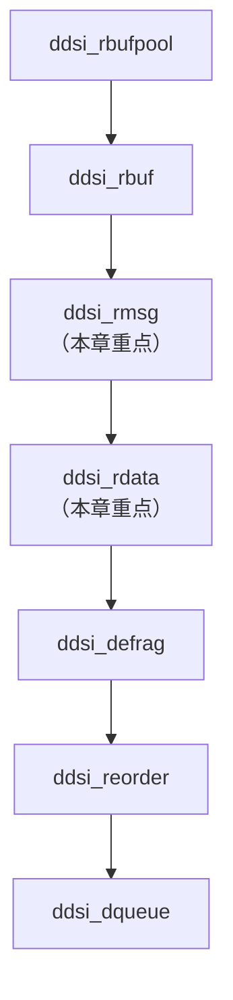
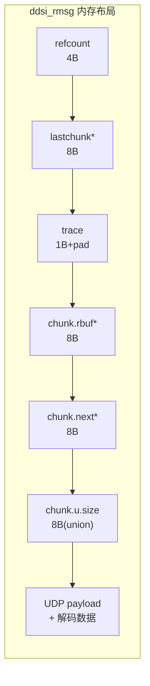
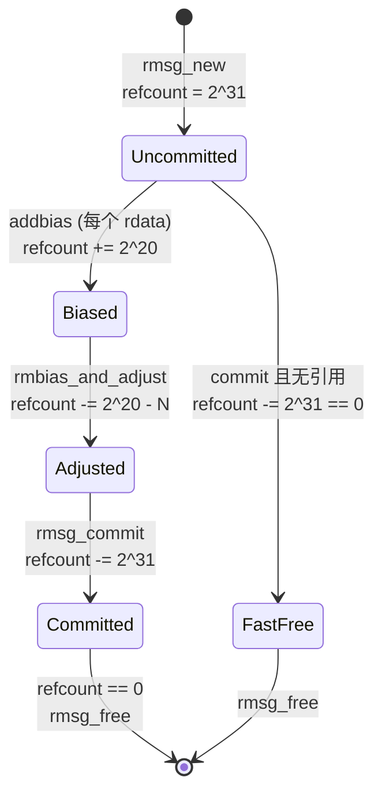
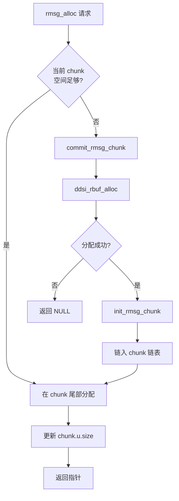
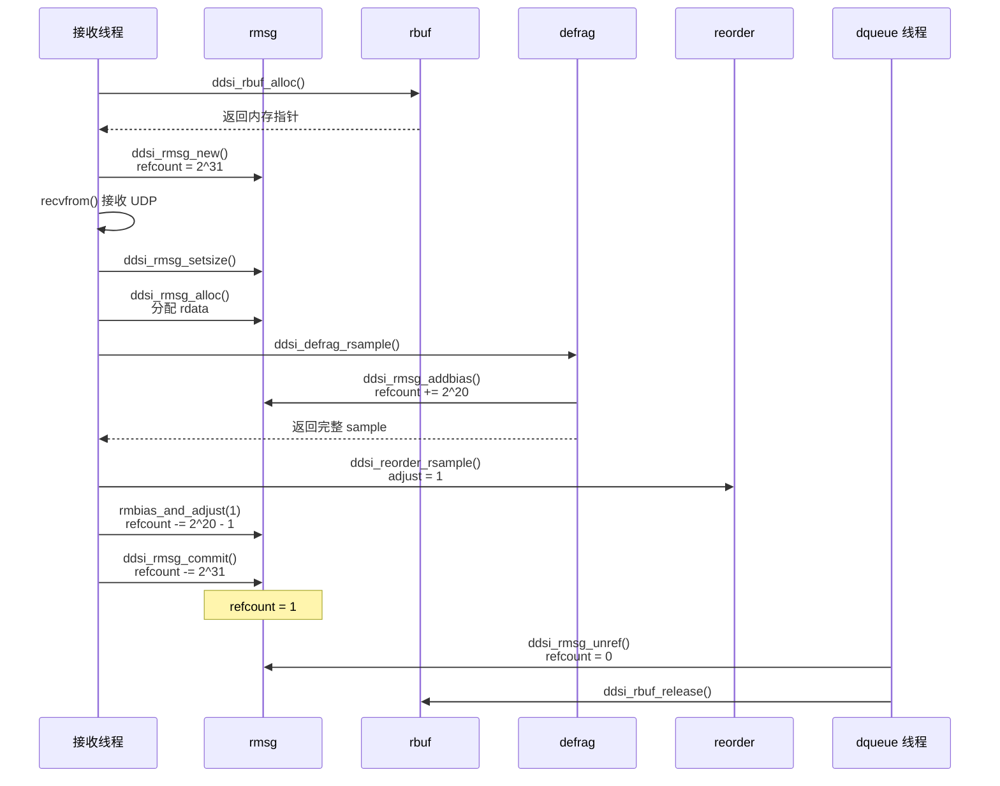

# 消息管理与引用计数：rmsg 与 rdata

## 1. 模块概述

### 1.1 职责定位

rmsg（receive message）与 rdata（receive data）是 rbuf 内存模型的第三、四层结构，承担以下核心职责：

- **rmsg**：表示一个完整的 UDP 数据包及其所有解码数据，管理包级别的引用计数和内存分配
- **rdata**：表示包内的一个 Data/DataFrag 子消息，以零拷贝偏移量引用 rmsg 中的原始数据

两者配合实现了一个关键设计目标：接收线程可以在处理消息的同时动态追加解码信息（defrag/reorder 索引结构），所有数据共享同一块连续内存，由 rmsg 的引用计数统一管理生命周期。

### 1.2 在系统中的位置

rmsg/rdata 位于缓冲池（rbufpool/rbuf）之上、分片重组（defrag）之下：



> **图 1** rmsg/rdata 在存储层级中的位置

### 1.3 对外接口一览

> **图 2** rmsg/rdata 模块核心函数

| 函数 | 位置 | 调用方 | 职责 |
|:--|:--|:--|:--|
| [ddsi_rmsg_new](../../src/cyclonedds/src/core/ddsi/src/ddsi_radmin.c#L528) | L528-548 | 接收线程 | 在 rbuf 上分配 rmsg |
| [ddsi_rmsg_setsize](../../src/cyclonedds/src/core/ddsi/src/ddsi_radmin.c#L550) | L550-564 | 接收线程 | 设置实际接收数据大小 |
| [ddsi_rmsg_alloc](../../src/cyclonedds/src/core/ddsi/src/ddsi_radmin.c#L672) | L672-712 | 接收线程 | 在 rmsg 后追加分配空间 |
| [ddsi_rmsg_commit](../../src/cyclonedds/src/core/ddsi/src/ddsi_radmin.c#L603) | L603-633 | 接收线程 | 提交消息，触发释放判断 |
| [ddsi_rdata_new](../../src/cyclonedds/src/core/ddsi/src/ddsi_radmin.c#L716) | L716-734 | 接收线程 | 分配 rdata，记录偏移量 |

## 2. 数据结构深度解析

### 2.1 ddsi_rmsg_chunk：链式扩展的基本单元

rmsg 可能需要的内存超过初始分配量（例如，一个 UDP 包触发了大量 defrag/reorder 索引结构的创建），此时通过 `ddsi_rmsg_chunk` 链表动态扩展。每个 chunk 代表 rbuf 中的一段连续内存。

> 📍 源码：[ddsi_radmin.h:34-51](../../src/cyclonedds/src/core/ddsi/include/dds/ddsi/ddsi_radmin.h#L34)

```c
struct ddsi_rmsg_chunk {
  struct ddsi_rbuf *rbuf;          // 所属 rbuf
  struct ddsi_rmsg_chunk *next;    // 下一个 chunk（链表）

  union {
    uint32_t size;                 // 已使用的 payload 字节数
    int64_t l;                     // 对齐占位
    double d;                      // 对齐占位
    void *p;                       // 对齐占位
  } u;

  // payload 紧跟 union 之后（柔性数组语义）
};
```

> **图 3** ddsi_rmsg_chunk 字段详解

| 字段 | 类型 | 含义 |
|:--|:--|:--|
| `rbuf` | [ddsi_rbuf](./01-rbufpool-rbuf.md#ddsi_rbuf)* | 该 chunk 所在的接收缓冲区 |
| `next` | `ddsi_rmsg_chunk`* | 链表指针，连接后续 chunk |
| `u.size` | `uint32_t` | 已分配的 payload 字节数（8 字节对齐后） |
| `u.l` / `u.d` / `u.p` | — | union 对齐成员，确保 payload 起始地址至少 8 字节对齐 |

**union 对齐设计**：`u` 使用 union 将 `size` 与 `int64_t`、`double`、`void*` 放在一起，目的是让整个 union 的大小达到 8 字节，从而保证紧跟其后的 payload 数据自然对齐到 8 字节边界。这对于后续在 payload 中存放各种结构体（`ddsi_rdata`、`ddsi_rsample_info` 等）至关重要。

**payload 位置计算**：由于 C99 不允许在嵌套结构中使用柔性数组成员，payload 的起始地址通过指针算术获得：

```c
// payload 起始 = chunk 结构体之后的第一个字节
void *payload_start = (unsigned char *)(chunk + 1);

// 当前可用位置 = payload 起始 + 已使用大小
void *current_pos = (unsigned char *)(chunk + 1) + chunk->u.size;
```

### 2.2 ddsi_rmsg：消息级管理核心

`ddsi_rmsg` 是 rmsg/rdata 模块的核心结构，代表一个接收到的 UDP 数据包及其全部附属数据。

> 📍 源码：[ddsi_radmin.h:53-93](../../src/cyclonedds/src/core/ddsi/include/dds/ddsi/ddsi_radmin.h#L53)

```c
struct ddsi_rmsg {
  ddsrt_atomic_uint32_t refcount;   // 双偏置原子引用计数
  struct ddsi_rmsg_chunk *lastchunk; // 指向最后一个 chunk
  bool trace;                       // 是否启用跟踪日志
  struct ddsi_rmsg_chunk chunk;     // 内联的第一个 chunk
};
```

> **图 4** ddsi_rmsg 字段详解

| 字段 | 类型 | 含义 |
|:--|:--|:--|
| `refcount` | `ddsrt_atomic_uint32_t` | 双偏置引用计数，追踪所有 rdata 的引用 |
| `lastchunk` | `ddsi_rmsg_chunk`* | 指向 chunk 链表的尾节点，加速追加分配 |
| `trace` | `bool` | 从 rbufpool 继承的日志开关 |
| `chunk` | `ddsi_rmsg_chunk` | 内联的首个 chunk，避免额外的指针跳转 |

**内联 chunk 设计**：rmsg 将第一个 chunk 直接嵌入自身结构体中，这意味着 rmsg header 和第一个 chunk 的 payload 在内存中是连续的。源码通过静态断言验证了这一布局：

> 📍 源码：[ddsi_radmin.h:93](../../src/cyclonedds/src/core/ddsi/include/dds/ddsi/ddsi_radmin.h#L93)

```c
DDSRT_STATIC_ASSERT(
  sizeof(struct ddsi_rmsg) ==
    offsetof(struct ddsi_rmsg, chunk) + sizeof(struct ddsi_rmsg_chunk)
);
```

此断言保证 `ddsi_rmsg` 的大小恰好等于其 header 部分加上内联 chunk 的大小，没有尾部填充。

**DDSI_RMSG_PAYLOAD 宏**：通过 `(m + 1)` 指针算术获取第一个 chunk 的 payload 起始地址：

> 📍 源码：[ddsi_radmin.h:94-95](../../src/cyclonedds/src/core/ddsi/include/dds/ddsi/ddsi_radmin.h#L94)

```c
#define DDSI_RMSG_PAYLOAD(m)       ((unsigned char *) (m + 1))
#define DDSI_RMSG_PAYLOADOFF(m, o) (DDSI_RMSG_PAYLOAD(m) + (o))
```

- `DDSI_RMSG_PAYLOAD(m)`：返回 rmsg 结构体之后第一个可用字节的地址，即 UDP 数据存放的起始位置
- `DDSI_RMSG_PAYLOADOFF(m, o)`：返回 payload 中偏移 `o` 处的地址，用于定位子消息和载荷

**rmsg 完整内存布局**：



> **图 5** ddsi_rmsg 在 rbuf 中的内存布局——结构体 header 与首个 chunk 的 payload 连续存放

### 2.3 ddsi_rdata：零拷贝子消息描述

`ddsi_rdata` 描述一个 Data/DataFrag 子消息在 rmsg 中的位置。它不拥有数据，仅通过偏移量指向 rmsg payload 中的相应区域。

> 📍 源码：[ddsi_radmin.h:98-108](../../src/cyclonedds/src/core/ddsi/include/dds/ddsi/ddsi_radmin.h#L98)

```c
struct ddsi_rdata {
  struct ddsi_rmsg *rmsg;              // 所属 rmsg（引用计数目标）
  struct ddsi_rdata *nextfrag;         // 分片链（defrag 使用）
  uint32_t min, maxp1;                // 分片字节范围 [min, maxp1)
  uint16_t submsg_zoff;               // 子消息头偏移（从包起始）
  uint16_t payload_zoff;              // 载荷偏移（从包起始）
  uint16_t keyhash_zoff;              // keyhash 偏移（0 表示无）
#ifndef NDEBUG
  ddsrt_atomic_uint32_t refcount_bias_added; // debug：偏置添加计数
#endif
};
```

> **图 6** ddsi_rdata 字段详解

| 字段 | 类型 | 含义 |
|:--|:--|:--|
| `rmsg` | `ddsi_rmsg`* | 所属的消息，rdata 的生命周期由此 rmsg 的 refcount 管理 |
| `nextfrag` | `ddsi_rdata`* | 分片链表指针，defrag 用于连接同一 sample 的多个分片 |
| `min` | `uint32_t` | 本分片覆盖的起始字节偏移 |
| `maxp1` | `uint32_t` | 本分片覆盖的结束字节偏移（不含），范围为 $[\text{min}, \text{maxp1})$ |
| `submsg_zoff` | `uint16_t` | 子消息头相对 UDP 包起始的偏移（零基偏移） |
| `payload_zoff` | `uint16_t` | 载荷数据相对 UDP 包起始的偏移 |
| `keyhash_zoff` | `uint16_t` | keyhash 相对 UDP 包起始的偏移，0 表示无 keyhash |
| `refcount_bias_added` | `ddsrt_atomic_uint32_t` | 仅 debug 模式，确保每个 rdata 只被加偏置一次 |

**零偏移量（zoff）设计**：

rdata 使用 `uint16_t` 类型的偏移量而非指针，这一设计有三个考量：

1. **空间效率**：RTPS 包最大 64KB，所有关心的偏移量（子消息头、载荷、keyhash）都在 4 字节对齐的位置上且不超过 $2^{16}$ 字节，因此 16 位足够表示
2. **零拷贝语义**：偏移量相对于 rmsg payload 起始计算，通过 `DDSI_RMSG_PAYLOADOFF(rmsg, off)` 即可获取绝对地址，无需拷贝数据
3. **可扩展性**：源码注释指出，技术上只需 14 位（$2^{14}$ 覆盖 64KB 范围的 4 字节对齐偏移），留有 2 位余量

> 📍 源码：[ddsi_radmin.h:110-129](../../src/cyclonedds/src/core/ddsi/include/dds/ddsi/ddsi_radmin.h#L110)

偏移量的转换通过以下宏完成：

```c
#define DDSI_ZOFF_TO_OFF(zoff) ((unsigned)(zoff))        // zoff -> 实际偏移
#define DDSI_OFF_TO_ZOFF(off)  ((unsigned short)(off))   // 实际偏移 -> zoff
#define DDSI_RDATA_PAYLOAD_OFF(rdata) DDSI_ZOFF_TO_OFF((rdata)->payload_zoff)
#define DDSI_RDATA_SUBMSG_OFF(rdata)  DDSI_ZOFF_TO_OFF((rdata)->submsg_zoff)
#define DDSI_RDATA_KEYHASH_OFF(rdata) DDSI_ZOFF_TO_OFF((rdata)->keyhash_zoff)
```

在 debug 模式下，`DDSI_OFF_TO_ZOFF` 还会 assert 检查偏移不超过 65536。

## 3. 双偏置引用计数机制

### 3.1 设计动机

rmsg 的引用计数需要应对一个复杂场景：接收线程在同步处理一个 UDP 包时，会为其中的多个子消息创建 rdata，每个 rdata 可能被多个 reorder admin 引用。如果在每次 reorder 操作时都立即更新 rmsg 的原子 refcount，会造成大量不必要的原子操作。

双偏置设计的核心思想是 **延迟记账**（deferred accounting）：

- 同步处理期间，用偏置标记"正在处理"和"待结算"状态
- 处理完所有 reorder admin 后，一次性结算实际引用数
- 提交（commit）时，一次性移除"正在处理"标记

### 3.2 两个偏置常量

> 📍 源码：[ddsi_radmin.c:483-484](../../src/cyclonedds/src/core/ddsi/src/ddsi_radmin.c#L483)

```c
#define RMSG_REFCOUNT_UNCOMMITTED_BIAS (1u << 31)  // 2^31 = 2147483648
#define RMSG_REFCOUNT_RDATA_BIAS       (1u << 20)  // 2^20 = 1048576
```

> **图 7** 双偏置引用计数的位域划分

| 偏置 | 值 | 位域 | 用途 |
|:--|:--|:--|:--|
| `UNCOMMITTED_BIAS` | $2^{31}$ | bit 31 | 标记消息尚未提交，用于安全检查 |
| `RDATA_BIAS` | $2^{20}$ | bit 20 | 每个 rdata 离开 defrag 时加此偏置，延迟实际引用计数结算 |

**容量分析**：

- 一个 64KB 的 UDP 包，最小子消息 32 字节，最多产生 $\frac{2^{16}}{32} = 2^{11} = 2048$ 个 rdata
- 每个 rdata 占用 $2^{20}$ 的偏置空间，$2048 \times 2^{20} = 2^{31}$，恰好不超过 `UNCOMMITTED_BIAS` 的位域
- 低 20 位用于实际引用计数，最多支持 $2^{20} \approx 100$ 万个并发引用（即 100 万个 out-of-sync reader）
- bit 31 = 1 表示未提交，bit 20 到 bit 30 区域给 rdata 偏置使用

### 3.3 refcount 状态转换

下图展示 refcount 在 rmsg 生命周期中的变化过程：



> **图 8** rmsg 引用计数状态转换——从创建到释放的完整路径

**具体数值示例**：假设一个 UDP 包包含 2 个 Data 子消息，生成 2 个 rdata，处理后被 1 个 reorder admin 各引用 1 次：

$$
\begin{aligned}
&\text{rmsg\_new:} &\quad refcount &= 2^{31} \\
&\text{addbias} \times 2: &\quad refcount &= 2^{31} + 2 \times 2^{20} \\
&\text{rmbias\_and\_adjust(1)} \times 2: &\quad refcount &= 2^{31} + 2 \times 2^{20} - 2 \times (2^{20} - 1) = 2^{31} + 2 \\
&\text{rmsg\_commit:} &\quad refcount &= 2^{31} + 2 - 2^{31} = 2 \\
&\text{unref} \times 2: &\quad refcount &= 0 \implies \text{free}
\end{aligned}
$$

### 3.4 设计决策分析：为什么用双偏置？

**问题**：为什么不用简单的引用计数（每个 rdata 被引用时 +1，释放时 -1）？

**答案**：在实际的接收路径中，一个 rdata 可能需要被送入多个 reorder admin（主 reorder 加上每个 out-of-sync reader 的 reorder）。如果每次 reorder 操作都立即更新 rmsg 的 refcount，会产生以下问题：

1. **原子操作开销**：每次 reorder 接受/拒绝 rdata 都要做一次原子加减，对于 N 个 reader 就是 N 次原子操作
2. **中间状态危险**：假设 rdata 先被 reorder-A 接受（refcount +1），再被 reorder-B 处理时，reorder-B 可能在处理过程中发现需要先投递之前缓存的 sample，这会在另一个线程触发 unref。此时 refcount 的中间状态可能导致 rmsg 被提前释放

双偏置的解决方案：

- **RDATA_BIAS** 充当"押金"，defrag 接受 rdata 后一次性加 $2^{20}$，保证在所有 reorder admin 处理完之前 refcount 不会归零
- 所有 reorder admin 处理完后，调用 `rmbias_and_adjust` 一次性结算：减去 $2^{20}$ 押金，加上实际引用数 N。这只需要一次原子操作：`atomic_sub(2^{20} - N)`
- **UNCOMMITTED_BIAS** 保证在接收线程同步处理期间，refcount 始终不为零，commit 时才移除

## 4. 关键函数剖析

### 4.1 ddsi_rmsg_new：消息分配

> 📍 源码：[ddsi_radmin.c:528-548](../../src/cyclonedds/src/core/ddsi/src/ddsi_radmin.c#L528)

```c
struct ddsi_rmsg *ddsi_rmsg_new (struct ddsi_rbufpool *rbp)
{
  struct ddsi_rmsg *rmsg;
  rmsg = ddsi_rbuf_alloc(rbp);     // 从 rbuf 顺序分配
  if (rmsg == NULL)
    return NULL;

  // 初始 refcount = UNCOMMITTED_BIAS (2^31)
  ddsrt_atomic_st32(&rmsg->refcount, RMSG_REFCOUNT_UNCOMMITTED_BIAS);
  init_rmsg_chunk(&rmsg->chunk, rbp->current);  // 初始化内联 chunk
  rmsg->trace = rbp->trace;
  rmsg->lastchunk = &rmsg->chunk;
  // 注意：freeptr 不在此处推进，而在 commit() 中
  return rmsg;
}
```

**关键设计点**：

- `ddsi_rbuf_alloc` 在当前 rbuf 的 `freeptr` 位置分配 `max_rmsg_size_w_hdr` 字节的空间
- 此时 `freeptr` **不推进**——如果消息最终被 commit 时发现无引用，可以原地复用，无需更新 freeptr
- `init_rmsg_chunk` 将内联 chunk 的 `size` 设为 0、`next` 设为 NULL，并原子递增所属 rbuf 的 `n_live_rmsg_chunks`

### 4.2 ddsi_rmsg_setsize：设置实际数据大小

> 📍 源码：[ddsi_radmin.c:550-564](../../src/cyclonedds/src/core/ddsi/src/ddsi_radmin.c#L550)

```c
void ddsi_rmsg_setsize (struct ddsi_rmsg *rmsg, uint32_t size)
{
  uint32_t size8P = align_rmsg(size);  // 向上对齐到 DDSI_ALIGNOF_RMSG
  ASSERT_RBUFPOOL_OWNER(rmsg->chunk.rbuf->rbufpool);
  ASSERT_RMSG_UNCOMMITTED(rmsg);
  assert(ddsrt_atomic_ld32(&rmsg->refcount) == RMSG_REFCOUNT_UNCOMMITTED_BIAS);
  assert(rmsg->chunk.u.size == 0);               // 只能设置一次
  assert(size8P <= rmsg->chunk.rbuf->max_rmsg_size);
  assert(rmsg->lastchunk == &rmsg->chunk);        // 只能在首 chunk
  rmsg->chunk.u.size = size8P;
}
```

**要点**：

- 将实际接收的 UDP 包大小向上对齐到 `DDSI_ALIGNOF_RMSG`（至少 8 字节），确保后续在此 chunk 中追加分配的数据对齐
- 多重 assert 检查保证此时处于正确状态：未提交、首次设置、未超过最大值、仍在首 chunk
- `align_rmsg` 函数通过简单的向上取整实现：`x = (x + ALIGN - 1) - (x + ALIGN - 1) % ALIGN`

> 📍 源码：[ddsi_radmin.c:300-305](../../src/cyclonedds/src/core/ddsi/src/ddsi_radmin.c#L300)（`align_rmsg` 函数）

### 4.3 ddsi_rmsg_alloc：chunk 链式扩展

这是 rmsg 内存管理的核心函数，用于在处理消息过程中追加分配空间（存放 rdata、rsample_info、defrag/reorder 索引等）。当当前 chunk 空间不足时，会自动分配新的 chunk。

> 📍 源码：[ddsi_radmin.c:672-712](../../src/cyclonedds/src/core/ddsi/src/ddsi_radmin.c#L672)

```c
void *ddsi_rmsg_alloc (struct ddsi_rmsg *rmsg, uint32_t size)
{
  struct ddsi_rmsg_chunk *chunk = rmsg->lastchunk;
  struct ddsi_rbuf *rbuf = chunk->rbuf;
  uint32_t size8P = align_rmsg(size);

  if (chunk->u.size + size8P > rbuf->max_rmsg_size)
  {
    // 当前 chunk 放不下 -> 提交当前 chunk 并分配新 chunk
    struct ddsi_rbufpool *rbp = rbuf->rbufpool;
    struct ddsi_rmsg_chunk *newchunk;
    commit_rmsg_chunk(chunk);            // 推进 rbuf->freeptr
    newchunk = ddsi_rbuf_alloc(rbp);     // 从 rbuf 分配新 chunk
    if (newchunk == NULL)
      return NULL;                       // 内存不足，放弃
    init_rmsg_chunk(newchunk, rbp->current);
    rmsg->lastchunk = chunk->next = newchunk;  // 链入链表
    chunk = newchunk;
  }

  void *ptr = (unsigned char *)(chunk + 1) + chunk->u.size;
  chunk->u.size += size8P;
  return ptr;
}
```

**chunk 扩展流程**：



> **图 9** ddsi_rmsg_alloc 的 chunk 扩展流程

**关键细节**：

- `commit_rmsg_chunk` 推进旧 chunk 所在 rbuf 的 `freeptr`，使其不会被后续的 `ddsi_rmsg_new` 覆盖
- 新 chunk 可能分配在不同的 rbuf 上（如果当前 rbuf 空间不足，`ddsi_rbuf_alloc` 会创建新的 rbuf）
- 新 chunk 的 `rbuf` 指针指向分配它的 rbuf，释放时会递减该 rbuf 的 `n_live_rmsg_chunks`
- `rmsg->lastchunk` 始终指向链表尾部，保证 O(1) 追加

### 4.4 ddsi_rmsg_commit：提交与快速释放

commit 是 rmsg 生命周期的关键转折点——移除未提交偏置，决定消息是保留还是立即释放。

> 📍 源码：[ddsi_radmin.c:603-633](../../src/cyclonedds/src/core/ddsi/src/ddsi_radmin.c#L603)

```c
void ddsi_rmsg_commit (struct ddsi_rmsg *rmsg)
{
  struct ddsi_rmsg_chunk *chunk = rmsg->lastchunk;
  ASSERT_RBUFPOOL_OWNER(chunk->rbuf->rbufpool);
  ASSERT_RMSG_UNCOMMITTED(rmsg);

  if (ddsrt_atomic_sub32_nv(&rmsg->refcount,
                             RMSG_REFCOUNT_UNCOMMITTED_BIAS) == 0)
    ddsi_rmsg_free(rmsg);              // 快速路径：无引用，直接释放
  else
  {
    // 慢速路径：有引用，推进 freeptr 保护内存
    commit_rmsg_chunk(chunk);
  }
}
```

**两条路径**：

| 路径 | 条件 | 行为 | 典型场景 |
|:--|:--|:--|:--|
| 快速释放 | `refcount - UNCOMMITTED_BIAS == 0` | 调用 `ddsi_rmsg_free`，不推进 `freeptr` | 无效包、无需异步处理的包 |
| 保留内存 | `refcount - UNCOMMITTED_BIAS > 0` | 调用 `commit_rmsg_chunk` 推进 `freeptr` | rdata 被 defrag/reorder 持有 |

**快速释放路径的意义**：如果消息中没有任何 rdata 需要异步处理（例如包无效、或所有 rdata 在同步阶段就已处理完毕），rmsg 的 refcount 在 commit 时恰好为 $2^{31}$。减去 $2^{31}$ 后为 0，直接释放。由于 `freeptr` 未被推进，下一次 `ddsi_rmsg_new` 会在相同位置分配——实现了内存的原地复用，零开销。

### 4.5 ddsi_rmsg_free：遍历 chunk 链释放

> 📍 源码：[ddsi_radmin.c:566-594](../../src/cyclonedds/src/core/ddsi/src/ddsi_radmin.c#L566)

```c
void ddsi_rmsg_free (struct ddsi_rmsg *rmsg)
{
  struct ddsi_rmsg_chunk *c;
  assert(ddsrt_atomic_ld32(&rmsg->refcount) == 0);
  c = &rmsg->chunk;
  while (c)
  {
    struct ddsi_rbuf *rbuf = c->rbuf;
    struct ddsi_rmsg_chunk *c1 = c->next;
    ddsi_rbuf_release(rbuf);   // 递减 rbuf 的 n_live_rmsg_chunks
    c = c1;
  }
}
```

**要点**：

- 遍历从首个内联 chunk 开始的整个链表
- 对每个 chunk 调用 `ddsi_rbuf_release`，原子递减对应 rbuf 的 `n_live_rmsg_chunks`
- 当 rbuf 的 `n_live_rmsg_chunks` 降至 0 且该 rbuf 不是 rbufpool 的当前 rbuf 时，整个 rbuf 可被释放
- 不同 chunk 可能属于不同的 rbuf，因此一次 free 可能触发多个 rbuf 的释放

### 4.6 ddsi_rmsg_addbias 与 ddsi_rmsg_rmbias_and_adjust

这两个函数是双偏置机制的执行者，配合工作实现延迟记账。

**addbias**：当 defrag 决定保留一个 rdata 时调用，为 rmsg 加上 `RDATA_BIAS`。

> 📍 源码：[ddsi_radmin.c:635-647](../../src/cyclonedds/src/core/ddsi/src/ddsi_radmin.c#L635)

```c
static void ddsi_rmsg_addbias (struct ddsi_rmsg *rmsg)
{
  ASSERT_RBUFPOOL_OWNER(rmsg->chunk.rbuf->rbufpool);
  ASSERT_RMSG_UNCOMMITTED(rmsg);
  ddsrt_atomic_add32(&rmsg->refcount, RMSG_REFCOUNT_RDATA_BIAS);
}
```

**约束**：只有拥有 rbufpool 的接收线程可以调用，且 rmsg 必须处于未提交状态。虽然其他线程可能已经被触发（例如投递线程），但增加操作是原子的，所以安全。

**rmbias_and_adjust**：所有 reorder admin 处理完一个 rdata 后调用，移除偏置并加上实际引用数。

> 📍 源码：[ddsi_radmin.c:649-662](../../src/cyclonedds/src/core/ddsi/src/ddsi_radmin.c#L649)

```c
static void ddsi_rmsg_rmbias_and_adjust (struct ddsi_rmsg *rmsg, int adjust)
{
  assert(adjust >= 0);
  assert((uint32_t)adjust < RMSG_REFCOUNT_RDATA_BIAS);
  uint32_t sub = RMSG_REFCOUNT_RDATA_BIAS - (uint32_t)adjust;
  if (ddsrt_atomic_sub32_nv(&rmsg->refcount, sub) == 0)
    ddsi_rmsg_free(rmsg);
}
```

**计算逻辑**：需要从 refcount 中减去 `RDATA_BIAS`（移除押金），加上 `adjust`（实际引用数）。合并为一次原子操作：`sub = RDATA_BIAS - adjust`，然后 `atomic_sub(sub)`。这等价于 `refcount = refcount - RDATA_BIAS + adjust`。

### 4.7 ddsi_rmsg_unref：简单引用释放

> 📍 源码：[ddsi_radmin.c:664-670](../../src/cyclonedds/src/core/ddsi/src/ddsi_radmin.c#L664)

```c
static void ddsi_rmsg_unref (struct ddsi_rmsg *rmsg)
{
  assert(ddsrt_atomic_ld32(&rmsg->refcount) > 0);
  if (ddsrt_atomic_dec32_ov(&rmsg->refcount) == 1)
    ddsi_rmsg_free(rmsg);
}
```

这是最简单的引用计数操作：原子递减，如果原值为 1（即递减后为 0），则释放。用于投递完成后释放 rdata 对 rmsg 的引用。

注意 `ddsrt_atomic_dec32_ov` 返回的是 **递减前** 的旧值（ov = old value），所以判断条件是 `== 1`。

### 4.8 ddsi_rdata_new：分配 rdata

> 📍 源码：[ddsi_radmin.c:716-734](../../src/cyclonedds/src/core/ddsi/src/ddsi_radmin.c#L716)

```c
struct ddsi_rdata *ddsi_rdata_new (
  struct ddsi_rmsg *rmsg,
  uint32_t start, uint32_t endp1,
  uint32_t submsg_offset, uint32_t payload_offset,
  uint32_t keyhash_offset)
{
  struct ddsi_rdata *d;
  if ((d = ddsi_rmsg_alloc(rmsg, sizeof(*d))) == NULL)
    return NULL;
  d->rmsg = rmsg;
  d->nextfrag = NULL;
  d->min = start;
  d->maxp1 = endp1;
  d->submsg_zoff = (uint16_t)DDSI_OFF_TO_ZOFF(submsg_offset);
  d->payload_zoff = (uint16_t)DDSI_OFF_TO_ZOFF(payload_offset);
  d->keyhash_zoff = (uint16_t)DDSI_OFF_TO_ZOFF(keyhash_offset);
#ifndef NDEBUG
  ddsrt_atomic_st32(&d->refcount_bias_added, 0);
#endif
  return d;
}
```

**关键要点**：

- rdata 通过 `ddsi_rmsg_alloc` 在 rmsg 的 chunk 中分配，与 UDP 数据在同一连续内存区域
- 不增加 rmsg 的 refcount——只有当 defrag 决定保留该 rdata 时才会通过 `ddsi_rdata_addbias` 增加
- `start` 和 `endp1` 定义分片的字节范围 $[\text{start}, \text{endp1})$
- 偏移量通过 `DDSI_OFF_TO_ZOFF` 从 `uint32_t` 压缩到 `uint16_t`
- debug 模式下 `refcount_bias_added` 初始化为 0，用于检测重复加偏置

### 4.9 rdata 的偏置代理函数

rdata 层面的偏置操作都是对 rmsg 操作的简单代理，加上 debug 模式的安全检查：

> 📍 源码：[ddsi_radmin.c:736-764](../../src/cyclonedds/src/core/ddsi/src/ddsi_radmin.c#L736)

- `ddsi_rdata_addbias(rdata)`：检查 `refcount_bias_added` 不超过 1 次，然后调用 `ddsi_rmsg_addbias(rdata->rmsg)`
- `ddsi_rdata_rmbias_and_adjust(rdata, adjust)`：检查 `refcount_bias_added` 从 1 递减，然后调用 `ddsi_rmsg_rmbias_and_adjust(rdata->rmsg, adjust)`
- `ddsi_rdata_unref(rdata)`：直接调用 `ddsi_rmsg_unref(rdata->rmsg)`

这些代理函数确保了一个重要不变量：**每个 rdata 在其生命周期中只被加偏置一次、移除偏置一次**。

## 5. rmsg 生命周期完整追踪

### 5.1 生命周期时序图

以一个包含 1 个 Data 子消息的 UDP 包为例，追踪 rmsg 从创建到释放的完整路径：



> **图 10** rmsg 完整生命周期时序——从分配到释放

### 5.2 快速释放场景

当 UDP 包无效（格式错误、版本不匹配等）时，不会创建任何 rdata，refcount 始终为 $2^{31}$：

```c
// 无效包场景
rmsg = ddsi_rmsg_new(rbp);        // refcount = 2^31
ddsi_rmsg_setsize(rmsg, size);
// process() 发现包无效，不创建任何 rdata
ddsi_rmsg_commit(rmsg);           // 2^31 - 2^31 = 0 -> rmsg_free()
// freeptr 未推进，下次 rmsg_new 原地复用
```

这是最常见的高性能路径——大量无效或无需异步处理的包可以零开销地回收内存。

## 6. 设计决策总结

### 6.1 内联 chunk vs 外部 chunk

rmsg 将第一个 chunk 内联嵌入自身结构体，这一设计的权衡：

| 方面 | 内联 chunk | 独立分配 chunk |
|:--|:--|:--|
| 内存访问 | 结构体与 payload 连续，缓存友好 | 额外指针跳转 |
| 分配开销 | 一次分配同时获得 header 和首 chunk | 需要两次分配 |
| 代码复杂度 | 首 chunk 和后续 chunk 有细微区别 | 统一处理 |
| 实际影响 | 绝大多数 rmsg 只需一个 chunk | 极少需要扩展 |

结论：绝大多数场景下一个 chunk 就够（UDP 包 + 少量解码数据），内联设计消除了指针跳转和额外分配的开销。

### 6.2 偏置延迟记账 vs 即时更新

| 方面 | 双偏置延迟记账 | 即时引用计数 |
|:--|:--|:--|
| 原子操作次数 | 每个 rdata 固定 3 次（addbias、rmbias_and_adjust、unref） | 每次 reorder 接受/拒绝都要更新 |
| 正确性保证 | UNCOMMITTED_BIAS 防止提前释放 | 需要复杂的锁或屏障 |
| 多 reader 扩展性 | adjust 参数批量结算 | N 个 reader 需要 N 次原子操作 |
| 实现复杂度 | 偏置常量的位域规划需要仔细设计 | 逻辑简单但并发安全难保证 |

### 6.3 零偏移量 vs 绝对指针

| 方面 | `uint16_t` 零偏移量 | 绝对指针 |
|:--|:--|:--|
| 空间 | 每个偏移 2 字节，共 6 字节 | 每个指针 8 字节，共 24 字节 |
| 表示范围 | 64KB 足以覆盖最大 UDP 包 | 无限制 |
| 转换开销 | 需要 `DDSI_RMSG_PAYLOADOFF` 宏计算 | 直接解引用 |
| 可移动性 | 偏移量不依赖 rmsg 的绝对地址 | 指针在内存移动后失效 |

在网络协议场景中，数据包大小受 UDP 限制不超过 64KB，偏移量完全够用，且节省了 $3 \times 6 = 18$ 字节/rdata 的空间开销。

## 7. 学习检查点

### 7.1 本章小结

1. **ddsi_rmsg** 是消息级管理的核心，通过内联 chunk 实现连续内存布局，通过 chunk 链表支持动态扩展
2. **ddsi_rdata** 是零拷贝的子消息描述符，用 `uint16_t` 偏移量指向 rmsg payload 中的数据，不独立管理生命周期
3. **双偏置引用计数** 用 `UNCOMMITTED_BIAS`（$2^{31}$）标记同步处理阶段，用 `RDATA_BIAS`（$2^{20}$）实现延迟记账，将多次原子操作合并为单次结算
4. **快速释放路径** 是关键优化：无引用的 rmsg 在 commit 时直接释放且不推进 freeptr，实现零开销的内存原地复用
5. **chunk 链式扩展** 解决了最坏情况下的内存需求（大量分片、大量索引），同时保持常见场景的高效性

### 7.2 思考题

1. **如果去掉 `RMSG_REFCOUNT_UNCOMMITTED_BIAS`，只保留 `RDATA_BIAS`，会发生什么问题？**

   提示：考虑 commit 时如何判断是否可以释放，以及在 commit 之前 refcount 可能为 0 的场景。

2. **为什么 `ddsi_rmsg_new` 不立即推进 rbuf 的 `freeptr`，而是推迟到 commit？**

   提示：思考无效包的处理场景和内存复用效率。

3. **假设一个 rdata 需要被 100 个 out-of-sync reader 的 reorder admin 处理，双偏置机制相比即时更新节省了多少原子操作？**

   提示：对比两种方案中 addbias、reorder 处理、rmbias_and_adjust 的原子操作总次数。
