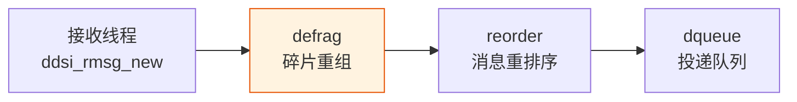
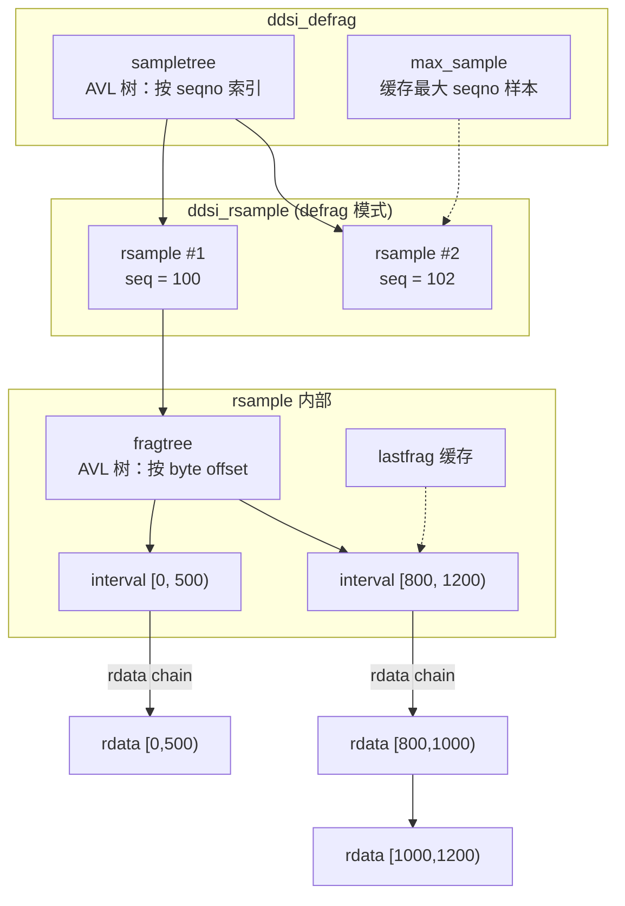
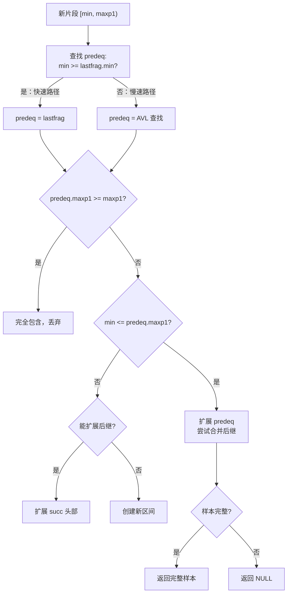

# defrag：碎片重组

## 1. 模块概述

defrag 模块负责将接收到的 RTPS 数据片段（DataFrag 子消息）重组为完整样本。在 DDS 中，当一条数据超过网络 MTU 时，发送方会将其拆分为多个片段，接收方需要将这些片段重新拼合。

defrag 位于接收管线的第二级：



每个 proxy writer 拥有一个独立的 defrag 实例。defrag 使用**区间树**（interval tree）来跟踪每个样本已收到的片段范围。当所有片段到齐时，样本被转换为 reorder 格式并传递给 [reorder](./04-reorder.md#struct-ddsi_reorder)。

## 2. API Signatures

```c
// 创建碎片重组器
struct ddsi_defrag *ddsi_defrag_new (const struct ddsrt_log_cfg *logcfg,
    enum ddsi_defrag_drop_mode drop_mode, uint32_t max_samples);

// 释放碎片重组器
void ddsi_defrag_free (struct ddsi_defrag *defrag);

// 核心：接收一个片段，返回完整样本（若已完成重组）
struct ddsi_rsample *ddsi_defrag_rsample (struct ddsi_defrag *defrag,
    struct ddsi_rdata *rdata, const struct ddsi_rsample_info *sampleinfo);

// 通知 gap/heartbeat：丢弃指定范围内的碎片
void ddsi_defrag_notegap (struct ddsi_defrag *defrag,
    ddsi_seqno_t min, ddsi_seqno_t maxp1);

// 生成 NACK bitmap（请求重传缺失片段）
enum ddsi_defrag_nackmap_result ddsi_defrag_nackmap (
    struct ddsi_defrag *defrag, ddsi_seqno_t seq, uint32_t maxfragnum,
    struct ddsi_fragment_number_set_header *map, uint32_t *mapbits,
    uint32_t maxsz);

// 按目标 GUID 前缀修剪碎片（用于安全通道）
void ddsi_defrag_prune (struct ddsi_defrag *defrag,
    ddsi_guid_prefix_t *dst, ddsi_seqno_t min);

// 获取统计信息（丢弃字节数）
void ddsi_defrag_stats (struct ddsi_defrag *defrag, uint64_t *discarded_bytes);

// === 片段链引用计数 ===
void ddsi_fragchain_adjust_refcount (struct ddsi_rdata *frag, int adjust);
void ddsi_fragchain_unref (struct ddsi_rdata *frag);

// === 内部函数 ===
// 尝试将片段与后继区间合并
static int defrag_try_merge_with_succ (const struct ddsi_defrag *defrag,
    struct ddsi_rsample_defrag *sample, struct ddsi_defrag_iv *node);

// 在区间树中添加新区间
static void defrag_rsample_addiv (struct ddsi_rsample_defrag *sample,
    struct ddsi_rdata *rdata, ddsrt_avl_ipath_t *path);

// 创建新样本节点
static struct ddsi_rsample *defrag_rsample_new (struct ddsi_rdata *rdata,
    const struct ddsi_rsample_info *sampleinfo);

// 向已有样本添加片段
static struct ddsi_rsample *defrag_add_fragment (struct ddsi_defrag *defrag,
    struct ddsi_rsample *sample, struct ddsi_rdata *rdata,
    const struct ddsi_rsample_info *sampleinfo);

// 检查样本是否完整
static int is_complete (const struct ddsi_rsample_defrag *sample);

// 将 defrag 格式转换为 reorder 格式
static void rsample_convert_defrag_to_reorder (struct ddsi_rsample *sample);

// 丢弃样本
static void defrag_rsample_drop (struct ddsi_defrag *defrag,
    struct ddsi_rsample *rsample);

// 限制样本数量
static int defrag_limit_samples (struct ddsi_defrag *defrag,
    ddsi_seqno_t seq, ddsi_seqno_t *max_seq);
```

## 3. 多层次代码展示

### 3.1 defrag 内部结构关系



### 3.2 核心流程：ddsi_defrag_rsample

```c
struct ddsi_rsample *ddsi_defrag_rsample(defrag, rdata, sampleinfo)
{
    // 快速路径：非碎片消息，直接返回
    if (!ddsi_rdata_is_fragment(rdata, sampleinfo))
        return reorder_rsample_new(rdata, sampleinfo);

    // 查找或创建样本
    if (sampleinfo->seq == max_seq)
        result = defrag_add_fragment(defrag, max_sample, rdata, sampleinfo);
    else if (样本数量已满 && 被丢弃)
        result = NULL;
    else if (sampleinfo->seq > max_seq)
        创建新样本, 设为 max_sample;
    else if (已存在该 seqno 的样本)
        result = defrag_add_fragment(defrag, sample, rdata, sampleinfo);
    else
        创建新样本, 插入树中;

    if (result != NULL) {
        // 碎片重组完成！
        从 sampletree 删除;
        rsample_convert_defrag_to_reorder(result);
    }
    return result;
}
```

> 📍 源码：[ddsi_radmin.c:1324-1432](../../source/cyclonedds/src/core/ddsi/src/ddsi_radmin.c#L1324)

### 3.3 碎片添加算法：defrag_add_fragment

这是 defrag 最核心的算法。它处理新片段与现有区间树的合并。



源码中的四种情况（[ddsi_radmin.c:1161-1272](../../source/cyclonedds/src/core/ddsi/src/ddsi_radmin.c#L1161)）：

| 情况 | 条件 | 操作 |
|------|------|------|
| 1. 完全包含 | `predeq.maxp1 >= maxp1` | 丢弃新片段 |
| 2. 扩展 predeq | `min <= predeq.maxp1` | 追加到 predeq 链尾，尝试合并后继 |
| 3. 扩展 succ | `succ.min <= maxp1` | 插入到 succ 链头 |
| 4. 新区间 | 以上都不满足 | 创建新的 defrag_iv 节点 |

## 4. 数据结构深度解析

### struct ddsi_defrag

> 📍 源码：[ddsi_radmin.c:854-863](../../source/cyclonedds/src/core/ddsi/src/ddsi_radmin.c#L854)

```c
struct ddsi_defrag {
  ddsrt_avl_tree_t sampletree;              // 按序列号索引的样本 AVL 树
  struct ddsi_rsample *max_sample;          // 缓存：最大序列号的样本
  uint32_t n_samples;                       // 当前正在重组的样本数
  uint32_t max_samples;                     // 最大允许的并发样本数
  enum ddsi_defrag_drop_mode drop_mode;     // 溢出时丢弃策略
  uint64_t discarded_bytes;                 // 统计：累计丢弃字节数
  const struct ddsrt_log_cfg *logcfg;       // 日志配置
  bool trace;                               // 跟踪日志开关
};
```

**`drop_mode` 枚举**（[ddsi__radmin.h:101-104](../../source/cyclonedds/src/core/ddsi/src/ddsi__radmin.h#L101)）：

```c
enum ddsi_defrag_drop_mode {
  DDSI_DEFRAG_DROP_OLDEST,   // 丢弃最旧的样本（适合 best-effort）
  DDSI_DEFRAG_DROP_LATEST    // 丢弃最新的样本（适合 reliable）
};
```

| 模式 | 适用场景 | 原因 |
|------|----------|------|
| `DROP_OLDEST` | 不可靠传输 | 旧数据已无价值，优先处理新数据 |
| `DROP_LATEST` | 可靠传输 | 旧数据必须按序投递，新数据可以等重传 |

### struct ddsi_defrag_iv

> 📍 源码：[ddsi_radmin.c:829-834](../../source/cyclonedds/src/core/ddsi/src/ddsi_radmin.c#L829)

```c
struct ddsi_defrag_iv {
  ddsrt_avl_node_t avlnode;     // 区间树的 AVL 节点
  uint32_t min, maxp1;          // 字节范围 [min, maxp1)
  struct ddsi_rdata *first;     // 片段链的第一个 rdata
  struct ddsi_rdata *last;      // 片段链的最后一个 rdata
};
```

每个 `defrag_iv` 代表一段连续已知的字节范围。区间内可能包含多个重叠的 rdata（通过 `nextfrag` 链接）。贪心合并策略确保相邻区间会被及时合并。

### struct ddsi_rsample

> 📍 源码：[ddsi_radmin.c:836-852](../../source/cyclonedds/src/core/ddsi/src/ddsi_radmin.c#L836)

```c
struct ddsi_rsample {
  union {
    struct ddsi_rsample_defrag {
      ddsrt_avl_node_t avlnode;          // sampletree 中的 AVL 节点
      ddsrt_avl_tree_t fragtree;         // 片段区间 AVL 树
      struct ddsi_defrag_iv *lastfrag;   // 缓存：最近的区间
      struct ddsi_rsample_info *sampleinfo; // 样本元信息
      ddsi_seqno_t seq;                  // 序列号
    } defrag;

    struct ddsi_rsample_reorder {
      ddsrt_avl_node_t avlnode;          // sampleivtree 中的节点
      struct ddsi_rsample_chain sc;      // 样本链
      ddsi_seqno_t min, maxp1;           // 序列号范围
      uint32_t n_samples;                // 链中实际样本数
    } reorder;
  } u;
};
```

这是一个联合体：`defrag` 和 `reorder` 共享同一块内存。碎片重组完成后，通过 `rsample_convert_defrag_to_reorder` 就地转换。这种设计的关键好处是**内存复用**：defrag_iv 节点的内存被重用为 rsample_chain_elem。

## 5. 关键算法剖析

### 5.1 区间合并算法

`defrag_try_merge_with_succ` 尝试将当前区间与后继区间合并：

```c
static int defrag_try_merge_with_succ(defrag, sample, node) {
    succ = avl_find_succ(node);
    if (succ == NULL || succ->min > node->maxp1)
        return 0;  // 没有后继或有间隙

    // 合并：将 succ 的 rdata 链追加到 node
    avl_delete(succ);           // 从树中删除 succ
    node->last->nextfrag = succ->first;
    node->last = succ->last;
    node->maxp1 = succ->maxp1;

    // 如果 node 覆盖了 succ 之外的范围，可能还能继续合并
    return node->maxp1 > succ_maxp1;
}
```

> 📍 源码：[ddsi_radmin.c:960-1017](../../source/cyclonedds/src/core/ddsi/src/ddsi_radmin.c#L960)

这个函数返回 1 表示"可能还能继续合并"，调用方用 `while` 循环反复调用：

```c
while (defrag_try_merge_with_succ(defrag, dfsample, predeq))
    ;
```

### 5.2 哨兵区间

当收到的第一个片段不是从字节 0 开始时，defrag 会插入一个**哨兵区间** `[0, 0)`：

```c
if (rdata->min > 0) {
    sentinel->first = sentinel->last = NULL;  // 空链！
    sentinel->min = sentinel->maxp1 = 0;      // 零长度区间
    avl_insert(sentinel);
}
```

> 📍 源码：[ddsi_radmin.c:1057-1066](../../source/cyclonedds/src/core/ddsi/src/ddsi_radmin.c#L1057)

哨兵的作用：
- 确保区间树中总有一个 `min == 0` 的节点
- 使得 `defrag_add_fragment` 的 `predeq` 查找总能找到结果
- 当第一个片段到达时，哨兵被扩展（`predeq->first = rdata`），同时**覆盖 sampleinfo**

### 5.3 完整性检测

```c
static int is_complete(const struct ddsi_rsample_defrag *sample) {
    const struct ddsi_defrag_iv *iv = avl_root(&sample->fragtree);
    return (iv->min == 0 && iv->maxp1 >= sample->sampleinfo->size);
}
```

> 📍 源码：[ddsi_radmin.c:1110-1133](../../source/cyclonedds/src/core/ddsi/src/ddsi_radmin.c#L1110)

由于贪心合并，完整的样本必然只有一个区间 `[0, size)`。检测完整性只需检查根节点是否覆盖了全部字节范围。时间复杂度为 $O(1)$。

### 5.4 defrag 到 reorder 的就地转换

```c
static void rsample_convert_defrag_to_reorder(struct ddsi_rsample *sample) {
    // 从 defrag 模式提取关键数据
    struct ddsi_defrag_iv *iv = avl_root(&sample->u.defrag.fragtree);
    struct ddsi_rdata *fragchain = iv->first;
    struct ddsi_rsample_info *sampleinfo = sample->u.defrag.sampleinfo;
    ddsi_seqno_t seq = sample->u.defrag.seq;

    // 将 defrag_iv 节点的内存重用为 rsample_chain_elem
    struct ddsi_rsample_chain_elem *sce = (struct ddsi_rsample_chain_elem *) iv;
    sce->fragchain = fragchain;
    sce->next = NULL;
    sce->sampleinfo = sampleinfo;

    // 覆盖联合体为 reorder 模式
    sample->u.reorder.sc.first = sample->u.reorder.sc.last = sce;
    sample->u.reorder.min = seq;
    sample->u.reorder.maxp1 = seq + 1;
    sample->u.reorder.n_samples = 1;
}
```

> 📍 源码：[ddsi_radmin.c:1135-1159](../../source/cyclonedds/src/core/ddsi/src/ddsi_radmin.c#L1135)

这段代码非常巧妙：`defrag_iv` 和 `rsample_chain_elem` 大小兼容（defrag_iv 更大），可以安全地将一个类型的内存重新解释为另一个类型。

## 6. 设计决策分析

### 6.1 AVL 树 vs 其他选择

源码注释明确提到（[ddsi_radmin.c:822-827](../../source/cyclonedds/src/core/ddsi/src/ddsi_radmin.c#L822)）：AVL 树可能"overkill"，并建议了两个替代：

| 方案 | 优势 | 劣势 |
|------|------|------|
| AVL 树（当前） | 严格平衡，最坏情况 $O(\log n)$ | 节点开销大（需要平衡因子） |
| 红黑树 | 无需父指针，性能更好 | 实现复杂度相当 |
| 伸展树 | 简单，摊还 $O(\log n)$ | 可退化为线性，需父指针 |

### 6.2 lastfrag 缓存

`ddsi_rsample_defrag::lastfrag` 缓存了区间树中的最大区间。这是典型的**局部性优化**：数据通常按序到达，新片段大概率属于最后一个区间或其后继。快速路径（[ddsi_radmin.c:1183-1188](../../source/cyclonedds/src/core/ddsi/src/ddsi_radmin.c#L1183)）直接用 `lastfrag` 避免树搜索。

### 6.3 defrag 与 reorder 的内存复用

`ddsi_rsample` 的联合体设计使得同一块内存在碎片重组阶段用于 defrag，重组完成后就地转换为 reorder 格式。这避免了额外的内存分配和拷贝，与 rbuf 内存模型的"零拷贝"理念一致。

## 7. 学习检查点

📝 **本章小结**
1. defrag 使用两级 AVL 树：外层按序列号索引样本，内层按字节偏移索引片段区间
2. 片段到达时通过贪心合并算法与相邻区间合并
3. 哨兵区间 `[0, 0)` 简化了边界处理逻辑
4. 完整性检测为 $O(1)$：只需检查唯一区间是否覆盖 `[0, size)`
5. defrag 格式到 reorder 格式的就地转换实现了零拷贝

🤔 **思考题**
1. `DDSI_DEFRAG_DROP_OLDEST` 模式下，丢弃最旧的样本后，如果该样本的某些片段后续到达，会发生什么？这些片段会被如何处理？
2. `defrag_add_fragment` 对重叠片段的处理策略是"保留但不去重"。这意味着片段链中可能有冗余数据。这对下游的反序列化有什么影响？
3. 为什么 `max_sample` 缓存是安全的？在多线程场景下（虽然 defrag 是单线程的），这种缓存策略有什么约束？
