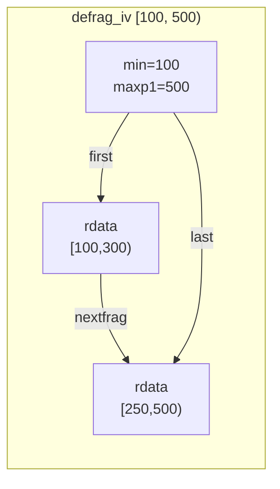
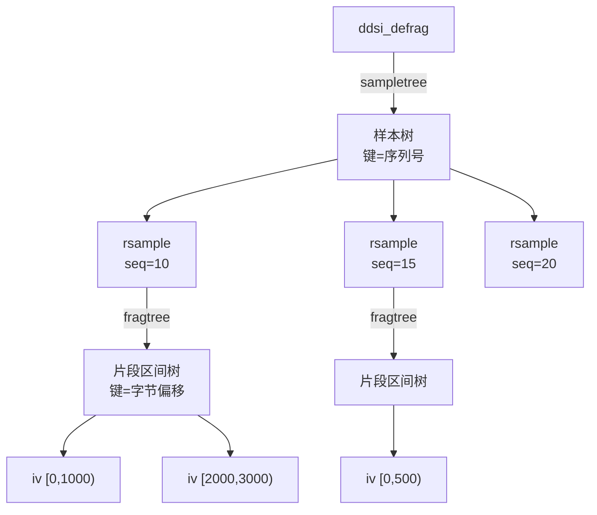
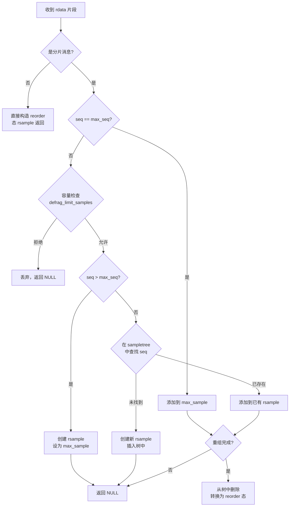
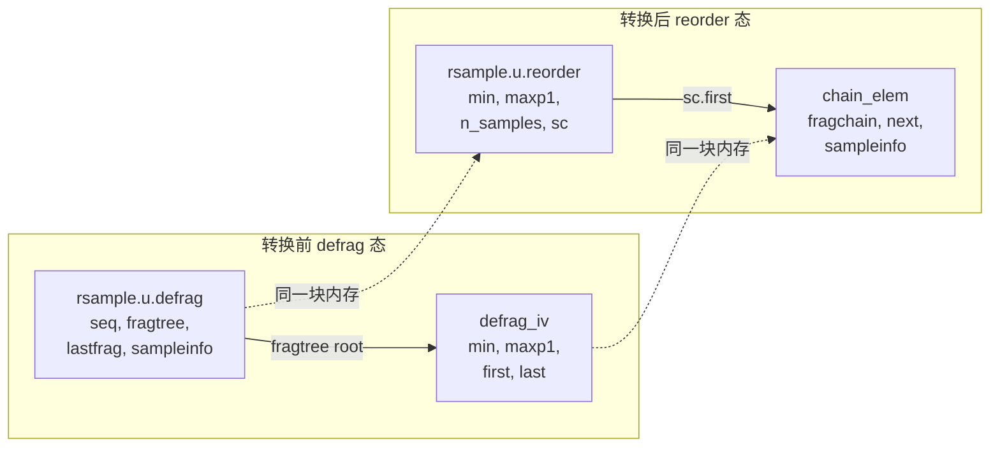

# 第 3 章 分片重组机制（defrag）

## 3.1 模块概述

### 3.1.1 为什么需要分片重组

RTPS 协议允许发送端将大消息拆分为多个 UDP 片段传输。接收端必须将这些片段重新拼接成完整消息，才能交给上层处理。这就是 defrag（defragmentation）模块的核心职责。

分片重组面临三个工程挑战：

1. **片段乱序到达**——UDP 不保证顺序，片段可能以任意顺序到达
2. **片段部分重叠**——重传可能导致已有片段被重复发送，且分片边界可能不一致
3. **多消息并发重组**——丢包和重传使得多条消息的片段交织到达

### 3.1.2 模块在管线中的位置

defrag 是接收管线的第二级处理器，位于 rmsg/rdata（第一级，原始缓冲区管理）和 reorder（第三级，序列号重排）之间：

```text
网络数据包 --> rbuf/rmsg/rdata --> defrag --> reorder --> dqueue --> 应用回调
                  第一级           第二级     第三级      第四级
```

defrag 接收单个 `rdata`（一个字节范围的片段），输出完整的 `rsample`（包含所有片段的链表）。

### 3.1.3 对外接口一览

> **图 1** defrag 模块公共 API

| 函数 | 源码位置 | 职责 |
|:--|:--|:--|
| [ddsi_defrag_new](../../src/cyclonedds/src/core/ddsi/src/ddsi_radmin.c#L885) | L885-900 | 创建 defrag 实例 |
| [ddsi_defrag_free](../../src/cyclonedds/src/core/ddsi/src/ddsi_radmin.c#L946) | L946-958 | 释放 defrag 及所有缓存片段 |
| [ddsi_defrag_rsample](../../src/cyclonedds/src/core/ddsi/src/ddsi_radmin.c#L1324) | L1324-1432 | 主入口：接收片段，完整时返回 rsample |
| [ddsi_defrag_notegap](../../src/cyclonedds/src/core/ddsi/src/ddsi_radmin.c#L1434) | L1434-1447 | 标记序列号范围不可用，丢弃对应片段 |
| [ddsi_defrag_nackmap](../../src/cyclonedds/src/core/ddsi/src/ddsi_radmin.c#L1449) | L1449-1553 | 生成 NACK 位图，告知发送端缺失片段 |
| [ddsi_defrag_prune](../../src/cyclonedds/src/core/ddsi/src/ddsi_radmin.c#L1562) | L1562-1575 | 按目标 GUID 前缀裁剪缓存片段 |
| [ddsi_defrag_stats](../../src/cyclonedds/src/core/ddsi/src/ddsi_radmin.c#L902) | L902-905 | 获取统计信息（丢弃字节数） |

---

## 3.2 核心数据结构

### 3.2.1 ddsi_defrag——重组器主控

> 📍 源码：[ddsi_radmin.c:854-863](../../src/cyclonedds/src/core/ddsi/src/ddsi_radmin.c#L854)

```c
struct ddsi_defrag {
  ddsrt_avl_tree_t sampletree;      /* 按序列号索引的 rsample AVL 树 */
  struct ddsi_rsample *max_sample;  /* 缓存：sampletree 中序列号最大的节点 */
  uint32_t n_samples;               /* 当前正在重组的消息数 */
  uint32_t max_samples;             /* 允许的最大并发重组数 */
  enum ddsi_defrag_drop_mode drop_mode; /* 淘汰策略 */
  uint64_t discarded_bytes;         /* 统计：被丢弃的重复字节数 */
  const struct ddsrt_log_cfg *logcfg;
  bool trace;
};
```

> **图 2** ddsi_defrag 字段详解

| 字段 | 类型 | 说明 |
|:--|:--|:--|
| `sampletree` | AVL 树 | 以序列号为键，每个节点是一个正在重组的 `ddsi_rsample` |
| `max_sample` | 指针缓存 | 指向序列号最大的 rsample，用于快速路径判断 |
| `n_samples` | `uint32_t` | 当前树中 rsample 数量 |
| `max_samples` | `uint32_t` | 容量上限，达到时触发淘汰 |
| `drop_mode` | 枚举 | `DROP_OLDEST`（适合 best-effort）或 `DROP_LATEST`（适合 reliable） |
| `discarded_bytes` | `uint64_t` | 累计丢弃的重复片段字节数 |

`max_sample` 缓存是一个重要的性能优化——正常情况下新片段属于序列号最大的消息，直接命中缓存即可避免 AVL 树查找（$O(1)$ vs $O(\log n)$）。

### 3.2.2 ddsi_defrag_iv——区间节点

> 📍 源码：[ddsi_radmin.c:829-834](../../src/cyclonedds/src/core/ddsi/src/ddsi_radmin.c#L829)

```c
struct ddsi_defrag_iv {
  ddsrt_avl_node_t avlnode;   /* fragtree 的 AVL 节点头 */
  uint32_t min, maxp1;        /* 字节范围 [min, maxp1) */
  struct ddsi_rdata *first;   /* 片段链表头 */
  struct ddsi_rdata *last;    /* 片段链表尾 */
};
```

每个区间节点表示一段已接收的**连续字节范围** $[\text{min}, \text{maxp1})$。`first` 和 `last` 指向该范围内的 `rdata` 链表——多个片段可以覆盖同一个区间（因为贪心合并会将相邻区间的链表串联起来）。

> **图 3** 区间节点内存布局示意



注意链表中的片段可能存在字节重叠（如上例中 $[250,300)$ 被两个 rdata 覆盖）。这是设计上允许的——反序列化器会跳过不增加新数据的片段。


### 3.2.3 ddsi_rsample——union 双态设计

> 📍 源码：[ddsi_radmin.c:836-852](../../src/cyclonedds/src/core/ddsi/src/ddsi_radmin.c#L836)

```c
struct ddsi_rsample {
  union {
    struct ddsi_rsample_defrag {
      ddsrt_avl_node_t avlnode;       /* 在 defrag->sampletree 中的节点 */
      ddsrt_avl_tree_t fragtree;      /* 片段区间 AVL 树 */
      struct ddsi_defrag_iv *lastfrag; /* 缓存：最大区间节点 */
      struct ddsi_rsample_info *sampleinfo;
      ddsi_seqno_t seq;               /* 消息序列号 */
    } defrag;
    struct ddsi_rsample_reorder {
      ddsrt_avl_node_t avlnode;       /* 在 reorder->sampleivtree 中的节点 */
      struct ddsi_rsample_chain sc;   /* sample 链表 */
      ddsi_seqno_t min, maxp1;        /* 序列号区间 [min, maxp1) */
      uint32_t n_samples;             /* 链表中的 sample 数量 */
    } reorder;
  } u;
};
```

这是 defrag 模块最精妙的设计之一：**同一块内存通过 union 在不同阶段承担不同角色**。

> **图 4** rsample 双态对比

| 维度 | defrag 态 | reorder 态 |
|:--|:--|:--|
| 角色 | 正在重组的分片消息 | 已完整、等待排序的消息 |
| AVL 节点 | 挂在 `defrag->sampletree` | 挂在 `reorder->sampleivtree` |
| 核心数据 | `fragtree`（片段区间树） | `sc`（sample 链表） |
| 键值 | 单个 `seq` | 区间 $[\text{min}, \text{maxp1})$ |
| 生命期 | 从首片段到达到重组完成 | 从完成到投递 |

状态转换通过 [rsample_convert_defrag_to_reorder](../../src/cyclonedds/src/core/ddsi/src/ddsi_radmin.c#L1135) 函数实现（详见 3.5 节）。


### 3.2.4 两棵 AVL 树的角色

defrag 模块使用两棵 AVL 树，层次分明：



- **外层 sampletree**：按序列号索引，管理所有正在重组的消息
- **内层 fragtree**：按字节偏移索引，管理单条消息内已接收的片段区间

两棵树的 treedef 在模块初始化时静态定义：

> 📍 源码：[ddsi_radmin.c:868-869](../../src/cyclonedds/src/core/ddsi/src/ddsi_radmin.c#L868)

```c
/* 外层：按序列号排序 */
static const ddsrt_avl_treedef_t defrag_sampletree_treedef =
  DDSRT_AVL_TREEDEF_INITIALIZER(
    offsetof(struct ddsi_rsample, u.defrag.avlnode),
    offsetof(struct ddsi_rsample, u.defrag.seq),
    compare_seqno, 0);

/* 内层：按字节偏移排序 */
static const ddsrt_avl_treedef_t rsample_defrag_fragtree_treedef =
  DDSRT_AVL_TREEDEF_INITIALIZER(
    offsetof(struct ddsi_defrag_iv, avlnode),
    offsetof(struct ddsi_defrag_iv, min),
    compare_uint32, 0);
```

---

## 3.3 主入口函数：ddsi_defrag_rsample

> 📍 源码：[ddsi_radmin.c:1324-1432](../../src/cyclonedds/src/core/ddsi/src/ddsi_radmin.c#L1324)

这是 defrag 模块的核心函数。每收到一个 `rdata` 片段，接收线程调用此函数。返回值含义：

- 返回非 NULL：消息重组完成，返回的 `rsample` 已转换为 reorder 态
- 返回 NULL：消息尚未完整，片段已存储（或因重复/淘汰被丢弃）


### 3.3.1 完整流程图



### 3.3.2 分步解析

**步骤 1：非分片快速路径**

```c
if (!ddsi_rdata_is_fragment(rdata, sampleinfo))
    return reorder_rsample_new(rdata, sampleinfo);
```

如果 `rdata` 覆盖了整个消息（`min == 0 && maxp1 == size`），说明这不是分片消息。此时直接调用 [reorder_rsample_new](../../src/cyclonedds/src/core/ddsi/src/ddsi_radmin.c#L1074) 构造 reorder 态的 `rsample` 返回，完全跳过 defrag 的 AVL 树操作。


**步骤 2：快速路径——命中 max_sample**

```c
if (sampleinfo->seq == max_seq) {
    result = defrag_add_fragment(defrag, defrag->max_sample, rdata, sampleinfo);
}
```

正常情况下，同一条消息的片段按序到达。`max_sample` 缓存了序列号最大的消息，命中率极高。这避免了 $O(\log n)$ 的 AVL 查找。

**步骤 3：容量检查与淘汰**

如果序列号不是 `max_seq`，先调用 [defrag_limit_samples](../../src/cyclonedds/src/core/ddsi/src/ddsi_radmin.c#L1282) 检查容量：

- 未达上限：放行
- 已达上限：根据 `drop_mode` 淘汰一个现有 rsample（详见 3.7 节）
- 如果新片段自身就是要被淘汰的（最新/最旧），直接返回 0 表示拒绝

**步骤 4：创建或查找 rsample**

```c
else if (sampleinfo->seq > max_seq) {
    /* 新的最大序列号：创建 rsample，设为 max_sample */
    sample = defrag_rsample_new(rdata, sampleinfo);
    ddsrt_avl_insert_ipath(..., sample, &path);
    defrag->max_sample = sample;
    defrag->n_samples++;
    result = NULL;  /* 新消息第一片段不可能完整 */
}
else if ((sample = ddsrt_avl_lookup_ipath(..., &sampleinfo->seq, &path)) == NULL) {
    /* 新序列号，但小于 max_seq */
    sample = defrag_rsample_new(rdata, sampleinfo);
    ddsrt_avl_insert_ipath(..., sample, &path);
    defrag->n_samples++;
    result = NULL;
}
else {
    /* 已存在的消息，添加片段 */
    result = defrag_add_fragment(defrag, sample, rdata, sampleinfo);
}
```

**步骤 5：完成处理**

```c
if (result != NULL) {
    /* 重组完成：从树中移除，转换为 reorder 态 */
    ddsrt_avl_delete(&defrag_sampletree_treedef, &defrag->sampletree, result);
    defrag->n_samples--;
    if (result == defrag->max_sample)
        defrag->max_sample = ddsrt_avl_find_max(...);
    rsample_convert_defrag_to_reorder(result);
}
```

完成后将 rsample 从 sampletree 中删除，并更新 `max_sample` 缓存。然后调用状态转换函数将 union 从 defrag 态切换为 reorder 态。


---

## 3.4 区间树插入算法：defrag_add_fragment

> 📍 源码：[ddsi_radmin.c:1161-1272](../../src/cyclonedds/src/core/ddsi/src/ddsi_radmin.c#L1161)

这是 defrag 的核心算法函数。它将一个新片段 `rdata [min, maxp1)` 插入到某条消息的片段区间树中，并在可能时合并相邻区间。

### 3.4.1 四种插入情况

算法先找到 `predeq`——区间树中 `min` 值 $\leq$ 新片段 `min` 的最大区间（即"前驱或相等"节点）。然后根据新片段与 predeq、succ（后继）的空间关系，分四种情况处理：

> **图 5** 四种插入情况

| 情况 | 条件 | 处理方式 | 能否触发完成 |
|:--|:--|:--|:--|
| 完全包含 | `predeq->maxp1 >= maxp1` | 丢弃新片段，累计 `discarded_bytes` | 否 |
| 扩展 predeq | `min <= predeq->maxp1` 且 `maxp1 > predeq->maxp1` | 追加到 predeq 链尾，尝试合并后继 | 是 |
| 扩展 succ | 与 predeq 不相邻，但 `succ->min <= maxp1` | 插入 succ 链头，可能扩展 succ 尾部 | 否 |
| 新区间 | 与 predeq、succ 均不相邻 | 创建新 `defrag_iv` 节点插入树 | 否 |

### 3.4.2 情况 1：完全包含（重复片段）

```c
if (predeq->maxp1 >= maxp1) {
    /* 新片段完全在已有区间内，直接丢弃 */
    defrag->discarded_bytes += maxp1 - min;
    return NULL;
}
```

这是网络重传导致的重复数据。不需要存储，也不会使消息更完整。


### 3.4.3 情况 2：扩展 predeq（最常见路径）

```c
else if (min <= predeq->maxp1) {
    /* 新片段与 predeq 相邻或重叠，扩展 predeq */
    ddsi_rdata_addbias(rdata);
    rdata->nextfrag = NULL;
    if (predeq->first)
        predeq->last->nextfrag = rdata;  /* 追加到链尾 */
    else {
        /* predeq 是哨兵节点 [0,0)，首次填充 */
        predeq->first = rdata;
        *dfsample->sampleinfo = *sampleinfo;
    }
    predeq->last = rdata;
    predeq->maxp1 = maxp1;
    /* 扩展后可能与后继合并 */
    while (defrag_try_merge_with_succ(defrag, dfsample, predeq))
        ;
    return is_complete(dfsample) ? sample : NULL;
}
```

要点：

1. 将 `rdata` 追加到 predeq 的 `last->nextfrag`，更新 `last` 和 `maxp1`
2. 特殊处理**哨兵节点**：当消息的第一个字节尚未到达时，会创建一个 `[0,0)` 的空区间作为哨兵。当首字节到达时，哨兵被填充并成为真实区间
3. 扩展后调用 `defrag_try_merge_with_succ` 循环尝试合并后继区间
4. 这是唯一可能返回"完成"的情况——因为扩展+合并可能使区间覆盖整个消息

### 3.4.4 情况 3：扩展后继 succ

```c
else if (predeq != dfsample->lastfrag &&
         (succ = ddsrt_avl_find_succ(..., predeq)) != NULL &&
         succ->min <= maxp1) {
    /* 新片段与 succ 的低端相邻，在 succ 头部插入 */
    ddsi_rdata_addbias(rdata);
    rdata->nextfrag = succ->first;
    succ->first = rdata;
    succ->min = min;
    if (maxp1 > succ->maxp1) {
        succ->maxp1 = maxp1;
        while (defrag_try_merge_with_succ(defrag, dfsample, succ))
            ;
    }
    return NULL;  /* 不可能完成：predeq 和 succ 之间有间隙 */
}
```

注意此情况永远不能触发完成——因为进入此分支的前提是新片段与 predeq 不相邻（`min > predeq->maxp1`），所以即使 succ 被扩展，predeq 和 succ 之间仍有间隙。

### 3.4.5 情况 4：创建新区间

```c
else {
    /* 与前后均不相邻，创建全新的区间节点 */
    ddsrt_avl_ipath_t path;
    ddsrt_avl_lookup_ipath(..., &min, &path);
    defrag_rsample_addiv(dfsample, rdata, &path);
    return NULL;
}
```

调用 [defrag_rsample_addiv](../../src/cyclonedds/src/core/ddsi/src/ddsi_radmin.c#L1019) 从 rmsg 分配一个新的 `defrag_iv`，初始化并插入区间树。


### 3.4.6 快速路径优化：lastfrag 缓存

在查找 `predeq` 时，函数首先检查 `lastfrag`（区间树中最大的节点）：

```c
if (min >= dfsample->lastfrag->min) {
    predeq = dfsample->lastfrag;  /* O(1) 快速路径 */
} else {
    predeq = ddsrt_avl_lookup_pred_eq(..., &min);  /* O(log n) 慢路径 */
}
```

正常情况下片段按偏移递增到达，`lastfrag` 命中率极高。这与外层 `max_sample` 缓存一起，形成了**双层快速路径**优化。

---

## 3.5 区间合并算法：defrag_try_merge_with_succ

> 📍 源码：[ddsi_radmin.c:960-1017](../../src/cyclonedds/src/core/ddsi/src/ddsi_radmin.c#L960)

当一个区间被扩展后，它可能与后继区间变得相邻或重叠，此时需要合并。

### 3.5.1 合并条件

```c
succ = ddsrt_avl_find_succ(&rsample_defrag_fragtree_treedef,
                            &sample->fragtree, node);
if (succ->min > node->maxp1) {
    /* 仍有间隙，无法合并 */
    return 0;
}
```

合并条件：`node->maxp1 >= succ->min`（即 node 的尾部与 succ 的头部相邻或重叠）。

### 3.5.2 合并操作

```c
/* 从区间树中删除 succ */
ddsrt_avl_delete(&rsample_defrag_fragtree_treedef, &sample->fragtree, succ);
if (sample->lastfrag == succ)
    sample->lastfrag = node;  /* 更新 lastfrag 缓存 */

/* 将 succ 的片段链表拼接到 node 尾部 */
node->last->nextfrag = succ->first;
node->last = succ->last;
node->maxp1 = succ_maxp1;

/* 如果 node 扩展超过了 succ 的范围，可能还需继续合并 */
return node->maxp1 > succ_maxp1;
```

关键细节：

1. **即使 succ 完全包含在 node 中**，仍要将 succ 的链表拼接过来——因为 `rsample` 的内存可能依赖 succ 中 rdata 引用的 rmsg，释放 succ 可能导致 rsample 被释放
2. 返回值为 `int`：如果 node 扩展超过了 succ 的原始范围，返回非零，提示调用者继续尝试合并下一个后继
3. 合并是循环执行的：`while (defrag_try_merge_with_succ(...)) ;`


### 3.5.3 合并过程图示

假设消息总大小 1000 字节，已有三个区间，收到新片段 `[300, 700)`：

```text
合并前：
  [0, 200)     [400, 600)     [800, 1000)
      |              |               |
   已有链表       已有链表        已有链表

收到 [300, 700)，predeq = [0,200)：
  min=300 > predeq.maxp1=200 → 不属于情况2

检查 succ = [400,600)：
  succ.min=400 <= maxp1=700 → 情况3，扩展 succ

扩展后 succ 变为 [300, 700)：
  [0, 200)     [300, 700)     [800, 1000)

succ.maxp1=700 > 原 succ_maxp1=600 → 继续尝试合并
检查 succ-succ = [800,1000)：
  succ-succ.min=800 > node.maxp1=700 → 仍有间隙，停止
```

---

## 3.6 完整性判断：is_complete

> 📍 源码：[ddsi_radmin.c:1110-1133](../../src/cyclonedds/src/core/ddsi/src/ddsi_radmin.c#L1110)

```c
static int is_complete(const struct ddsi_rsample_defrag *sample)
{
    const struct ddsi_defrag_iv *iv =
        ddsrt_avl_root(&rsample_defrag_fragtree_treedef, &sample->fragtree);
    assert(iv != NULL);
    if (iv->min == 0 && iv->maxp1 >= sample->sampleinfo->size) {
        assert(ddsrt_avl_is_singleton(&sample->fragtree));
        return 1;
    }
    return 0;
}
```

判断逻辑极其简洁：**区间树的根节点覆盖 $[0, \text{size})$**。

为什么只检查根节点就够了？因为贪心合并保证了：如果所有字节都已收齐，所有区间必然已被合并为一个，而 AVL 树只有一个节点时，该节点就是根。`ddsrt_avl_is_singleton` 断言验证了这一点。

注意函数接受 `maxp1 >= size`（即片段可以包含超出消息末尾的数据），这些多余数据会在后续反序列化时被忽略。

---

## 3.7 状态转换：rsample_convert_defrag_to_reorder

> 📍 源码：[ddsi_radmin.c:1135-1159](../../src/cyclonedds/src/core/ddsi/src/ddsi_radmin.c#L1135)

当消息重组完成后，rsample 需要从 defrag 态转换为 reorder 态。这个转换是原地（in-place）进行的，复用同一块 union 内存。


### 3.7.1 转换步骤

```c
static void rsample_convert_defrag_to_reorder(struct ddsi_rsample *sample)
{
    /* 1. 从 defrag 态提取信息到局部变量 */
    struct ddsi_defrag_iv *iv = ddsrt_avl_root_non_empty(..., &sample->u.defrag.fragtree);
    struct ddsi_rdata *fragchain = iv->first;
    struct ddsi_rsample_info *sampleinfo = sample->u.defrag.sampleinfo;
    ddsi_seqno_t seq = sample->u.defrag.seq;

    /* 2. 将 defrag_iv 节点的内存原地转换为 rsample_chain_elem */
    struct ddsi_rsample_chain_elem *sce = (struct ddsi_rsample_chain_elem *) iv;
    sce->fragchain = fragchain;
    sce->next = NULL;
    sce->sampleinfo = sampleinfo;

    /* 3. 填写 reorder 态字段 */
    sample->u.reorder.sc.first = sample->u.reorder.sc.last = sce;
    sample->u.reorder.min = seq;
    sample->u.reorder.maxp1 = seq + 1;
    sample->u.reorder.n_samples = 1;
}
```

### 3.7.2 内存复用的精妙之处

这个转换有两层内存复用：

1. **rsample 的 union 复用**：`u.defrag` 和 `u.reorder` 共享同一块内存。写入 `u.reorder` 的字段会覆盖 `u.defrag` 的字段，因此必须先用局部变量保存需要的值
2. **defrag_iv 节点变身 rsample_chain_elem**：完成时区间树只剩一个根节点（`defrag_iv`），这个节点的内存被强制类型转换为 `rsample_chain_elem`。这是安全的，因为 `defrag_iv` 的大小 $\geq$ `rsample_chain_elem` 的大小

> **图 6** 内存复用前后对比




---

## 3.8 淘汰策略：defrag_limit_samples

> 📍 源码：[ddsi_radmin.c:1282-1322](../../src/cyclonedds/src/core/ddsi/src/ddsi_radmin.c#L1282)

当正在重组的消息数达到 `max_samples` 时，必须淘汰一个才能接纳新的。淘汰策略由 `drop_mode` 决定。

### 3.8.1 两种淘汰模式

```c
switch (defrag->drop_mode) {
    case DDSI_DEFRAG_DROP_LATEST:
        if (seq > defrag->max_sample->u.defrag.seq) {
            /* 新片段的序列号最大 → 新片段自己被丢弃 */
            return 0;
        }
        sample_to_drop = defrag->max_sample;  /* 淘汰当前最大的 */
        break;
    case DDSI_DEFRAG_DROP_OLDEST:
        sample_to_drop = ddsrt_avl_find_min(...);
        if (seq < sample_to_drop->u.defrag.seq) {
            /* 新片段的序列号最小 → 新片段自己被丢弃 */
            return 0;
        }
        sample_to_drop = ...; /* 淘汰当前最小的 */
        break;
}
```

> **图 7** 淘汰策略对比

| 模式 | 淘汰目标 | 保留目标 | 适用场景 |
|:--|:--|:--|:--|
| `DROP_OLDEST` | 序列号最小的 | 最新数据 | best-effort（无重传） |
| `DROP_LATEST` | 序列号最大的 | 最旧数据 | reliable（有重传） |

### 3.8.2 为什么 reliable 用 DROP_LATEST

这个设计决策值得深思。对于 reliable 通信：

- reorder 模块要求消息**严格按序列号顺序**投递
- 序列号小的消息必须先投递，序列号大的要等前面的都齐了才能投递
- 如果淘汰了序列号小的消息，那个位置永远无法补齐（因为接收端已丢弃了部分片段），导致后面所有消息都被阻塞
- 淘汰序列号大的消息代价较小——它们本来就要等前面的完成，丢弃后可通过 NACK 触发重传

对于 best-effort 通信：

- 不需要严格顺序投递
- 最新的数据价值最高（应用通常关心最新状态）
- 丢弃最旧的消息更合理

### 3.8.3 淘汰的副作用

淘汰一个 rsample 会调用 [defrag_rsample_drop](../../src/cyclonedds/src/core/ddsi/src/ddsi_radmin.c#L923)，它会：

1. 从 sampletree 中删除该 rsample
2. 遍历其 fragtree 的所有区间节点
3. 对每个区间的片段链表调用 `ddsi_fragchain_rmbias`——移除 rdata 的引用计数偏置
4. 这最终可能触发 rmsg 的释放（如果引用计数归零）

如果被淘汰的是 `max_sample`，还需要重新查找树中的最大节点来更新缓存。


---

## 3.9 NACK 位图生成：ddsi_defrag_nackmap

> 📍 源码：[ddsi_radmin.c:1449-1553](../../src/cyclonedds/src/core/ddsi/src/ddsi_radmin.c#L1449)

当接收端发现缺少某些片段时，需要生成 NACK（Negative Acknowledgment）位图通知发送端重传。此函数根据 defrag 的区间树状态，精确计算哪些片段号需要重传。

### 3.9.1 函数签名

```c
enum ddsi_defrag_nackmap_result ddsi_defrag_nackmap(
    struct ddsi_defrag *defrag,
    ddsi_seqno_t seq,            /* 目标消息的序列号 */
    uint32_t maxfragnum,         /* 已知的最大片段号（0-based） */
    struct ddsi_fragment_number_set_header *map,  /* 输出：位图头 */
    uint32_t *mapbits,           /* 输出：位图数据 */
    uint32_t maxsz               /* 位图最大比特数 */
);
```

返回值三种情况：

| 返回值 | 含义 |
|:--|:--|
| `DDSI_DEFRAG_NACKMAP_UNKNOWN_SAMPLE` | defrag 中无此消息记录，且调用者也不知道片段总数 |
| `DDSI_DEFRAG_NACKMAP_ALL_ADVERTISED_FRAGMENTS_KNOWN` | 已知的所有片段都已收到 |
| `DDSI_DEFRAG_NACKMAP_FRAGMENTS_MISSING` | 有缺失片段，位图已填充 |

### 3.9.2 算法流程

**第 1 步：查找目标消息**

```c
s = ddsrt_avl_lookup(&defrag_sampletree_treedef, &defrag->sampletree, &seq);
if (s == NULL) {
    if (maxfragnum == UINT32_MAX)
        return DDSI_DEFRAG_NACKMAP_UNKNOWN_SAMPLE;
    /* 调用者知道片段总数，生成全 1 位图 */
    map->numbits = min(maxfragnum + 1, maxsz);
    map->bitmap_base = 0;
    ddsi_bitset_one(map->numbits, mapbits);
    return DDSI_DEFRAG_NACKMAP_FRAGMENTS_MISSING;
}
```

**第 2 步：计算位图范围**

```c
/* 片段大小和总片段数 */
fragsz = s->u.defrag.sampleinfo->fragsize;
nfrags = (s->u.defrag.sampleinfo->size + fragsz - 1) / fragsz;

/* 位图起始：第一个缺失的片段号 */
iv = ddsrt_avl_find_min(...);  /* 第一个区间 [0, ...) */
map->bitmap_base = iv->maxp1 / fragsz;  /* 第一个间隙开始处 */

/* 位图结束：最后一个缺失的片段号 */
/* 考虑 lastfrag 是否覆盖到消息末尾 */
```


**第 3 步：填充位图**

```c
ddsi_bitset_zero(map->numbits, mapbits);  /* 先清零 */
i = map->bitmap_base;
while (iv && i < map->bitmap_base + map->numbits) {
    /* iv->min 是下一个已有字节的起始 → iv->min/fragsz 是不需要请求的片段 */
    uint32_t bound = iv->min / fragsz;
    /* 将 [i, bound) 范围的位设为 1（表示缺失） */
    for (; i < bound && i < map->bitmap_base + map->numbits; i++)
        ddsi_bitset_set(map->numbits, mapbits, i - map->bitmap_base);
    /* 跳过已有的区间 */
    i = iv->maxp1 / fragsz;
    iv = ddsrt_avl_find_succ(..., iv);
}
/* 最后一个区间之后的片段也标记为缺失 */
for (; i < map->bitmap_base + map->numbits; i++)
    ddsi_bitset_set(map->numbits, mapbits, i - map->bitmap_base);
```

算法遍历区间树，将"间隙"对应的片段号在位图中置 1。位图中 1 表示缺失、需要重传，0 表示已有。

### 3.9.3 位图示例

假设消息大小 5000 字节，片段大小 1000 字节（共 5 个片段），已收区间 `[0,2000)` 和 `[3000,4000)`：

```text
片段号：    0     1     2     3     4
字节范围：[0,1k) [1k,2k) [2k,3k) [3k,4k) [4k,5k)
已收状态：  有     有     缺     有     缺

bitmap_base = 2  (第一个缺失片段)
numbits = 3      (片段 2, 3, 4)
mapbits = [1, 0, 1]  (片段 2 缺, 3 有, 4 缺)
```

---

## 3.10 辅助函数

### 3.10.1 defrag_rsample_new——创建新 rsample

> 📍 源码：[ddsi_radmin.c:1038-1072](../../src/cyclonedds/src/core/ddsi/src/ddsi_radmin.c#L1038)

为新序列号的消息创建 defrag 态的 rsample：

1. 从 `rdata->rmsg` 分配 rsample 内存
2. 初始化 defrag 字段：`seq`、`sampleinfo`、空的 `fragtree`
3. 如果 `rdata->min > 0`（首字节未到达），插入哨兵区间 `[0, 0)`
4. 插入第一个真实区间

**哨兵节点的作用**：保证区间树总是有一个从 0 开始的节点。这简化了 `defrag_add_fragment` 中的查找逻辑——`predeq` 总能找到（至少有哨兵）。当真正的首字节到达时，哨兵会被"填充"成真实区间（见情况 2 的 `predeq->first == NULL` 分支）。


### 3.10.2 defrag_rsample_addiv——添加区间节点

> 📍 源码：[ddsi_radmin.c:1019-1032](../../src/cyclonedds/src/core/ddsi/src/ddsi_radmin.c#L1019)

```c
static void defrag_rsample_addiv(struct ddsi_rsample_defrag *sample,
                                  struct ddsi_rdata *rdata,
                                  ddsrt_avl_ipath_t *path)
{
    struct ddsi_defrag_iv *newiv;
    newiv = ddsi_rmsg_alloc(rdata->rmsg, sizeof(*newiv));
    rdata->nextfrag = NULL;
    newiv->first = newiv->last = rdata;
    newiv->min = rdata->min;
    newiv->maxp1 = rdata->maxp1;
    ddsi_rdata_addbias(rdata);  /* 增加引用计数偏置 */
    ddsrt_avl_insert_ipath(..., newiv, path);
    if (sample->lastfrag == NULL || rdata->min > sample->lastfrag->min)
        sample->lastfrag = newiv;
}
```

关键点：
- 区间节点（`defrag_iv`）的内存从 `rmsg` 分配，与数据片段共享生命周期
- `ddsi_rdata_addbias` 为 rdata 的 rmsg 添加 $2^{20}$ 偏置，防止 rmsg 在 defrag 持有期间被释放
- 更新 `lastfrag` 缓存

### 3.10.3 ddsi_defrag_notegap——间隙通知

> 📍 源码：[ddsi_radmin.c:1434-1447](../../src/cyclonedds/src/core/ddsi/src/ddsi_radmin.c#L1434)

```c
void ddsi_defrag_notegap(struct ddsi_defrag *defrag,
                          ddsi_seqno_t min, ddsi_seqno_t maxp1)
{
    struct ddsi_rsample *s = ddsrt_avl_lookup_succ_eq(..., &min);
    while (s && s->u.defrag.seq < maxp1) {
        struct ddsi_rsample *s1 = ddsrt_avl_find_succ(..., s);
        defrag_rsample_drop(defrag, s);
        s = s1;
    }
    defrag->max_sample = ddsrt_avl_find_max(...);
}
```

当收到 Heartbeat 或 Gap 消息时调用，表示 $[\text{min}, \text{maxp1})$ 范围内的序列号不可用。函数遍历 sampletree 中落在该范围的所有 rsample 并逐一丢弃。用于 Heartbeat 时 `min=1`，清除所有已过时的重组中消息。

### 3.10.4 ddsi_defrag_prune——按目标裁剪

> 📍 源码：[ddsi_radmin.c:1562-1575](../../src/cyclonedds/src/core/ddsi/src/ddsi_radmin.c#L1562)

仅用于 Volatile Secure writer 场景。当某个本地 participant 被删除时，需要清除 defrag 中发给该 participant 的片段。函数遍历所有 $\geq \text{min}$ 的 rsample，检查其 `dst_guid_prefix` 是否匹配，匹配则丢弃。


---

## 3.11 设计决策分析

### 3.11.1 为什么用 AVL 树而非位图

一种直觉的分片重组方案是使用位图：为消息的每个片段分配一个 bit，收到时置 1，全 1 即完整。但 Cyclone DDS 选择了 AVL 区间树，原因如下：

> **图 8** 方案对比

| 维度 | 位图方案 | AVL 区间树方案 |
|:--|:--|:--|
| 空间复杂度 | $O(n)$，$n$ = 片段数 | $O(k)$，$k$ = 区间数（通常 $\ll n$） |
| 完整性判断 | 遍历位图 $O(n)$ | 检查根节点 $O(1)$ |
| 插入操作 | $O(1)$ | $O(\log k)$（通常 $O(1)$ 因 lastfrag 缓存） |
| 分片大小变化 | 需要重新计算位图 | 天然支持（字节级粒度） |
| NACK 生成 | 遍历位图 $O(n)$ | 遍历区间 $O(k)$ |
| 内存分配 | 需预分配固定大小 | 增量分配，从 rmsg 借用 |

关键优势在于：

1. **片段大小可变**：RTPS 规范允许同一消息的不同片段有不同大小。位图需要预设固定片段大小，区间树使用字节偏移天然适应
2. **正常情况下区间极少**：片段通常按序到达且相邻，合并后区间数 $k$ 通常为 1-2 个
3. **零额外分配**：区间节点从 rmsg 的追加分配器获取，不需要独立 malloc

源码注释中也提到了 AVL 树可能是"过度设计"（overkill），建议将来可换用红黑树或伸展树以获得更好的常数因子性能。

### 3.11.2 哨兵节点的设计考量

在 `defrag_rsample_new` 中，如果首字节未到达，会插入一个 `[0, 0)` 的空哨兵区间。这个设计简化了后续代码：

- `defrag_add_fragment` 中的 `predeq` 查找永远不会返回 NULL
- 当首字节到达时，自然落入"扩展 predeq"分支，哨兵被填充为真实区间
- `sampleinfo` 在此时被更新为首片段的信息（因为只有首片段携带完整的消息元数据）

### 3.11.3 引用计数与内存安全

defrag 模块的内存安全依赖于 rmsg 的引用计数机制：

1. 每个 rdata 被存入 defrag 时，调用 `ddsi_rdata_addbias` 增加 $2^{20}$ 偏置
2. defrag_iv 节点分配自 rmsg，不需要独立管理生命周期
3. rsample 也分配自 rmsg
4. 淘汰时通过 `ddsi_fragchain_rmbias` 逐一移除偏置
5. 完成转换后偏置保留，由 reorder/dqueue 后续管理

这种设计避免了独立的内存分配/释放，所有对象都"寄生"在 rmsg 上，随 rmsg 的释放自动回收。


---

## 3.12 本章小结

本章深入分析了 Cyclone DDS 的分片重组（defrag）模块。核心要点：

1. **双层 AVL 树架构**：外层 sampletree 按序列号索引正在重组的消息，内层 fragtree 按字节偏移管理单条消息的片段区间。双层 `max_sample`/`lastfrag` 缓存在正常路径下实现 $O(1)$ 查找

2. **贪心区间合并**：`defrag_add_fragment` 通过四种情况分类处理新片段，`defrag_try_merge_with_succ` 循环合并相邻区间。完整性判断简化为检查区间树是否为单节点覆盖 $[0, \text{size})$

3. **union 双态设计**：`ddsi_rsample` 通过 union 在 defrag 态和 reorder 态之间切换，`defrag_iv` 节点的内存被复用为 `rsample_chain_elem`，实现零拷贝的状态转换

4. **差异化淘汰策略**：`DROP_LATEST` 适用于 reliable 通信（优先保留低序列号避免阻塞），`DROP_OLDEST` 适用于 best-effort 通信（优先保留最新数据）

5. **零额外分配**：所有中间数据结构（rsample、defrag_iv、sampleinfo）都从 rmsg 的追加分配器获取，利用引用计数偏置保证生命周期安全

---

## 3.13 思考题

1. **如果发送端在重传时改变了片段大小（例如首次用 1000 字节分片，重传用 500 字节分片），defrag 模块能否正确处理？** 提示：考虑区间树使用字节偏移而非片段号作为键。

2. **在 `defrag_try_merge_with_succ` 中，为什么即使 succ 完全包含在 node 中，也要将 succ 的片段链表拼接到 node？** 提示：考虑 rsample 的内存分配来源和引用计数关系。

3. **如果将 `max_samples` 设为 1，对 reliable 通信的性能有什么影响？** 提示：考虑丢包后多条消息片段交织到达的场景。

