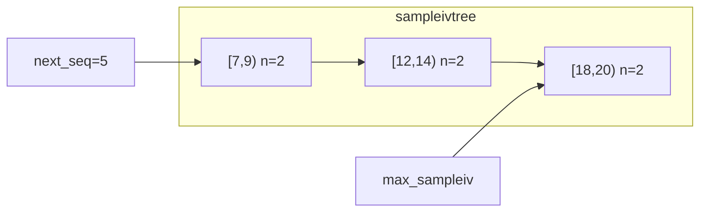
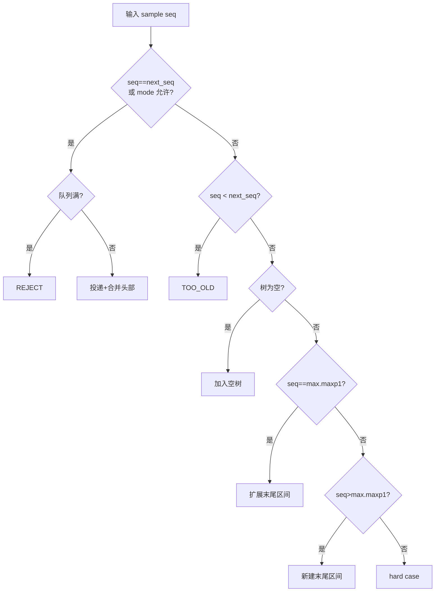

# 第 4 章 序列重排机制（reorder）

## 4.1 模块概述

### 4.1.1 为什么需要序列重排

RTPS 可靠通信要求数据按序列号顺序投递给应用层。然而 UDP 传输不保证顺序，加上分片重组（defrag）可能以任意顺序完成各消息，接收端看到的完整消息序列可能是 1, 3, 2, 5, 4 这样的乱序。

序列重排（reorder）模块解决三个核心问题：

1. **乱序恢复**——将乱序到达的完整消息按序列号排列，确保按序投递
2. **缺失检测**——识别序列号间的空洞，配合 NACK 机制请求重传
3. **Gap 消息处理**——当发送端通知某些序列号不可用时，跳过这些空洞继续投递

### 4.1.2 模块在管线中的位置

reorder 是接收管线的第三级处理器，承接 defrag 输出的完整 `rsample`，输出可投递的有序 sample 链：

```text
网络数据包 --> rbuf/rmsg/rdata --> defrag --> reorder --> dqueue --> 应用回调
                  第一级           第二级     第三级      第四级
```

每个可靠 proxy writer 拥有一个「主 reorder」（primary），每个 out-of-sync 的 reader 匹配还会拥有「辅 reorder」（secondary）。

### 4.1.3 核心 API 一览

> **表 1** reorder 模块公共 API

| 函数 | 职责 |
|:--|:--|
| [ddsi_reorder_new](../../src/cyclonedds/src/core/ddsi/src/ddsi_radmin.c#L1669) | 创建 reorder 实例 |
| [ddsi_reorder_free](../../src/cyclonedds/src/core/ddsi/src/ddsi_radmin.c#L1703) | 释放实例及所有缓存 sample |
| [ddsi_reorder_rsample](../../src/cyclonedds/src/core/ddsi/src/ddsi_radmin.c#L1895) | 插入 sample，可能触发投递链 |
| [ddsi_reorder_gap](../../src/cyclonedds/src/core/ddsi/src/ddsi_radmin.c#L2224) | 处理 Gap/Heartbeat 消息 |
| [ddsi_reorder_rsample_dup_first](../../src/cyclonedds/src/core/ddsi/src/ddsi_radmin.c#L1790) | 为辅 reorder 复制 sample |
| [ddsi_reorder_nackmap](../../src/cyclonedds/src/core/ddsi/src/ddsi_radmin.c#L2379) | 生成 NACK 序列号位图 |
| [ddsi_reorder_drop_upto](../../src/cyclonedds/src/core/ddsi/src/ddsi_radmin.c#L2336) | 批量丢弃旧数据 |
| [ddsi_reorder_wantsample](../../src/cyclonedds/src/core/ddsi/src/ddsi_radmin.c#L2367) | 查询是否需要某序列号 |

## 4.2 数据结构详解

### 4.2.1 ddsi_reorder 结构体

> 📍 源码：[ddsi_radmin.c:1653-1664](../../src/cyclonedds/src/core/ddsi/src/ddsi_radmin.c#L1653)

```c
struct ddsi_reorder {
  ddsrt_avl_tree_t sampleivtree;      // 序列号区间 AVL 树
  struct ddsi_rsample *max_sampleiv;  // 树中最大区间的快速缓存
  ddsi_seqno_t next_seq;              // 下一个期望的序列号
  enum ddsi_reorder_mode mode;        // 工作模式
  uint32_t max_samples;               // 容量上限
  uint32_t n_samples;                 // 当前缓存的 sample 数
  uint64_t discarded_bytes;           // 统计：已丢弃字节数
  const struct ddsrt_log_cfg *logcfg; // 日志配置
  bool late_ack_mode;                 // 延迟确认模式
  bool trace;                         // 是否启用 RADMIN trace
};
```

> **表 2** ddsi_reorder 关键字段说明

| 字段 | 类型 | 说明 |
|:--|:--|:--|
| `sampleivtree` | AVL 树 | 存储不重叠、不连续的序列号区间，按 `min` 排序 |
| `max_sampleiv` | 指针 | 指向树中 `min` 最大的区间节点，避免每次查树 |
| `next_seq` | `ddsi_seqno_t` | 下一个期望投递的序列号，初始为 1 |
| `mode` | 枚举 | 三种模式之一：NORMAL / MONOTONICALLY_INCREASING / ALWAYS_DELIVER |
| `max_samples` | `uint32_t` | 最多缓存多少个 sample，超出时淘汰末尾最新的 |
| `n_samples` | `uint32_t` | 当前树中实际存储的 sample 计数 |
| `late_ack_mode` | `bool` | 为 true 时，投递队列满则拒绝所有「hard case」插入 |

`sampleivtree` 的逻辑结构是一棵按序列号区间组织的 AVL 树，每个节点代表一段连续（或含 Gap 的）序列号范围。树的不变量是：**任意两个区间互不重叠、互不相邻**——如果两个区间相邻就会被合并。

### 4.2.2 ddsi_rsample 的 reorder 态

> 📍 源码：[ddsi_radmin.c:836-852](../../src/cyclonedds/src/core/ddsi/src/ddsi_radmin.c#L836)

`ddsi_rsample` 是一个 union 结构，在 defrag 阶段使用 `defrag` 分支，转入 reorder 后切换为 `reorder` 分支：

```c
struct ddsi_rsample_reorder {
  ddsrt_avl_node_t avlnode;       // 用于 sampleivtree 的 AVL 节点
  struct ddsi_rsample_chain sc;   // 本区间的 sample 链表
  ddsi_seqno_t min, maxp1;        // 序列号范围 [min, maxp1)
  uint32_t n_samples;             // 链中实际 sample 数（可能 < maxp1-min）
};
```

> **表 3** ddsi_rsample_reorder 字段说明

| 字段 | 类型 | 说明 |
|:--|:--|:--|
| `avlnode` | AVL 节点 | 嵌入式节点，支持零额外分配地挂入 `sampleivtree` |
| `sc` | [ddsi_rsample_chain](../../src/cyclonedds/src/core/ddsi/src/ddsi__radmin.h#L90) | `first`/`last` 指针构成的单链表 |
| `min` | `ddsi_seqno_t` | 本区间起始序列号（含） |
| `maxp1` | `ddsi_seqno_t` | 本区间结束序列号（不含），区间为 $[min, maxp1)$ |
| `n_samples` | `uint32_t` | 链中实际 sample 数量，$n\_samples \leq maxp1 - min$ |

`n_samples` 可以小于区间长度 $maxp1 - min$，这是因为区间中可能包含 Gap 占位（Gap 的 `sampleinfo` 为 NULL，不算真正的 sample）。

### 4.2.3 ddsi_rsample_chain 与 chain_elem

> 📍 源码：[ddsi__radmin.h:78-93](../../src/cyclonedds/src/core/ddsi/src/ddsi__radmin.h#L78)

每个区间节点内部通过 `ddsi_rsample_chain` 维护一条单链表：

```c
struct ddsi_rsample_chain_elem {
  struct ddsi_rdata *fragchain;       // 该 sample 的片段链
  struct ddsi_rsample_chain_elem *next; // 下一个 chain 元素
  struct ddsi_rsample_info *sampleinfo; // 元信息（Gap 时为 NULL）
};

struct ddsi_rsample_chain {
  struct ddsi_rsample_chain_elem *first;
  struct ddsi_rsample_chain_elem *last;
};
```

链表中每个元素对应一个序列号的 sample（或 Gap 占位）。`first` 指向最小序列号，`last` 指向最大序列号，支持 $O(1)$ 尾部追加。

### 4.2.4 区间树可视化

以下 Mermaid 图展示 reorder 在某个时刻缓存了三段不连续区间的状态。假设 `next_seq = 5`，树中存储了 [7,9)、[12,14)、[18,20) 三个区间：



每个区间节点内部的 `sc` 链表按序列号顺序串联该区间内的所有 sample。当序列号 5 和 6 到达后，[5,7) 和 [7,9) 会合并为 [5,9)；当 `next_seq` 推进到 5 且 [5,9) 紧邻时，整个区间被投递并从树中删除。

## 4.3 三种重排模式

> 📍 源码：[ddsi__radmin.h:95-99](../../src/cyclonedds/src/core/ddsi/src/ddsi__radmin.h#L95)

reorder 支持三种工作模式，在创建时通过 `mode` 参数指定：

> **表 4** 三种重排模式对比

| 模式 | 标识字符 | 适用场景 | 投递条件 |
|:--|:--|:--|:--|
| `NORMAL` | R | 可靠通信的主 reorder | `seq == next_seq` 时投递 |
| `MONOTONICALLY_INCREASING` | U | 尽力而为/不可靠通信 | `seq >= next_seq` 时投递 |
| `ALWAYS_DELIVER` | A | 无条件投递 | 任何 sample 立即投递 |

### 4.3.1 NORMAL 模式（严格排序）

这是可靠 proxy writer 的默认模式。只有当到达的 sample 序列号**恰好等于** `next_seq` 时才触发投递。如果序列号大于 `next_seq`，sample 被缓存到区间树中等待缺失数据到达。

工作流程：
1. `seq == next_seq`：立即投递，同时检查区间树头部是否可以合并一起投递
2. `seq < next_seq`：丢弃（`TOO_OLD`），数据已过期
3. `seq > next_seq`：插入区间树等待

### 4.3.2 MONOTONICALLY_INCREASING 模式（单调递增）

适用于不可靠通信。当 sample 序列号**大于等于** `next_seq` 时直接投递，不等待缺失数据。这允许跳过丢失的 sample，但保证不会回退投递旧数据。

与 NORMAL 的关键区别：`seq > next_seq` 时不缓存而是直接投递，Gap 消息被忽略。

### 4.3.3 ALWAYS_DELIVER 模式（无条件投递）

任何到达的 sample 都立即投递，不做任何排序或过滤。这是最宽松的模式，适用于对顺序完全不敏感的场景。

## 4.4 核心算法：ddsi_reorder_rsample

> 📍 源码：[ddsi_radmin.c:1895-2145](../../src/cyclonedds/src/core/ddsi/src/ddsi_radmin.c#L1895)

这是 reorder 模块的主入口函数。每当 defrag 完成一条消息的重组，就调用此函数将完整 sample 插入重排树。

### 4.4.1 函数签名

```c
ddsi_reorder_result_t ddsi_reorder_rsample (
  struct ddsi_rsample_chain *sc,     // [out] 可投递的 sample 链
  struct ddsi_reorder *reorder,       // reorder 实例
  struct ddsi_rsample *rsampleiv,     // 待插入的 sample（必须是单例区间）
  int *refcount_adjust,               // [in/out] 引用计数调整量
  int delivery_queue_full_p           // 投递队列是否已满
);
```

返回值语义：
- $> 0$：投递了 N 个 sample，链在 `sc` 中
- $= 0$（`ACCEPT`）：已缓存，等待后续数据
- $= -1$（`TOO_OLD`）：序列号过旧，已丢弃
- $= -2$（`REJECT`）：被拒绝（容量满、队列满等），调用者可复用内存

### 4.4.2 完整分支决策树

函数内部包含十余种 case，按判断优先级排列：




### 4.4.3 各分支详解

#### 分支 1：可立即投递（L1932-1972）

判断条件：
- `seq == next_seq`（NORMAL 模式的正常投递点）
- `seq > next_seq` 且 mode 为 `MONOTONICALLY_INCREASING`
- mode 为 `ALWAYS_DELIVER`

处理逻辑：
1. 如果 `delivery_queue_full_p` 为 true，直接 `REJECT`（不能在 reorder 中保留可投递的 sample，否则会破坏不变量）
2. 如果区间树非空，尝试将树中最小区间合并到投递链尾部（`reorder_try_append_and_discard`）
3. 更新 `next_seq = s->maxp1`
4. 将 sample 链通过 `sc` 返回给调用者
5. `refcount_adjust` 递增 1（表示 sample 被接受）
6. 返回投递的 sample 数量

这是**热路径**——在网络正常、数据有序的情况下，绝大多数 sample 走此分支。

#### 分支 2：序列号过旧（L1973-1980）

当 `seq < next_seq` 时，该 sample 已经被投递过或被 Gap 跳过，直接丢弃。返回 `TOO_OLD`，不调整 `refcount_adjust`。

#### 分支 3：插入空树（L1981-2000）

区间树为空且 sample 不可直接投递（`seq > next_seq`），将 sample 作为唯一节点插入树中：
- 检查 `max_samples` 是否为 0（技术上允许但不缓存任何数据）
- 更新 `max_sampleiv` 和 `n_samples`

#### 分支 4：扩展末尾区间（L2001-2025）

当 `seq == max_sampleiv->maxp1` 时，新 sample 恰好紧接已有最大区间的尾部：
- 如果 `delivery_queue_full_p` 为 true，拒绝（避免增长可能导致投递的区间）
- 如果 `n_samples < max_samples`，调用 `append_rsample_interval` 将 sample 追加到末尾区间
- 否则容量已满，`REJECT`

这是**次热路径**——当一批乱序数据中较大序列号连续到达时频繁触发。

#### 分支 5：新建末尾区间（L2026-2048）

当 `seq > max_sampleiv->maxp1` 时，新 sample 的序列号超出了已有所有区间，创建新的独立区间：
- 同样受 `delivery_queue_full_p` 和 `max_samples` 限制
- 更新 `max_sampleiv` 指向新节点

#### 分支 6：hard case——中间插入（L2049-2141）

这是最复杂的分支，当 sample 落在已有区间之间时触发。源码注释将其称为「hard case」：

**步骤 1：查找前驱区间 `predeq`**

```c
predeq = ddsrt_avl_lookup_pred_eq(&..., &reorder->sampleivtree, &s->min);
```

查找 `min` $\leq$ `s->min` 的最大区间 $[m, n)$。

**步骤 2：检查重复**

如果 `s->min` $\geq$ `predeq->min` 且 `s->min` $<$ `predeq->maxp1`，则 sample 已被该区间覆盖，返回 `REJECT`。

**步骤 3：查找紧邻后继 `immsucc`**

```c
immsucc = ddsrt_avl_lookup(&..., &reorder->sampleivtree, &s->maxp1);
```

精确查找 `min == s->maxp1` 的区间——如果存在，说明新 sample 恰好填补了前后区间之间的空洞。

**步骤 4：三路合并**

- **predeq 尾部可追加**（`s->min == predeq->maxp1`）：将 sample 追加到 predeq，如果 immsucc 也紧邻则三路合并
- **仅有 immsucc**：将 sample 插入 immsucc 头部，同时执行节点替换（`avl_swap_node`）防止内存悬挂
- **都不紧邻**：创建新的独立区间

**步骤 5：容量控制**

如果 `n_samples` 达到 `max_samples`，调用 `delete_last_sample` 淘汰最新的 sample（详见 4.4.5 节）。

节点替换的设计值得特别关注——当 sample 被插入 immsucc 头部时，immsucc 的内存可能来自后续被淘汰的 sample 所在的 rmsg。为防止释放后悬挂指针，代码将 immsucc 的内容复制到 rsampleiv（确定存活的内存）中，并用 `ddsrt_avl_swap_node` 在树中替换：

```c
rsampleiv->u.reorder = immsucc->u.reorder;
ddsrt_avl_swap_node(&..., &reorder->sampleivtree, immsucc, rsampleiv);
```

### 4.4.4 辅助函数：reorder_try_append_and_discard

> 📍 源码：[ddsi_radmin.c:1755-1788](../../src/cyclonedds/src/core/ddsi/src/ddsi_radmin.c#L1755)

此函数尝试将 `todiscard` 区间合并到 `appendto` 区间尾部：

```c
static int reorder_try_append_and_discard (
  struct ddsi_reorder *reorder,
  struct ddsi_rsample *appendto,
  struct ddsi_rsample *todiscard);
```

合并条件：`appendto->maxp1 == todiscard->min`（两区间恰好相邻）。成功时：
1. 从 AVL 树中删除 `todiscard`
2. 调用 `append_rsample_interval` 将两个 sample 链拼接
3. 返回值指示 `todiscard` 是否为 `max_sampleiv`——如果是，调用者需要更新缓存

### 4.4.5 容量控制：delete_last_sample

> 📍 源码：[ddsi_radmin.c:1842-1893](../../src/cyclonedds/src/core/ddsi/src/ddsi_radmin.c#L1842)

当 `n_samples` 达到 `max_samples` 上限时，优先淘汰**序列号最大**的 sample。这体现了「优先保留低序列号」的策略——低序列号必须先于高序列号投递，留住它们更有价值。

```c
static void delete_last_sample (struct ddsi_reorder *reorder);
```

两种情况：

1. **最后一个 sample 独占一个区间**（singleton）：直接从树中删除整个区间节点，重新查找 `max_sampleiv`
2. **最后一个 sample 在大区间的尾部**：遍历链表找到倒数第二个元素，截断尾部，更新 `maxp1` 和 `n_samples`

两种情况都会通过 `ddsi_fragchain_unref` 释放被淘汰 sample 的片段链引用。

## 4.5 Gap 消息处理：ddsi_reorder_gap

> 📍 源码：[ddsi_radmin.c:2224-2334](../../src/cyclonedds/src/core/ddsi/src/ddsi_radmin.c#L2224)

### 4.5.1 Gap 的语义

Gap 消息表示 $[min, maxp1)$ 范围内的序列号**不可用**——发送端不会（再）发送这些数据。这既用于 Gap 子消息（通告特定序列号不可用），也用于 Heartbeat 处理（通过设置 `min=1` 来推进 `next_seq`）。

### 4.5.2 函数签名

```c
ddsi_reorder_result_t ddsi_reorder_gap (
  struct ddsi_rsample_chain *sc,      // [out] 因 gap 而可投递的链
  struct ddsi_reorder *reorder,
  struct ddsi_rdata *rdata,           // gap 的 rdata（长度为 0）
  ddsi_seqno_t min, ddsi_seqno_t maxp1,
  int *refcount_adjust);
```

### 4.5.3 三大 Case

**Case I：`maxp1 <= next_seq`**

Gap 范围完全在已投递区域内，无任何效果，返回 `TOO_OLD`。

**Case II：`min <= next_seq`（且 `maxp1 > next_seq`）**

Gap 覆盖了 `next_seq` 附近的空洞。调用 `coalesce_intervals_touching_range` 合并所有与 $[min, maxp1)$ 重叠或相邻的区间，然后：
- 如果合并后的区间 $\leq$ `next_seq`，将其从树中取出，投递其中的 sample
- 更新 `next_seq` 到合并区间的 `maxp1`

**Case III：`min > next_seq`**

Gap 在未来区域。同样调用 `coalesce_intervals_touching_range`：
- 如果没有可合并的区间，创建一个新的 Gap 区间插入树中（通过 `reorder_insert_gap`）
- 如果合并后的区间触及 `next_seq`，可以投递
- 否则仅记录合并结果

重要约束：**非 NORMAL 模式下 Gap 消息被忽略**——MONOTONICALLY_INCREASING 和 ALWAYS_DELIVER 模式不关心序列号空洞。

### 4.5.4 区间合并算法：coalesce_intervals_touching_range

> 📍 源码：[ddsi_radmin.c:2147-2191](../../src/cyclonedds/src/core/ddsi/src/ddsi_radmin.c#L2147)

这是 Gap 处理的核心子算法。给定范围 $[min, maxp1)$，它将所有与此范围重叠或相邻的区间合并为一个：

```c
static struct ddsi_rsample *coalesce_intervals_touching_range (
  struct ddsi_reorder *reorder,
  ddsi_seqno_t min, ddsi_seqno_t maxp1,
  int *valuable);
```

算法步骤：

1. **找起始区间**：查找满足 $n \geq min$ 且 $m \leq maxp1$ 的第一个区间 $[m, n)$
   - 先用 `lookup_pred_eq` 找 $m \leq min$ 的最大区间
   - 如果其 $n \geq min$，即为起始区间
   - 否则取其后继，检查 $m \leq maxp1$
2. **循环合并后继**：只要后继区间 $[m', n')$ 满足 $m' \leq maxp1$，就从树中删除它并追加到起始区间
3. **扩展范围**：如果 $min$ 或 $maxp1$ 超出了合并后区间的边界，扩展区间范围

`valuable` 输出参数指示合并是否产生了「有价值的」变化（扩展了范围或合并了多个区间），用于决定返回 `ACCEPT` 还是 `REJECT`。

### 4.5.5 Gap 区间插入：reorder_insert_gap

> 📍 源码：[ddsi_radmin.c:2202-2222](../../src/cyclonedds/src/core/ddsi/src/ddsi_radmin.c#L2202)

当 Gap 范围与现有区间不重叠时，需要创建一个新的 Gap 区间节点。Gap 区间的特点是：
- `sampleinfo` 为 NULL（表示这不是真正的数据）
- `fragchain` 指向一个长度为 0 的 rdata（`min == maxp1 == 0`）
- `n_samples` 为 1（Gap 本身占一个 chain_elem 位置）

Gap 的 rdata 通过 `ddsi_rdata_newgap` 创建，它会调用 `ddsi_rdata_addbias` 预设偏置引用计数。

## 4.6 引用计数调整协议

### 4.6.1 问题背景

从 defrag 输出的每个 sample，其所有 rdata 的所属 rmsg 引用计数都带有 `RDATA_BIAS`（$2^{20}$）的偏置。reorder 需要在适当时机移除这个偏置并设定正确的引用计数。

挑战在于：sample 一旦被插入 reorder 的区间树，它可能位于链表的任意位置，**原始的 rsampleiv 指针不再可用于定位其 rdata**（因为区间可能已被合并）。

### 4.6.2 延迟记账方案

reorder 采用「延迟记账」策略——不直接修改引用计数，而是通过 `refcount_adjust` 参数告知调用者需要做多少调整：

- **sample 被接受**（存储或投递）：`refcount_adjust` 递增 1
- **sample 被拒绝**（旧数据或重复）：`refcount_adjust` 不变

调用者（`ddsi_receive.c` 中的接收路径）在处理完所有 reorder 操作后，统一对 sample 的 fragchain 执行引用计数调整：

```c
ddsi_fragchain_adjust_refcount(fragchain, refcount_adjust);
```

### 4.6.3 两种使用场景

源码注释详细区分了两种场景（参见 L1606-1651 的大段注释）：

**Case I：主 reorder（primary）**

每个 sample 只经过一个 reorder 实例。接受或投递时 `refcount_adjust += 1`，加上必须移除的初始偏置 `-BIAS`，净调整为 $1 - BIAS$。拒绝时净调整为 $-BIAS$。

**Case II：辅 reorder（secondary）**

sample 被复制后分别送入 N 个辅 reorder。假设 M 个接受，净调整为 $M - BIAS$。因为每个辅 reorder 操作的是独立复制的 rsample，原始 fragchain 的引用计数需要额外加 M 来对应 M 个持有者。

两种 case 的统一公式：

$$refcount\_adjust = accepted\_count - BIAS$$

其中 $BIAS = 2^{20}$，`accepted_count` 是接受该 sample 的 reorder 实例总数。

## 4.7 sample 复制：ddsi_reorder_rsample_dup_first

> 📍 源码：[ddsi_radmin.c:1790-1822](../../src/cyclonedds/src/core/ddsi/src/ddsi_radmin.c#L1790)

### 4.7.1 使用场景

当一个 proxy writer 有多个 out-of-sync 的 reader 时，每个 reader 的辅 reorder 需要各自独立跟踪序列号进度。但原始 rsample 被主 reorder 占用（或已投递），所以需要为每个辅 reorder 复制一份。

### 4.7.2 复制机制

```c
struct ddsi_rsample *ddsi_reorder_rsample_dup_first (
  struct ddsi_rmsg *rmsg,
  struct ddsi_rsample *rsampleiv);
```

复制过程极其轻量——**不复制数据，只复制索引结构**：

1. 在当前 `rmsg` 上分配新的 `ddsi_rsample` 和 `ddsi_rsample_chain_elem`
2. 新 chain_elem 的 `fragchain` 和 `sampleinfo` 指向原始数据（共享，不拷贝）
3. 新 rsample 的序列号范围设为 $[min, min+1)$——只取原区间的第一个 sample

关键约束：`rmsg` 必须是当前正在处理的（未提交的）消息，因为 `ddsi_rmsg_alloc` 只能在未提交的 rmsg 上分配。Debug 模式下会断言验证 rsampleiv 的 fragchain 中确实有一个 rdata 属于该 rmsg。

不更新引用计数——这由调用者通过 `refcount_adjust` 统一处理。

## 4.8 NACK 位图生成：ddsi_reorder_nackmap

> 📍 源码：[ddsi_radmin.c:2379-2479](../../src/cyclonedds/src/core/ddsi/src/ddsi_radmin.c#L2379)

### 4.8.1 NACK 的作用

RTPS 可靠通信中，接收端通过 ACKNACK 消息告知发送端哪些序列号尚未收到。NACK 位图（bitmap）中每个置位的 bit 对应一个需要重传的序列号。

### 4.8.2 函数签名与返回值

```c
enum ddsi_reorder_nackmap_result ddsi_reorder_nackmap (
  const struct ddsi_reorder *reorder,
  ddsi_seqno_t base,           // 位图起始序列号
  ddsi_seqno_t maxseq,         // 已知存在的最大序列号
  struct ddsi_sequence_number_set_header *map,  // [out] 位图头
  uint32_t *mapbits,           // [out] 位图数据
  uint32_t maxsz,              // 最大位图长度（1-256）
  int notail);                 // 是否裁剪尾部
```

> **表 5** nackmap 返回值

| 返回值 | 含义 |
|:--|:--|
| `DDSI_REORDER_NACKMAP_ACK` | 无需 NACK，位图长度为 0 |
| `DDSI_REORDER_NACKMAP_NACK` | 有需要重传的序列号 |
| `DDSI_REORDER_NACKMAP_SUPPRESSED_NACK` | 有缺失但被抑制（notail 模式） |

### 4.8.3 位图生成算法

算法遍历 reorder 的区间树，将区间之间的**空隙**标记为 NACK：

1. **初始化**：`map->bitmap_base = base`，`map->numbits = min(maxseq+1-base, maxsz)`
2. **清零位图**：`ddsi_bitset_zero`
3. **遍历区间**：从最小区间开始，每两个相邻区间之间的序列号置位（表示缺失）
4. **尾部处理**：
   - 正常模式（`notail = 0`）：区间树之后到 maxseq 的所有序列号都置位
   - notail 模式（`notail = 1`）：截断位图到最后一个置位 bit，避免请求过多数据

`maxsz` 还会被 `reorder->max_samples` 限制——请求超过缓存容量的数据没有意义。

### 4.8.4 notail 模式的边界情况

notail 模式下有三种特殊情况：
- **reorder 为空，无 NACK bit**：发送 1 bit 的 NACK（至少请求一个 sample）
- **有 NACK bit**：截断到最后一个置位 bit
- **reorder 非空但无 NACK bit**：说明投递落后超出位图范围，发送 1 bit 位图（值为 0），返回 `SUPPRESSED_NACK`

## 4.9 批量丢弃：ddsi_reorder_drop_upto

> 📍 源码：[ddsi_radmin.c:2336-2365](../../src/cyclonedds/src/core/ddsi/src/ddsi_radmin.c#L2336)

### 4.9.1 使用场景

当需要快速推进 `next_seq`（例如发现对端 writer 已经远远领先），调用此函数丢弃所有 $< maxp1$ 的缓存 sample。

### 4.9.2 实现策略

利用现有的 `ddsi_reorder_gap` 实现——构造一个覆盖 $[1, maxp1)$ 的虚拟 Gap：

```c
void ddsi_reorder_drop_upto (struct ddsi_reorder *reorder, ddsi_seqno_t maxp1)
{
  struct ddsi_rdata gap = { .rmsg = NULL, ... };
  struct ddsi_rsample_chain sc;
  int refc_adjust = 0;
  if (ddsi_reorder_gap (&sc, reorder, &gap, 1, maxp1, &refc_adjust) > 0)
  {
    while (sc.first) {
      struct ddsi_rsample_chain_elem *e = sc.first;
      sc.first = e->next;
      ddsi_fragchain_unref (e->fragchain);
    }
  }
}
```

前置断言要求 `max_sampleiv->maxp1 <= maxp1`——即不能丢弃未来的数据，调用者需确保 reorder 中没有超过 maxp1 的 sample。

Gap 的 rdata 在栈上分配，不涉及 rmsg，也不调整引用计数（`refc_adjust` 最终断言为 0）。

## 4.10 辅助函数

### 4.10.1 ddsi_reorder_wantsample

> 📍 源码：[ddsi_radmin.c:2367-2377](../../src/cyclonedds/src/core/ddsi/src/ddsi_radmin.c#L2367)

快速判断 reorder 是否「想要」某个序列号的 sample：

```c
int ddsi_reorder_wantsample (const struct ddsi_reorder *reorder, ddsi_seqno_t seq);
```

- `seq < next_seq`：不想要（已投递过）
- 否则查找包含 `seq` 的区间——如果 `seq` 落在某个区间内（即已缓存），返回 0；否则返回 1

### 4.10.2 ddsi_fragchain_unref

> 📍 源码：[ddsi_radmin.c:1692-1701](../../src/cyclonedds/src/core/ddsi/src/ddsi_radmin.c#L1692)

遍历 rdata 片段链，逐个释放引用：

```c
void ddsi_fragchain_unref (struct ddsi_rdata *frag)
{
  struct ddsi_rdata *frag1;
  while (frag) {
    frag1 = frag->nextfrag;
    ddsi_rdata_unref (frag);
    frag = frag1;
  }
}
```

在 reorder 的 `free`、`delete_last_sample`、`drop_upto` 中都会调用此函数来正确释放片段链占用的 rmsg 引用。

### 4.10.3 append_rsample_interval

> 📍 源码：[ddsi_radmin.c:1747-1753](../../src/cyclonedds/src/core/ddsi/src/ddsi_radmin.c#L1747)

将区间 b 的 sample 链追加到区间 a：

```c
static void append_rsample_interval (struct ddsi_rsample *a, struct ddsi_rsample *b)
{
  a->u.reorder.sc.last->next = b->u.reorder.sc.first;
  a->u.reorder.sc.last = b->u.reorder.sc.last;
  a->u.reorder.maxp1 = b->u.reorder.maxp1;
  a->u.reorder.n_samples += b->u.reorder.n_samples;
}
```

$O(1)$ 操作——仅修改链表指针和元数据，不涉及数据拷贝。

## 4.11 设计决策分析

### 4.11.1 为什么 reorder 和 defrag 共享 rsample union

`ddsi_rsample` 使用 union 在 defrag 态和 reorder 态之间复用同一块内存。这个设计有两个关键好处：

1. **零额外分配**：defrag 完成后通过 `rsample_convert_defrag_to_reorder` 原地转换，不需要分配新的 reorder 节点。转换时 defrag 态的 `defrag_iv` 节点（AVL 节点 + 两个指针 + min/maxp1）被复用为 `rsample_chain_elem`（fragchain 指针 + next 指针 + sampleinfo 指针），两者大小兼容。

2. **生命周期衔接**：rsample 的内存来自 `ddsi_rmsg_alloc`，生命周期绑定到 rmsg。defrag 完成后该内存仍然有效，直接复用避免了跨分配器的所有权转移问题。

### 4.11.2 refcount_adjust 延迟记账的好处

不在 reorder 内部直接操作原子引用计数，而是通过 `refcount_adjust` 参数「记账」，有三个优势：

1. **减少原子操作**：reorder 处理过程中可能多次判断接受/拒绝，延迟到最终一次性调整，减少 `atomic_fetch_add` 的调用次数
2. **支持多 reorder 场景**：辅 reorder 使用复制的 rsample，最终调整量 $M - BIAS$ 只需对原始 fragchain 做一次原子操作
3. **解耦索引与引用**：reorder 只负责排序索引，引用计数管理留给调用者，职责清晰

### 4.11.3 优先保留低序列号的淘汰策略

当缓存达到 `max_samples` 上限时，`delete_last_sample` 总是淘汰序列号最大的 sample。这与 defrag 的策略（可选 oldest/latest）不同，reorder 固定选择淘汰最新的。

理由：低序列号的 sample 必须在高序列号之前投递。如果淘汰低序列号，这些序列号的数据可能永远无法补齐（除非收到 Gap），导致整个流水线阻塞。而淘汰高序列号的 sample 后，这些数据可以通过 NACK 机制重新请求。

### 4.11.4 avl_swap_node 防内存悬挂

在 hard case 的 immsucc 头部插入路径中，代码执行了一个精妙的节点替换操作。问题场景：

1. 新 sample 被插入到 immsucc 的头部
2. 随后 `delete_last_sample` 可能淘汰 immsucc 区间内最后一个 sample
3. 如果 immsucc 的内存恰好来自该被淘汰 sample 的 rmsg，释放后 immsucc 成为悬挂指针

解决方案：将 immsucc 的内容拷贝到确定存活的 rsampleiv（当前正在处理的 sample）中，并通过 `ddsrt_avl_swap_node` 在 AVL 树中原子替换。这保证了树中的节点始终指向有效内存。

## 4.12 学习检查点

### 4.12.1 本章小结

1. **reorder 使用 AVL 树管理不重叠的序列号区间**，每个区间内部用单链表串联 sample。`next_seq` 标记投递边界，只有紧邻 `next_seq` 的区间才可被投递。

2. **三种模式适配不同可靠性需求**：NORMAL 严格按序等待缺失数据，MONOTONICALLY_INCREASING 允许跳跃但不回溯，ALWAYS_DELIVER 无条件投递。

3. **Gap 消息通过区间合并算法推进 `next_seq`**，是可靠通信中补齐空洞的关键机制。`coalesce_intervals_touching_range` 将多个相邻或重叠区间合并为一个。

4. **引用计数采用延迟记账策略**，通过 `refcount_adjust` 参数在 reorder 外部统一调整，减少原子操作并支持多 reorder 共享 sample。

5. **容量控制优先淘汰高序列号**，配合 NACK 机制重请求被淘汰的数据，保证低序列号数据的投递优先级。

### 4.12.2 思考题

1. **如果将淘汰策略改为「淘汰最旧的 sample」**（与当前的「淘汰最新的」相反），在可靠通信场景下会导致什么问题？提示：考虑 `next_seq` 的推进条件。

2. **为什么 MONOTONICALLY_INCREASING 模式下 Gap 消息被直接忽略？** 如果不忽略，尝试在非 NORMAL 模式下处理 Gap 会产生什么副作用？

3. **在 hard case 的 immsucc 头部插入路径中，如果不做 `avl_swap_node` 替换**，描述一个具体的操作序列会导致内存安全问题。提示：考虑 `delete_last_sample` 释放了哪块内存。
