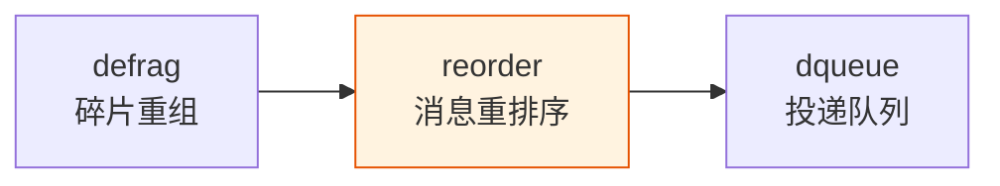
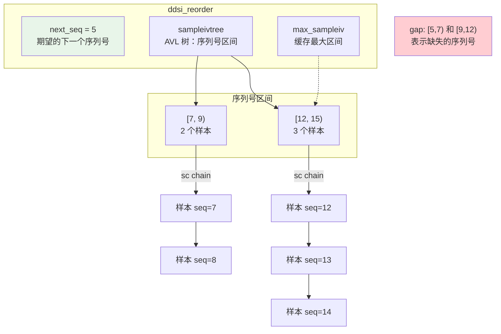
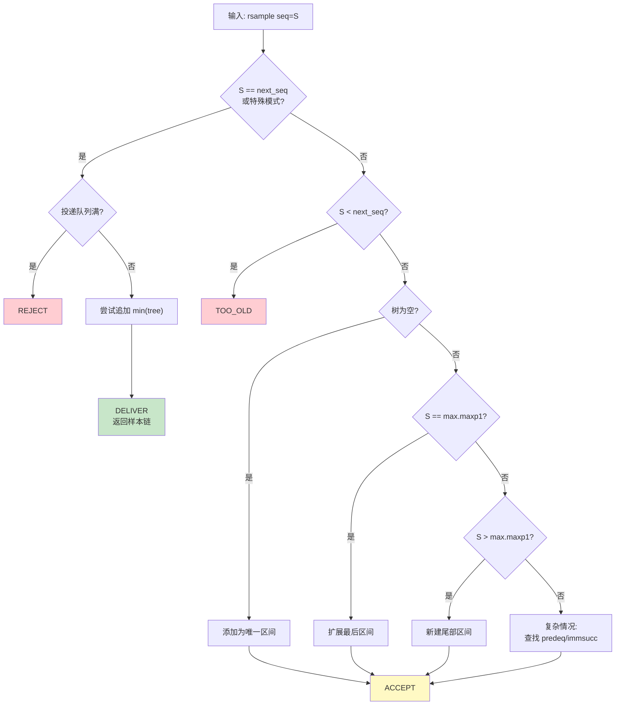

# reorder：消息重排序

## 1. 模块概述

reorder 模块负责将乱序到达的完整样本按序列号重新排列，确保投递给上层的数据是有序的。它是接收管线的第三级：



reorder 使用 AVL 树管理**序列号区间**（interval），每个区间包含一条或多条连续样本的链表。当新样本的序列号恰好是期望的下一个时（快速路径），样本可能直接被传递给投递队列而无需存储。

**primary vs secondary reorder**：每个可靠 proxy writer 拥有一个 primary reorder。当某些 reader 与 writer 不同步时，每个不同步的匹配关系还有一个 secondary reorder。primary reorder 可以复用 [defrag](./03-defrag.md#struct-ddsi_defrag) 分配的内存，secondary 则需要通过 [ddsi_reorder_rsample_dup_first](./04-reorder.md#struct-ddsi_reorder) 复制样本。

## 2. API Signatures

```c
// 创建重排序器
struct ddsi_reorder *ddsi_reorder_new (const struct ddsrt_log_cfg *logcfg,
    enum ddsi_reorder_mode mode, uint32_t max_samples, bool late_ack_mode);

// 释放重排序器
void ddsi_reorder_free (struct ddsi_reorder *r);

// 核心：插入一个样本，返回可投递的样本链
ddsi_reorder_result_t ddsi_reorder_rsample (struct ddsi_rsample_chain *sc,
    struct ddsi_reorder *reorder, struct ddsi_rsample *rsampleiv,
    int *refcount_adjust, int delivery_queue_full_p);

// 处理 gap：标记不可用的序列号范围
ddsi_reorder_result_t ddsi_reorder_gap (struct ddsi_rsample_chain *sc,
    struct ddsi_reorder *reorder, struct ddsi_rdata *rdata,
    ddsi_seqno_t min, ddsi_seqno_t maxp1, int *refcount_adjust);

// 丢弃指定范围之前的所有样本
void ddsi_reorder_drop_upto (struct ddsi_reorder *reorder, ddsi_seqno_t maxp1);

// 查询是否需要某个序列号的样本
int ddsi_reorder_wantsample (const struct ddsi_reorder *reorder, ddsi_seqno_t seq);

// 生成 NACK bitmap
enum ddsi_reorder_nackmap_result ddsi_reorder_nackmap (
    const struct ddsi_reorder *reorder, ddsi_seqno_t base, ddsi_seqno_t maxseq,
    struct ddsi_sequence_number_set_header *map, uint32_t *mapbits,
    uint32_t maxsz, int notail);

// 复制样本的第一条（用于 secondary reorder）
struct ddsi_rsample *ddsi_reorder_rsample_dup_first (struct ddsi_rmsg *rmsg,
    struct ddsi_rsample *rsampleiv);

// 获取 fragment chain
struct ddsi_rdata *ddsi_rsample_fragchain (struct ddsi_rsample *rsample);

// 获取/设置下一个期望的序列号
ddsi_seqno_t ddsi_reorder_next_seq (const struct ddsi_reorder *reorder);
void ddsi_reorder_set_next_seq (struct ddsi_reorder *reorder, ddsi_seqno_t seq);

// 获取统计信息
void ddsi_reorder_stats (struct ddsi_reorder *reorder, uint64_t *discarded_bytes);
```

## 3. 多层次代码展示

### 3.1 reorder 内部结构



### 3.2 ddsi_reorder_rsample 主逻辑



> 📍 源码：[ddsi_radmin.c:1895-2145](../../source/cyclonedds/src/core/ddsi/src/ddsi_radmin.c#L1895)

### 3.3 快速路径代码

最常见的情况是：样本按序到达，序列号恰好是 `next_seq`：

```c
if (s->min == reorder->next_seq ||
    (s->min > reorder->next_seq &&
     reorder->mode == DDSI_REORDER_MODE_MONOTONICALLY_INCREASING) ||
    reorder->mode == DDSI_REORDER_MODE_ALWAYS_DELIVER)
{
  if (delivery_queue_full_p) {
    return DDSI_REORDER_REJECT;  // 队列满，拒绝
  }

  // 尝试将树中的第一个区间追加到当前样本
  if (reorder->max_sampleiv != NULL) {
    struct ddsi_rsample *min = avl_find_min(&reorder->sampleivtree);
    if (reorder_try_append_and_discard(reorder, rsampleiv, min))
      reorder->max_sampleiv = NULL;
  }

  reorder->next_seq = s->maxp1;    // 更新期望序列号
  *sc = rsampleiv->u.reorder.sc;   // 输出样本链
  (*refcount_adjust)++;             // 增加引用计数调整值
  return (ddsi_reorder_result_t) s->n_samples;  // 返回样本数
}
```

> 📍 源码：[ddsi_radmin.c:1932-1972](../../source/cyclonedds/src/core/ddsi/src/ddsi_radmin.c#L1932)

### 3.4 复杂情况：区间合并

当样本序列号落在已有区间之间时（"hard case"），需要：
1. 查找 `predeq`：前驱或等值区间
2. 查找 `immsucc`：紧邻后继区间
3. 尝试扩展 predeq 或 immsucc，或创建新区间

```c
// 查找前驱区间 predeq = max{[m,n) : m <= s->min}
predeq = avl_lookup_pred_eq(&reorder->sampleivtree, &s->min);

// 检查是否被 predeq 包含（重复样本）
if (predeq && s->min >= predeq->min && s->min < predeq->maxp1)
    return DDSI_REORDER_REJECT;  // 重复

// 查找紧邻后继 immsucc = [s->maxp1, ...)
immsucc = avl_lookup(&reorder->sampleivtree, &s->maxp1);

if (predeq && s->min == predeq->maxp1) {
    // 扩展 predeq 尾部
    append_rsample_interval(predeq, rsampleiv);
    reorder_try_append_and_discard(reorder, predeq, immsucc);
} else if (immsucc) {
    // 扩展 immsucc 头部
    s->sc.last->next = immsucc->sc.first;
    immsucc->sc.first = s->sc.first;
    immsucc->min = s->min;
    // 关键：交换节点避免悬挂指针
    avl_swap_node(&reorder->sampleivtree, immsucc, rsampleiv);
} else {
    // 创建新区间
    reorder_add_rsampleiv(reorder, rsampleiv);
}
```

> 📍 源码：[ddsi_radmin.c:2049-2141](../../source/cyclonedds/src/core/ddsi/src/ddsi_radmin.c#L2049)

## 4. 数据结构深度解析

### struct ddsi_reorder

> 📍 源码：[ddsi_radmin.c:1653-1664](../../source/cyclonedds/src/core/ddsi/src/ddsi_radmin.c#L1653)

```c
struct ddsi_reorder {
  ddsrt_avl_tree_t sampleivtree;            // 序列号区间 AVL 树
  struct ddsi_rsample *max_sampleiv;        // 缓存：最大序列号区间
  ddsi_seqno_t next_seq;                    // 下一个期望投递的序列号
  enum ddsi_reorder_mode mode;              // 重排序模式
  uint32_t max_samples;                     // 最大缓存样本数
  uint32_t n_samples;                       // 当前缓存样本数
  uint64_t discarded_bytes;                 // 统计：丢弃字节数
  const struct ddsrt_log_cfg *logcfg;       // 日志配置
  bool late_ack_mode;                       // 延迟确认模式
  bool trace;                               // 跟踪日志
};
```

### 三种 reorder 模式

```c
enum ddsi_reorder_mode {
  DDSI_REORDER_MODE_NORMAL,                  // 严格按序投递
  DDSI_REORDER_MODE_MONOTONICALLY_INCREASING, // 单调递增即可
  DDSI_REORDER_MODE_ALWAYS_DELIVER            // 始终立即投递
};
```

| 模式 | 行为 | 用途 |
|------|------|------|
| `NORMAL` | 只在 `seq == next_seq` 时投递 | 可靠传输的 primary reorder |
| `MONOTONICALLY_INCREASING` | `seq > next_seq` 也投递 | best-effort，允许跳过 |
| `ALWAYS_DELIVER` | 任何序列号都立即投递 | 历史数据、无序投递场景 |

### struct ddsi_rsample（reorder 联合体）

reorder 使用 [ddsi_rsample](./03-defrag.md#struct-ddsi_rsample) 联合体的 `reorder` 成员：

```c
struct ddsi_rsample_reorder {
  ddsrt_avl_node_t avlnode;           // sampleivtree 中的 AVL 节点
  struct ddsi_rsample_chain sc;       // 样本链 [first, last]
  ddsi_seqno_t min, maxp1;           // 序列号范围 [min, maxp1)
  uint32_t n_samples;                 // 链中的实际样本数
};
```

注意 `n_samples` 可能小于 `maxp1 - min`，因为区间中可能存在 gap（序列号被 gap 消息覆盖但没有实际数据）。

### ddsi_reorder_result_t

> 📍 源码：[ddsi__radmin.h:106-112](../../source/cyclonedds/src/core/ddsi/src/ddsi__radmin.h#L106)

```c
typedef int32_t ddsi_reorder_result_t;
#define DDSI_REORDER_ACCEPT    0   // 接受并存储
#define DDSI_REORDER_TOO_OLD  -1   // 太旧，丢弃
#define DDSI_REORDER_REJECT   -2   // 拒绝（重复或队列满）
// > 0: 可投递的样本数量
```

返回值 > 0 表示有样本可投递，此时 `sc` 参数中包含了样本链。

## 5. 关键算法剖析

### 5.1 区间追加与合并

`reorder_try_append_and_discard` 尝试将 `todiscard` 区间追加到 `appendto`：

```c
static int reorder_try_append_and_discard(reorder, appendto, todiscard) {
    if (todiscard == NULL || appendto->maxp1 < todiscard->min)
        return 0;  // 无法合并（有间隙）

    // appendto.maxp1 == todiscard.min，可以合并
    avl_delete(todiscard);
    append_rsample_interval(appendto, todiscard);
    return todiscard == reorder->max_sampleiv;  // 需要更新 max？
}
```

> 📍 源码：[ddsi_radmin.c:1755-1788](../../source/cyclonedds/src/core/ddsi/src/ddsi_radmin.c#L1755)

### 5.2 delete_last_sample：容量控制

当 `n_samples` 达到 `max_samples` 时，删除最后（最高序列号）的样本：

```c
static void delete_last_sample(struct ddsi_reorder *reorder) {
    struct ddsi_rsample_reorder *last = &reorder->max_sampleiv->u.reorder;

    if (last->sc.first == last->sc.last) {
        // 区间中只有一个样本 → 删除整个区间
        avl_delete(reorder->max_sampleiv);
        reorder->max_sampleiv = avl_find_max(&reorder->sampleivtree);
    } else {
        // 区间中有多个样本 → 删除最后一个
        // 需要遍历链表找到倒数第二个节点
        e = last->sc.first;
        do { pe = e; e = e->next; } while (e != last->sc.last);
        pe->next = NULL;
        last->sc.last = pe;
        last->maxp1--;
        last->n_samples--;
    }

    ddsi_fragchain_unref(fragchain);
}
```

> 📍 源码：[ddsi_radmin.c:1842-1893](../../source/cyclonedds/src/core/ddsi/src/ddsi_radmin.c#L1842)

注意：遍历链表是 $O(n)$ 的，源码注释（[ddsi_radmin.c:1871](../../source/cyclonedds/src/core/ddsi/src/ddsi_radmin.c#L1871)）提醒不要将 `max_samples` 设得太大。

### 5.3 avl_swap_node：避免悬挂指针

在"扩展 immsucc 头部"的情况中，有一段微妙的代码（[ddsi_radmin.c:2107-2122](../../source/cyclonedds/src/core/ddsi/src/ddsi_radmin.c#L2107)）：

```c
rsampleiv->u.reorder = immsucc->u.reorder;
ddsrt_avl_swap_node(&reorder_sampleivtree_treedef,
                     &reorder->sampleivtree, immsucc, rsampleiv);
if (immsucc == reorder->max_sampleiv)
    reorder->max_sampleiv = rsampleiv;
```

为什么不直接修改 `immsucc` 就好？因为 `delete_last_sample` 可能在将来删除 `immsucc` 指向的最后一个样本，而该样本的内存可能恰好包含了 `immsucc` 节点本身（因为 [rsample 从 rmsg 中分配](./02-rmsg-rdata.md#struct-ddsi_rmsg)）。一旦样本被释放，`immsucc` 就变成悬挂指针。

解决方案：用当前的 `rsampleiv`（肯定不会因删除最后样本而失效）替换 `immsucc` 在树中的位置。

### 5.4 引用计数交互

reorder 与 [偏置引用计数](./02-rmsg-rdata.md#struct-ddsi_rmsg) 的交互规则：

| 场景 | refcount_adjust 变化 | 原因 |
|------|---------------------|------|
| 接受（存储或投递） | `+1` | 一个新的引用被创建 |
| 拒绝（重复/太旧） | `0` | 无新引用 |
| 投递后 | `fragchain_unref` | 实际减少 rmsg.refcount |

最终调用方执行：

```c
ddsi_fragchain_adjust_refcount(fragchain, refcount_adjust);
// 效果：rmsg.refcount -= (RDATA_BIAS - refcount_adjust)
```

## 6. 设计决策分析

### 6.1 gap 的表示

Gap 使用特殊的 [rdata](./02-rmsg-rdata.md#struct-ddsi_rdata)（`min == maxp1 == 0`，`sampleinfo == NULL`）来占位。这使得 gap 可以和普通样本一起在 reorder 的区间中排列，复用同一套区间合并逻辑。

### 6.2 primary vs secondary reorder 的引用计数

- **Primary reorder** [CASE I]：样本直接来自 defrag，refcount 调整为 `accept_count - RDATA_BIAS`
- **Secondary reorder** [CASE II]：每个 secondary 得到样本的副本（通过 `ddsi_reorder_rsample_dup_first`），不影响原始 refcount

最终效果：`adjust = M - BIAS`，其中 $M$ 是接受该样本的 reorder admin 总数。详见 [02-rmsg-rdata.md 的完整示例](./02-rmsg-rdata.md#struct-ddsi_rmsg)。

### 6.3 投递队列满时的处理

当 [dqueue](./05-dqueue.md#struct-ddsi_dqueue) 满时，reorder 的行为取决于样本类型：

- 可立即投递的样本（`seq == next_seq`）→ `REJECT`（不能存储可投递样本）
- 扩展最后区间或新尾部区间 → `REJECT`
- 乱序样本在 late_ack_mode 下 → `REJECT`
- 填补间隙的样本 → 正常处理（这有助于排空积压）

## 7. 学习检查点

📝 **本章小结**
1. reorder 使用 AVL 树管理序列号区间，每个区间包含一条样本链
2. 三种模式（NORMAL/MONOTONICALLY_INCREASING/ALWAYS_DELIVER）适配不同可靠性需求
3. 快速路径：按序到达的样本直接投递，不进入树
4. 容量控制通过 `delete_last_sample` 丢弃最高序列号的样本
5. `avl_swap_node` 技巧避免了因内存复用导致的悬挂指针问题

🤔 **思考题**
1. 在 `DDSI_REORDER_MODE_MONOTONICALLY_INCREASING` 模式下，如果样本 5 在样本 3 之前到达，样本 3 会被如何处理？`next_seq` 会如何变化？
2. `reorder_try_append_and_discard` 在快速路径中被调用——为什么快速路径（样本按序到达）还需要尝试合并树中的区间？
3. Gap 消息的 `ddsi_reorder_gap` 为什么要求"如果 gap 导致数据投递，则不能修改 rdata 或 refcount_adjust"？这与不可靠 reader 的替代投递路径有什么关系？
