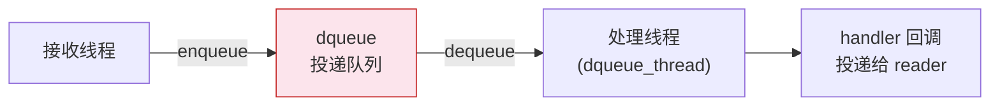
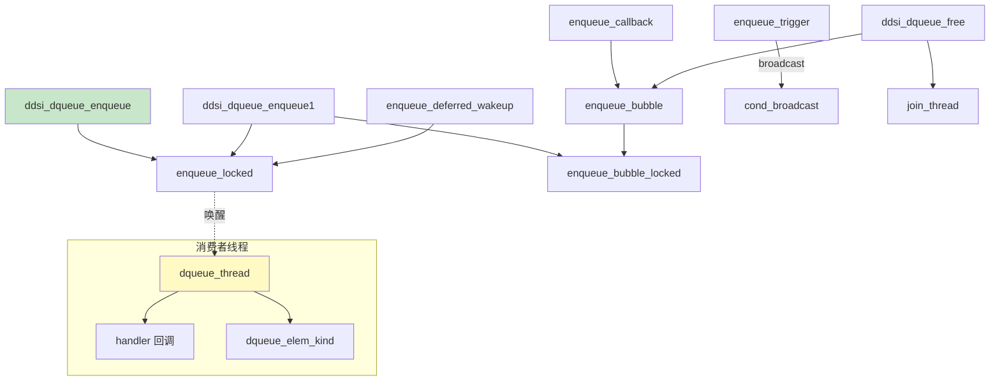
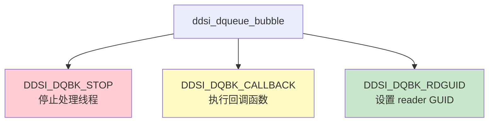

# dqueue：投递队列

## 1. 模块概述

dqueue（delivery queue）是接收管线的最后一级，负责将 [reorder](./04-reorder.md#struct-ddsi_reorder) 产出的有序样本链从接收线程传递给专用的处理线程。它是 rbuf 内存模型中**唯一涉及真正线程间通信**的组件。



dqueue 的设计要点：
- 使用**生产者-消费者模式**，接收线程是生产者，dqueue 线程是消费者
- 通过 mutex + condition variable 实现同步
- 支持三种元素类型：DATA（数据样本）、GAP（间隙标记）、BUBBLE（控制命令）
- 支持**延迟唤醒**优化，减少不必要的信号开销

## 2. API Signatures

```c
// 创建投递队列
struct ddsi_dqueue *ddsi_dqueue_new (const char *name,
    const struct ddsi_domaingv *gv, uint32_t max_samples,
    ddsi_dqueue_handler_t handler, void *arg);

// 启动处理线程
bool ddsi_dqueue_start (struct ddsi_dqueue *q);

// 释放投递队列（发送 STOP bubble 并等待线程退出）
void ddsi_dqueue_free (struct ddsi_dqueue *q);

// 入队样本链（立即唤醒）
void ddsi_dqueue_enqueue (struct ddsi_dqueue *q,
    struct ddsi_rsample_chain *sc, ddsi_reorder_result_t rres);

// 入队样本链（延迟唤醒，返回是否需要唤醒）
bool ddsi_dqueue_enqueue_deferred_wakeup (struct ddsi_dqueue *q,
    struct ddsi_rsample_chain *sc, ddsi_reorder_result_t rres);

// 触发唤醒（与 deferred_wakeup 配合使用）
void ddsi_dqueue_enqueue_trigger (struct ddsi_dqueue *q);

// 入队并关联 reader GUID
void ddsi_dqueue_enqueue1 (struct ddsi_dqueue *q, const ddsi_guid_t *rdguid,
    struct ddsi_rsample_chain *sc, ddsi_reorder_result_t rres);

// 入队回调请求
void ddsi_dqueue_enqueue_callback (struct ddsi_dqueue *q,
    ddsi_dqueue_callback_t cb, void *arg);

// 检查队列是否已满
int ddsi_dqueue_is_full (struct ddsi_dqueue *q);

// 如果队列满则等待清空
void ddsi_dqueue_wait_until_empty_if_full (struct ddsi_dqueue *q);

// 处理所有积压元素（丢弃数据，仅执行回调）
bool ddsi_dqueue_step_deaf (struct ddsi_dqueue *q);
```

## 3. 多层次代码展示

### 3.1 调用关系



### 3.2 dqueue 线程主循环

```c
static uint32_t dqueue_thread(void *vq) {
    struct ddsi_dqueue *q = vq;
    int keepgoing = 1;

    ddsrt_mutex_lock(&q->lock);
    while (keepgoing) {
        if (q->sc.first == NULL)
            ddsrt_cond_wait(&q->cond, &q->lock);  // 等待数据

        // 批量取出所有样本
        sc = q->sc;
        q->sc.first = q->sc.last = NULL;
        ddsrt_mutex_unlock(&q->lock);

        // 逐个处理
        while (sc.first) {
            e = sc.first;
            sc.first = e->next;
            ddsrt_atomic_dec32(&q->nof_samples);  // 减少计数

            switch (dqueue_elem_kind(e)) {
                case DQEK_DATA:
                    q->handler(e->sampleinfo, e->fragchain, prdguid, q->handler_arg);
                    ddsi_fragchain_unref(e->fragchain);
                    break;
                case DQEK_GAP:
                    ddsi_fragchain_unref(e->fragchain);
                    break;
                case DQEK_BUBBLE:
                    处理 bubble（STOP/CALLBACK/RDGUID）;
                    break;
            }
        }

        ddsrt_mutex_lock(&q->lock);
    }
    ddsrt_mutex_unlock(&q->lock);
}
```

> 📍 源码：[ddsi_radmin.c:2597-2688](../../source/cyclonedds/src/core/ddsi/src/ddsi_radmin.c#L2597)

### 3.3 延迟唤醒优化

```c
// 生产者侧
bool need_signal = ddsi_dqueue_enqueue_deferred_wakeup(q, &sc1, rres1);
// ... 处理更多子消息 ...
need_signal |= ddsi_dqueue_enqueue_deferred_wakeup(q, &sc2, rres2);
// 最后统一唤醒
if (need_signal)
    ddsi_dqueue_enqueue_trigger(q);
```

这种模式允许接收线程在处理一个 UDP 包中的多个子消息时，**批量入队后只唤醒一次**消费者线程。`enqueue_deferred_wakeup` 返回 `true` 表示队列从空变为非空（即第一个入队的元素），此时需要唤醒。

## 4. 数据结构深度解析

### struct ddsi_dqueue

> 📍 源码：[ddsi_radmin.c:2494-2507](../../source/cyclonedds/src/core/ddsi/src/ddsi_radmin.c#L2494)

```c
struct ddsi_dqueue {
  ddsrt_mutex_t lock;                       // 保护 sc 链表的互斥锁
  ddsrt_cond_t cond;                        // 生产者-消费者条件变量
  ddsi_dqueue_handler_t handler;            // 数据处理回调函数
  void *handler_arg;                        // 回调参数

  struct ddsi_rsample_chain sc;             // 待处理的样本链

  struct ddsi_thread_state *thrst;          // 处理线程的状态
  struct ddsi_domaingv *gv;                 // 域全局变量
  char *name;                               // 队列名称（如 "dq.user"）
  uint32_t max_samples;                     // 最大样本数
  ddsrt_atomic_uint32_t nof_samples;        // 当前样本数（原子计数）
};
```

**容量控制**：`nof_samples` 使用原子变量，允许 `ddsi_dqueue_is_full` 在不加锁的情况下检查。源码注释（[ddsi_radmin.c:2830-2836](../../source/cyclonedds/src/core/ddsi/src/ddsi_radmin.c#L2830)）解释了为什么近似检查是可接受的：
- 误判为满→丢弃样本，依赖重传
- 误判为未满→队列略超上限，可以容忍

### struct ddsi_dqueue_bubble

> 📍 源码：[ddsi_radmin.c:2521-2538](../../source/cyclonedds/src/core/ddsi/src/ddsi_radmin.c#L2521)

```c
struct ddsi_dqueue_bubble {
  struct ddsi_rsample_chain_elem sce;   // 链表节点（必须是第一个字段）
  enum ddsi_dqueue_bubble_kind kind;    // bubble 类型
  union {
    struct { ddsi_dqueue_callback_t cb; void *arg; } cb;       // 回调
    struct { ddsi_guid_t rdguid; uint32_t count; } rdguid;     // reader GUID
  } u;
};
```

bubble 的 `sce.sampleinfo` 指向自身（`b`），通过这个技巧让 `dqueue_elem_kind` 可以区分三种元素类型：

```c
static enum dqueue_elem_kind dqueue_elem_kind(const struct ddsi_rsample_chain_elem *e) {
  if (e->sampleinfo == NULL)
    return DQEK_GAP;             // gap: sampleinfo 为 NULL
  else if ((char *)e->sampleinfo != (char *)e)
    return DQEK_DATA;            // data: sampleinfo 指向别处
  else
    return DQEK_BUBBLE;          // bubble: sampleinfo 指向自身
}
```

> 📍 源码：[ddsi_radmin.c:2540-2548](../../source/cyclonedds/src/core/ddsi/src/ddsi_radmin.c#L2540)

### 三种 bubble 类型



| 类型 | 分配方式 | 释放方式 | 用途 |
|------|----------|----------|------|
| `DDSI_DQBK_STOP` | 栈分配 | 不释放 | 通知处理线程退出 |
| `DDSI_DQBK_CALLBACK` | 堆分配 | `ddsrt_free` | 在 dqueue 线程上下文中执行回调 |
| `DDSI_DQBK_RDGUID` | 堆分配 | `ddsrt_free` | 为后续 N 个样本关联 reader GUID |

**STOP bubble 的特殊设计**（[ddsi_radmin.c:2881-2893](../../source/cyclonedds/src/core/ddsi/src/ddsi_radmin.c#L2881)）：

```c
void ddsi_dqueue_free(struct ddsi_dqueue *q) {
  if (q->thrst) {
    struct ddsi_dqueue_bubble b;    // 栈上分配！
    b.kind = DDSI_DQBK_STOP;
    ddsi_dqueue_enqueue_bubble(q, &b);
    ddsi_join_thread(q->thrst);     // 等待线程退出
    assert(q->sc.first == NULL);    // 线程应该清空了队列
  }
  // ...
}
```

STOP bubble 不堆分配是为了避免在 `free()` 中分配内存失败的尴尬情况。由于 `ddsi_join_thread` 会阻塞直到线程退出，栈上的 `b` 在整个过程中都保持有效。

## 5. 关键算法剖析

### 5.1 RDGUID bubble 机制

`ddsi_dqueue_enqueue1` 先入队一个 RDGUID bubble，再入队样本链：

```c
void ddsi_dqueue_enqueue1(q, rdguid, sc, rres) {
    b = malloc(sizeof(*b));
    b->kind = DDSI_DQBK_RDGUID;
    b->u.rdguid.rdguid = *rdguid;
    b->u.rdguid.count = (uint32_t) rres;

    ddsrt_mutex_lock(&q->lock);
    nof_samples += 1 + rres;  // bubble 本身 + 样本数
    enqueue_bubble_locked(q, b);
    enqueue_locked(q, sc);
    ddsrt_mutex_unlock(&q->lock);
}
```

> 📍 源码：[ddsi_radmin.c:2807-2826](../../source/cyclonedds/src/core/ddsi/src/ddsi_radmin.c#L2807)

消费者侧处理 RDGUID bubble 时，设置 `prdguid` 和计数器 `rdguid_count`。之后的 `count` 个样本都会以这个 `prdguid` 调用 handler：

```c
case DDSI_DQBK_RDGUID:
    rdguid = b->u.rdguid.rdguid;
    rdguid_count = b->u.rdguid.count;
    prdguid = &rdguid;
    break;
```

这避免了为每个样本都存储 reader GUID。

### 5.2 ddsi_dqueue_step_deaf

这个函数用于"聋模式"（deaf mode）：处理队列中的所有积压，但**丢弃所有数据**，只执行回调。

```c
bool ddsi_dqueue_step_deaf(struct ddsi_dqueue *q) {
    ddsrt_mutex_lock(&q->lock);
    while ((sc = q->sc).first != NULL) {
        q->sc.first = q->sc.last = NULL;
        ddsrt_mutex_unlock(&q->lock);
        while (sc.first) {
            e = sc.first;
            switch (dqueue_elem_kind(e)) {
                case DQEK_DATA:
                case DQEK_GAP:
                    ddsi_fragchain_unref(e->fragchain);  // 丢弃数据
                    break;
                case DQEK_BUBBLE:
                    if (b->kind == DDSI_DQBK_CALLBACK)
                        b->u.cb.cb(b->u.cb.arg);  // 但仍执行回调
                    break;
            }
        }
        ddsrt_mutex_lock(&q->lock);
    }
    ddsrt_mutex_unlock(&q->lock);
}
```

> 📍 源码：[ddsi_radmin.c:2550-2595](../../source/cyclonedds/src/core/ddsi/src/ddsi_radmin.c#L2550)

## 6. 设计决策分析

### 6.1 为什么使用链表而非环形缓冲区？

dqueue 使用 [ddsi_rsample_chain](./04-reorder.md#struct-ddsi_reorder) 链表作为内部存储，而非固定大小的环形缓冲区。原因：

- [reorder](./04-reorder.md#struct-ddsi_reorder) 输出的已经是链表形式，直接拼接无需拷贝
- 样本数量不可预测（一次可能投递 1 个或数百个）
- 链表拼接是 $O(1)$ 的（只需修改 `last->next`）

### 6.2 原子计数器用于容量检测

`nof_samples` 使用原子变量而非受锁保护的普通变量。这允许 [reorder](./04-reorder.md#struct-ddsi_reorder) 在不加 dqueue 锁的情况下调用 `ddsi_dqueue_is_full`（即 `delivery_queue_full_p` 参数）。代价是可能有轻微的过时读取，但这在语义上是可接受的。

### 6.3 bubble 的 sampleinfo 自引用技巧

通过让 `bubble.sce.sampleinfo` 指向 bubble 自身，实现了在统一链表中区分三种元素类型而无需额外的类型字段。这是一种空间高效的**标签联合**（tagged union）实现方式，利用了指针比较而非额外的标记字段。

## 7. 学习检查点

📝 **本章小结**
1. dqueue 是接收管线中唯一的线程间通信组件
2. 支持 DATA/GAP/BUBBLE 三种元素类型，复用同一链表
3. 延迟唤醒优化减少了 `cond_broadcast` 的调用频率
4. STOP bubble 栈分配，避免 `free()` 中分配内存失败
5. RDGUID bubble 批量关联 reader GUID，避免每样本存储

🤔 **思考题**
1. `ddsi_dqueue_wait_until_empty_if_full` 在等待清空时调用了 `cond_broadcast`。为什么需要在等待之前广播？提示：考虑延迟唤醒的情况。
2. `dqueue_thread` 在批量取出样本后立即释放锁，然后逐个处理。如果处理过程中接收线程又入队了新样本，这些样本何时被处理？
3. STOP bubble 入队后，`ddsi_dqueue_free` 通过 `ddsi_join_thread` 等待线程退出。但线程退出前会处理所有已入队的元素。如果此时还有大量积压数据，是否会导致 `free()` 阻塞很长时间？
