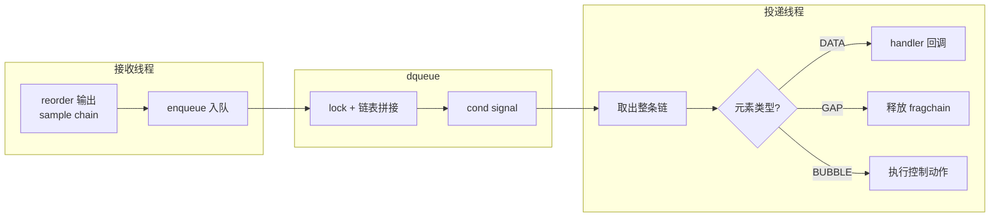
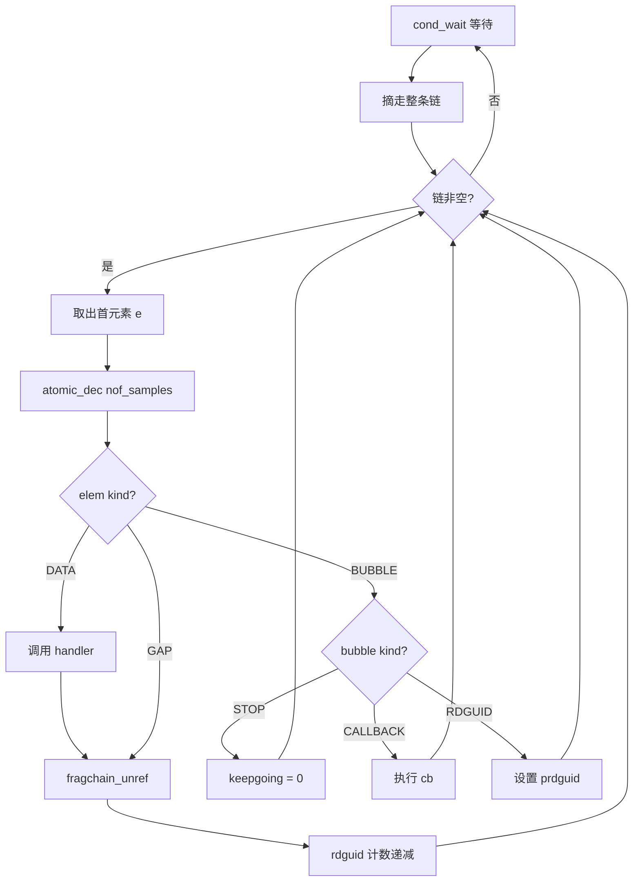
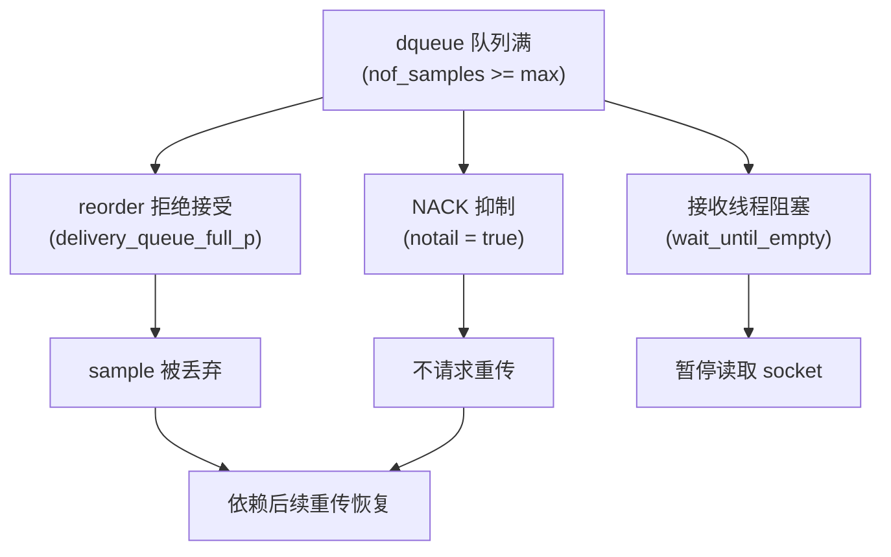

# 第 5 章 投递队列（dqueue）

## 5.1 模块概述

### 5.1.1 为什么需要投递队列

前四章介绍的 rbuf/rmsg/rdata、defrag、reorder 都运行在**接收线程**上下文中。接收线程的核心职责是尽快从 UDP socket 读取数据包并完成协议解析，如果在接收线程中直接执行应用回调（数据投递、reader 匹配等），会阻塞后续数据包的接收，导致丢包。

投递队列（delivery queue，简称 dqueue）的设计目标是**将数据消费与网络接收解耦**：

1. **接收线程**只负责将重排后的 sample chain 放入队列，尽快返回
2. **投递线程**（每个 dqueue 一个独立线程）从队列取出 sample 并调用 handler 回调
3. 通过**背压机制**防止队列无限增长，当队列满时通知 reorder 丢弃数据

### 5.1.2 模块在管线中的位置

dqueue 是接收管线的第四级（也是最后一级）处理器：

```text
网络数据包 --> rbuf/rmsg/rdata --> defrag --> reorder --> dqueue --> 应用回调
                  第一级           第二级     第三级      第四级
```

系统启动时创建两个 dqueue 实例：

- `builtins_dqueue`——处理内置话题（SPDP、SEDP 等发现协议数据）
- `user_dqueue`——处理用户数据话题

每个 proxy writer 持有一个 `dqueue` 指针，指向上述两个队列之一。

> 📍 源码：[ddsi_domaingv.h:254-262](../../src/cyclonedds/src/core/ddsi/include/dds/ddsi/ddsi_domaingv.h#L254)

### 5.1.3 架构全景



## 5.2 核心数据结构

### 5.2.1 ddsi_dqueue 结构体

> 📍 源码：[ddsi_radmin.c:2494-2507](../../src/cyclonedds/src/core/ddsi/src/ddsi_radmin.c#L2494)

```c
struct ddsi_dqueue {
  ddsrt_mutex_t lock;           // 互斥锁，保护 sc 链表
  ddsrt_cond_t cond;            // 条件变量，唤醒消费线程 / 通知队列排空
  ddsi_dqueue_handler_t handler; // 数据投递回调函数
  void *handler_arg;            // 回调参数

  struct ddsi_rsample_chain sc; // 待处理的 sample 链表（first/last）

  struct ddsi_thread_state *thrst; // 投递线程状态（NULL 表示未启动）
  struct ddsi_domaingv *gv;     // 域全局上下文
  char *name;                   // 队列名称（"builtins" / "user"）
  uint32_t max_samples;         // 背压阈值
  ddsrt_atomic_uint32_t nof_samples; // 当前队列中的 sample 数（原子变量）
};
```

> **图 1** ddsi_dqueue 字段一览

| 字段 | 类型 | 说明 |
|:--|:--|:--|
| `lock` | `ddsrt_mutex_t` | 保护 `sc` 链表的互斥锁 |
| `cond` | `ddsrt_cond_t` | 双重用途：唤醒消费线程 + 通知队列排空 |
| `handler` | `ddsi_dqueue_handler_t` | 数据到达时调用的回调函数指针 |
| `handler_arg` | `void*` | 传递给 handler 的用户参数 |
| `sc` | `ddsi_rsample_chain` | 由 `first`/`last` 指针构成的单链表 |
| `thrst` | `ddsi_thread_state*` | 投递线程的线程状态，未启动时为 NULL |
| `max_samples` | `uint32_t` | 队列容量上限，超过即触发背压 |
| `nof_samples` | `atomic_uint32` | 当前排队 sample 数，原子操作避免加锁 |

`cond` 条件变量承担双重职责：生产者入队时 broadcast 唤醒消费线程；消费线程将 `nof_samples` 减到 0 时 broadcast 通知等待排空的线程。这种复用之所以安全，是因为两种等待者检查的条件不同（消费者检查 `sc.first != NULL`，等待排空者检查 `nof_samples == 0`），spurious wakeup 不会导致错误行为。

### 5.2.2 三种元素类型

队列中的每个元素都是一个 `ddsi_rsample_chain_elem`，但实际承载三种语义：

> 📍 源码：[ddsi_radmin.c:2509-2513](../../src/cyclonedds/src/core/ddsi/src/ddsi_radmin.c#L2509)

```c
enum dqueue_elem_kind {
  DQEK_DATA,    // 正常数据 sample
  DQEK_GAP,     // 间隙标记
  DQEK_BUBBLE   // 控制信号（内带命令）
};
```

区分三种类型的判断逻辑非常巧妙，**完全利用 `sampleinfo` 指针的值**，无需额外标志位：

> 📍 源码：[ddsi_radmin.c:2540-2548](../../src/cyclonedds/src/core/ddsi/src/ddsi_radmin.c#L2540)

```c
static enum dqueue_elem_kind dqueue_elem_kind (const struct ddsi_rsample_chain_elem *e)
{
  if (e->sampleinfo == NULL)
    return DQEK_GAP;          // GAP: sampleinfo 为 NULL
  else if ((char *) e->sampleinfo != (char *) e)
    return DQEK_DATA;         // DATA: sampleinfo 指向其他位置
  else
    return DQEK_BUBBLE;       // BUBBLE: sampleinfo 指向自身
}
```

> **图 2** 三种元素的 sampleinfo 指针编码

| 元素类型 | `sampleinfo` 值 | 含义 |
|:--|:--|:--|
| GAP | `NULL` | reorder 产生的间隙标记，无 sample 信息 |
| DATA | 指向有效的 `ddsi_rsample_info` | 正常数据，sampleinfo 在 rmsg 中分配 |
| BUBBLE | 指向 `ddsi_rsample_chain_elem` 自身 | 控制信号，bubble 结构体首字段就是 sce |

这种编码之所以可行，是因为 bubble 的结构体布局经过精心设计：`ddsi_dqueue_bubble` 的第一个字段就是 `sce`（即 `ddsi_rsample_chain_elem`），入队时将 `sce.sampleinfo` 设置为指向 bubble 自身。由于正常 DATA 的 sampleinfo 永远不会指向 sce 本身（它们在 rmsg 中分配），这种自指（self-referencing）技巧就成了 bubble 的唯一标识。

### 5.2.3 ddsi_dqueue_bubble 结构体

> 📍 源码：[ddsi_radmin.c:2515-2538](../../src/cyclonedds/src/core/ddsi/src/ddsi_radmin.c#L2515)

```c
enum ddsi_dqueue_bubble_kind {
  DDSI_DQBK_STOP,      // 停止消费线程（栈上分配，不 free）
  DDSI_DQBK_CALLBACK,  // 在消费线程上下文执行回调
  DDSI_DQBK_RDGUID     // 为后续 N 个 sample 指定目标 reader
};

struct ddsi_dqueue_bubble {
  struct ddsi_rsample_chain_elem sce;  // 链表节点（必须是首字段）
  enum ddsi_dqueue_bubble_kind kind;   // bubble 类型
  union {
    struct {                           // CALLBACK 使用
      ddsi_dqueue_callback_t cb;
      void *arg;
    } cb;
    struct {                           // RDGUID 使用
      ddsi_guid_t rdguid;
      uint32_t count;                  // 后续多少个 sample 使用此 GUID
    } rdguid;
  } u;
};
```

三种 bubble 各自的用途：

> **图 3** bubble 类型详解

| bubble 类型 | 分配方式 | 用途 | 消费时行为 |
|:--|:--|:--|:--|
| `DDSI_DQBK_STOP` | 栈上分配 | 通知消费线程退出 | 设置 `keepgoing = 0`，不 free |
| `DDSI_DQBK_CALLBACK` | 堆分配 | 在投递线程上下文执行任意回调 | 调用 `cb(arg)` 后 free |
| `DDSI_DQBK_RDGUID` | 堆分配 | 为后续 count 个 sample 指定 reader GUID | 设置 `prdguid` 后 free |

**STOP bubble 的特殊之处**：它在 `ddsi_dqueue_free` 中分配在**栈上**，这是刻意的设计——释放队列时不应再依赖堆分配（万一堆空间不足，free 操作就会失败）。STOP bubble 入队后消费线程处理完当前批次就退出，不会 free 这个 bubble。

**RDGUID bubble 的设计动机**：当 proxy writer 有多个 out-of-sync reader 时，reorder 为每个 reader 单独产出一组 sample chain。`ddsi_dqueue_enqueue1` 先入队一个 RDGUID bubble（记录目标 reader GUID 和 sample 数量），再紧随其后入队对应的 sample chain。消费线程遇到 RDGUID bubble 后，会将 `prdguid` 指向该 GUID，并在后续 count 个 DATA/GAP 处理完后清除。

## 5.3 消费者主循环

### 5.3.1 dqueue_thread 函数

> 📍 源码：[ddsi_radmin.c:2597-2688](../../src/cyclonedds/src/core/ddsi/src/ddsi_radmin.c#L2597)

这是投递队列的核心——一个标准的生产者-消费者模式消费线程。

主循环的伪代码如下：

```c
dqueue_thread(q):
    lock(q->lock)
    while keepgoing:
        // 1. 等待数据
        if q->sc.first == NULL:
            cond_wait(q->cond, q->lock)

        // 2. 批量取出：一次性摘走整条链
        sc = q->sc
        q->sc.first = q->sc.last = NULL
        unlock(q->lock)

        // 3. 逐个处理
        thread_state_awake()
        for each elem e in sc:
            atomic_dec(q->nof_samples)  // 可能触发 broadcast
            switch dqueue_elem_kind(e):
                case DATA:
                    handler(e->sampleinfo, e->fragchain, prdguid, arg)
                    fragchain_unref(e->fragchain)
                    // 若有 rdguid 计数，递减
                case GAP:
                    fragchain_unref(e->fragchain)
                    // 若有 rdguid 计数，递减
                case BUBBLE:
                    if STOP: keepgoing = 0
                    if CALLBACK: cb(arg); free(b)
                    if RDGUID: 设置 prdguid 和 count; free(b)
        thread_state_asleep()
        lock(q->lock)
    unlock(q->lock)
```

### 5.3.2 关键设计细节

**批量取出（batch dequeue）**：消费线程不是逐个取元素，而是一次性将 `q->sc` 整条链摘走（`sc = q->sc; q->sc = {NULL, NULL}`），然后释放锁。这意味着在处理链表的整个过程中不持有锁，生产者可以继续入队，最大化并发度。

**nof_samples 递减时机**：每处理一个元素就原子递减 `nof_samples`，当减为 0 时执行 `cond_broadcast`。这个 broadcast 用于唤醒可能在 `ddsi_dqueue_wait_until_empty_if_full` 中等待的线程。

**rdguid 计数管理**：消费线程维护两个局部变量——`prdguid`（当前 reader GUID 指针）和 `rdguid_count`（剩余计数）。遇到 RDGUID bubble 时设置这两个变量；每处理一个 DATA 或 GAP 就将 count 减 1，减到 0 时将 `prdguid` 重置为 NULL。这样 handler 就知道当前 sample 应该投递给哪个 reader。

**STOP 处理**：遇到 STOP bubble 时只设 `keepgoing = 0`，不立即退出。这样当前批次中 STOP 之前的元素仍会被处理完毕（但 STOP 之后的元素不应存在——`ddsi_dqueue_free` 中有 assert 检查）。

**线程状态管理**：消费线程在处理数据时标记为 awake，处理完一批后标记为 asleep。每处理一个元素还调用 `ddsi_thread_state_awake_to_awake_no_nest` 来更新 vtime，确保垃圾回收器（GC）能正确判断线程活跃状态。

### 5.3.3 消费流程图



## 5.4 入队接口

dqueue 提供了一组入队函数，针对不同场景进行了优化。所有入队函数的核心都是同一个内部函数 `ddsi_dqueue_enqueue_locked`。

### 5.4.1 ddsi_dqueue_enqueue_locked（内部核心）

> 📍 源码：[ddsi_radmin.c:2729-2744](../../src/cyclonedds/src/core/ddsi/src/ddsi_radmin.c#L2729)

```c
static int ddsi_dqueue_enqueue_locked (struct ddsi_dqueue *q, struct ddsi_rsample_chain *sc)
{
  int must_signal;
  if (q->sc.first == NULL)
  {
    must_signal = 1;       // 队列为空，需要唤醒消费线程
    q->sc = *sc;           // 直接赋值
  }
  else
  {
    must_signal = 0;       // 队列非空，消费线程已在处理
    q->sc.last->next = sc->first;  // 尾部拼接
    q->sc.last = sc->last;
  }
  return must_signal;
}
```

返回值 `must_signal` 指示调用者是否需要唤醒消费线程。只有当队列从空变非空时才需要 signal——如果队列已有数据，消费线程要么正在处理，要么已经被之前的 signal 唤醒。

### 5.4.2 ddsi_dqueue_enqueue（标准入队）

> 📍 源码：[ddsi_radmin.c:2766-2776](../../src/cyclonedds/src/core/ddsi/src/ddsi_radmin.c#L2766)

这是最常用的入队函数。语义简单：加锁、更新计数、拼接链表、按需唤醒。

```c
void ddsi_dqueue_enqueue (struct ddsi_dqueue *q, struct ddsi_rsample_chain *sc,
                          ddsi_reorder_result_t rres)
{
  ddsrt_mutex_lock (&q->lock);
  ddsrt_atomic_add32 (&q->nof_samples, (uint32_t) rres);
  if (ddsi_dqueue_enqueue_locked (q, sc))
    ddsrt_cond_broadcast (&q->cond);
  ddsrt_mutex_unlock (&q->lock);
}
```

参数 `rres` 是 reorder 返回的结果值（$> 0$），表示 chain 中有多少个 sample。它被原子加到 `nof_samples` 上，用于背压判断。

**使用场景**：proxy writer 的全局 reorder 输出 sample chain 后，如果该 writer 不需要同步投递，就调用此函数将 chain 放入 `pwr->dqueue`。

### 5.4.3 ddsi_dqueue_enqueue_deferred_wakeup（延迟唤醒）

> 📍 源码：[ddsi_radmin.c:2746-2757](../../src/cyclonedds/src/core/ddsi/src/ddsi_radmin.c#L2746)

```c
bool ddsi_dqueue_enqueue_deferred_wakeup (struct ddsi_dqueue *q,
    struct ddsi_rsample_chain *sc, ddsi_reorder_result_t rres)
{
  bool signal;
  ddsrt_mutex_lock (&q->lock);
  ddsrt_atomic_add32 (&q->nof_samples, (uint32_t) rres);
  signal = ddsi_dqueue_enqueue_locked (q, sc);
  ddsrt_mutex_unlock (&q->lock);
  return signal;  // 只返回是否需要唤醒，不立即 signal
}
```

与 `ddsi_dqueue_enqueue` 的关键区别：**不在函数内执行 `cond_broadcast`**，而是将「是否需要唤醒」的决定权交给调用者。调用者可以累积多次入队操作，最后只调用一次 `ddsi_dqueue_enqueue_trigger`。

### 5.4.4 ddsi_dqueue_enqueue_trigger（触发唤醒）

> 📍 源码：[ddsi_radmin.c:2759-2764](../../src/cyclonedds/src/core/ddsi/src/ddsi_radmin.c#L2759)

```c
void ddsi_dqueue_enqueue_trigger (struct ddsi_dqueue *q)
{
  ddsrt_mutex_lock (&q->lock);
  ddsrt_cond_broadcast (&q->cond);
  ddsrt_mutex_unlock (&q->lock);
}
```

纯粹的唤醒操作，与 `deferred_wakeup` 配合使用。

**deferred wakeup 的性能意义**：在接收路径中，一个 RTPS 消息可能包含多个子消息，每个子消息可能产出一组 sample chain 需要入队。如果每次入队都执行 `cond_broadcast`，就会频繁触发线程上下文切换。deferred wakeup 模式允许接收线程处理完整个 RTPS 消息后才执行一次 broadcast，显著减少线程切换开销。

接收路径中的典型用法（`ddsi_receive.c`）：

```c
// 处理 RTPS 消息中的多个子消息
if (ddsi_dqueue_enqueue_deferred_wakeup (pwr->dqueue, &sc, rres))
{
  if (*deferred_wakeup && *deferred_wakeup != pwr->dqueue)
    ddsi_dqueue_enqueue_trigger (*deferred_wakeup);  // 触发之前的队列
  *deferred_wakeup = pwr->dqueue;                    // 记住当前队列
}
// ... 消息处理结束后
if (deferred_wakeup)
  ddsi_dqueue_enqueue_trigger (deferred_wakeup);     // 统一触发
```

### 5.4.5 ddsi_dqueue_enqueue1（带 reader GUID 路由）

> 📍 源码：[ddsi_radmin.c:2807-2826](../../src/cyclonedds/src/core/ddsi/src/ddsi_radmin.c#L2807)

```c
void ddsi_dqueue_enqueue1 (struct ddsi_dqueue *q, const ddsi_guid_t *rdguid,
    struct ddsi_rsample_chain *sc, ddsi_reorder_result_t rres)
{
  struct ddsi_dqueue_bubble *b;
  b = ddsrt_malloc (sizeof (*b));
  b->kind = DDSI_DQBK_RDGUID;
  b->u.rdguid.rdguid = *rdguid;
  b->u.rdguid.count = (uint32_t) rres;

  ddsrt_mutex_lock (&q->lock);
  ddsrt_atomic_add32 (&q->nof_samples, 1 + (uint32_t) rres);  // +1 是 bubble 自身
  if (ddsi_dqueue_enqueue_bubble_locked (q, b))
    ddsrt_cond_broadcast (&q->cond);
  (void) ddsi_dqueue_enqueue_locked (q, sc);  // bubble 之后紧跟 sample chain
  ddsrt_mutex_unlock (&q->lock);
}
```

这个函数做了两件事（在同一把锁内）：
1. 先入队一个 RDGUID bubble，记录目标 reader GUID 和后续 sample 数量
2. 再入队实际的 sample chain

消费线程处理时会先遇到 RDGUID bubble，设置 `prdguid` 和计数，然后对后续的 DATA/GAP 元素调用 handler 时传入这个 GUID。

**使用场景**：当 proxy writer 有 out-of-sync reader 时，每个 reader 有自己的 per-reader reorder。reorder 产出的 sample chain 需要标记它属于哪个 reader，这就是 `enqueue1` 的用途。

### 5.4.6 ddsi_dqueue_enqueue_callback（回调入队）

> 📍 源码：[ddsi_radmin.c:2797-2805](../../src/cyclonedds/src/core/ddsi/src/ddsi_radmin.c#L2797)

```c
void ddsi_dqueue_enqueue_callback (struct ddsi_dqueue *q,
    ddsi_dqueue_callback_t cb, void *arg)
{
  struct ddsi_dqueue_bubble *b;
  b = ddsrt_malloc (sizeof (*b));
  b->kind = DDSI_DQBK_CALLBACK;
  b->u.cb.cb = cb;
  b->u.cb.arg = arg;
  ddsi_dqueue_enqueue_bubble (q, b);
}
```

将一个回调函数入队，消费线程在处理到此 bubble 时会在自身上下文中调用 `cb(arg)`。

**使用场景**：
- **初始化同步**：`ddsi_init.c` 中调用 `ddsi_dqueue_enqueue_callback(gv->builtins_dqueue, builtins_dqueue_ready_cb, &arg)` 来确认投递线程已启动并准备就绪
- **proxy writer 清理**：`ddsi_proxy_endpoint.c` 中通过 CALLBACK bubble 在投递线程上下文中执行 proxy writer 的延迟删除，确保删除操作与数据投递串行化，避免竞态条件

### 5.4.7 入队函数对照

> **图 4** 入队函数对照表

| 函数 | 入队内容 | 唤醒策略 | 典型调用者 |
|:--|:--|:--|:--|
| `ddsi_dqueue_enqueue` | sample chain | 立即 broadcast | 全局 reorder 输出 |
| `ddsi_dqueue_enqueue_deferred_wakeup` | sample chain | 延迟，由调用者触发 | RTPS 消息批处理路径 |
| `ddsi_dqueue_enqueue_trigger` | 无（仅唤醒） | 立即 broadcast | 配合 deferred_wakeup |
| `ddsi_dqueue_enqueue1` | RDGUID bubble + chain | 立即 broadcast | per-reader reorder 输出 |
| `ddsi_dqueue_enqueue_callback` | CALLBACK bubble | 立即 broadcast | 初始化同步、延迟删除 |

## 5.5 背压控制

### 5.5.1 ddsi_dqueue_is_full

> 📍 源码：[ddsi_radmin.c:2828-2839](../../src/cyclonedds/src/core/ddsi/src/ddsi_radmin.c#L2828)

```c
int ddsi_dqueue_is_full (struct ddsi_dqueue *q)
{
  const uint32_t count = ddsrt_atomic_ld32 (&q->nof_samples);
  return (count >= q->max_samples);
}
```

**无锁读取**：这个函数故意不加锁，直接原子读取 `nof_samples`。源码注释详细解释了这种宽松一致性的安全性：

- **误判为满（实际未满）**：丢弃当前 sample，依赖重传恢复——可接受
- **误判为未满（实际已满）**：多入队几个 sample——队列略微超过上限——可接受

这种设计避免了在热路径上的锁争用，是典型的"宁可偶尔不精确，也不要增加同步开销"策略。

**使用场景**：`ddsi_dqueue_is_full` 作为参数传递给 `ddsi_reorder_rsample`，当队列满时 reorder 会拒绝接受新 sample，实现从 reorder 层面的流量控制。此外，ACK/NACK 生成时也会检查队列是否满——如果满则抑制 NACK（`notail` 参数），避免在无法处理的情况下请求重传。

### 5.5.2 ddsi_dqueue_wait_until_empty_if_full

> 📍 源码：[ddsi_radmin.c:2841-2853](../../src/cyclonedds/src/core/ddsi/src/ddsi_radmin.c#L2841)

```c
void ddsi_dqueue_wait_until_empty_if_full (struct ddsi_dqueue *q)
{
  const uint32_t count = ddsrt_atomic_ld32 (&q->nof_samples);
  if (count >= q->max_samples)
  {
    ddsrt_mutex_lock (&q->lock);
    ddsrt_cond_broadcast (&q->cond);  // 确保消费线程被唤醒
    while (ddsrt_atomic_ld32 (&q->nof_samples) > 0)
      ddsrt_cond_wait (&q->cond, &q->lock);
    ddsrt_mutex_unlock (&q->lock);
  }
}
```

这个函数的语义是：如果队列满了，就阻塞等待直到队列**完全排空**（而非只是低于阈值）。

注意它先执行一次 `cond_broadcast`——这是为了处理一个边界条件：如果所有入队操作都使用了 deferred_wakeup 但尚未调用 trigger，消费线程可能还在 sleep。这次 broadcast 确保消费线程被唤醒开始处理。

**使用场景**：接收路径在处理完一条 RTPS 消息后调用此函数。如果队列已满，接收线程暂停接收，等待投递线程将队列排空后再继续。这是背压从投递层传递到接收层的关键路径。

### 5.5.3 背压传播路径

背压从投递队列向上游逐层传播：



## 5.6 生命周期管理

### 5.6.1 ddsi_dqueue_new（创建）

> 📍 源码：[ddsi_radmin.c:2690-2714](../../src/cyclonedds/src/core/ddsi/src/ddsi_radmin.c#L2690)

创建一个 dqueue 实例，初始化所有字段但**不启动线程**：

```c
struct ddsi_dqueue *ddsi_dqueue_new (const char *name,
    const struct ddsi_domaingv *gv, uint32_t max_samples,
    ddsi_dqueue_handler_t handler, void *arg)
{
  struct ddsi_dqueue *q = ddsrt_malloc (sizeof (*q));
  q->name = ddsrt_strdup (name);
  q->max_samples = max_samples;
  ddsrt_atomic_st32 (&q->nof_samples, 0);
  q->handler = handler;
  q->handler_arg = arg;
  q->sc.first = q->sc.last = NULL;  // 空链表
  q->gv = (struct ddsi_domaingv *) gv;
  q->thrst = NULL;                   // 线程尚未启动
  ddsrt_mutex_init (&q->lock);
  ddsrt_cond_init (&q->cond);
  return q;
}
```

创建与启动分离的设计允许在系统初始化阶段灵活控制线程创建时机。

### 5.6.2 ddsi_dqueue_start（启动线程）

> 📍 源码：[ddsi_radmin.c:2716-2727](../../src/cyclonedds/src/core/ddsi/src/ddsi_radmin.c#L2716)

```c
bool ddsi_dqueue_start (struct ddsi_dqueue *q)
{
  char *thrname;
  size_t thrnamesz = 3 + strlen (q->name) + 1;
  thrname = ddsrt_malloc (thrnamesz);
  snprintf (thrname, thrnamesz, "dq.%s", q->name);
  dds_return_t ret = ddsi_create_thread (&q->thrst, q->gv, thrname, dqueue_thread, q);
  ddsrt_free (thrname);
  return ret == DDS_RETCODE_OK;
}
```

线程名格式为 `dq.<name>`，如 `dq.builtins`、`dq.user`。线程启动后进入 `dqueue_thread` 主循环。

### 5.6.3 ddsi_dqueue_free（优雅停止）

> 📍 源码：[ddsi_radmin.c:2878-2902](../../src/cyclonedds/src/core/ddsi/src/ddsi_radmin.c#L2878)

```c
void ddsi_dqueue_free (struct ddsi_dqueue *q)
{
  if (q->thrst)  // 线程已启动
  {
    // STOP bubble 分配在栈上——释放时不应依赖堆
    struct ddsi_dqueue_bubble b;
    b.kind = DDSI_DQBK_STOP;
    ddsi_dqueue_enqueue_bubble (q, &b);

    ddsi_join_thread (q->thrst);    // 等待线程退出
    assert (q->sc.first == NULL);   // 线程退出时应已排空
  }
  else  // 线程未启动
  {
    dqueue_free_remaining_elements (q);  // 手动释放残留元素
  }
  ddsrt_cond_destroy (&q->cond);
  ddsrt_mutex_destroy (&q->lock);
  ddsrt_free (q->name);
  ddsrt_free (q);
}
```

停止流程分两种情况：

**线程已启动**：
1. 在栈上构造 STOP bubble 并入队
2. 消费线程处理到 STOP 时设置 `keepgoing = 0`，处理完当前批次后退出
3. `ddsi_join_thread` 等待线程结束
4. assert 确认队列已排空

**线程未启动**：调用 `dqueue_free_remaining_elements` 手动遍历链表释放所有元素。

> 📍 源码：[ddsi_radmin.c:2855-2876](../../src/cyclonedds/src/core/ddsi/src/ddsi_radmin.c#L2855)

`dqueue_free_remaining_elements` 遍历队列，对 DATA/GAP 调用 `ddsi_fragchain_unref`（释放 rdata 引用链），对非 STOP 的 BUBBLE 执行 `ddsrt_free`。STOP bubble 不 free 因为它可能是栈上分配的。

## 5.7 deaf 模式

### 5.7.1 ddsi_dqueue_step_deaf

> 📍 源码：[ddsi_radmin.c:2550-2595](../../src/cyclonedds/src/core/ddsi/src/ddsi_radmin.c#L2550)

deaf 模式（聋模式）用于系统需要暂时停止处理数据但不销毁队列的场景。此函数在**调用者线程**（而非消费线程）上下文中执行，功能是清空队列并丢弃所有数据：

```c
bool ddsi_dqueue_step_deaf (struct ddsi_dqueue *q)
{
  struct ddsi_thread_state * const thrst = ddsi_lookup_thread_state ();
  struct ddsi_rsample_chain sc;
  ddsrt_mutex_lock (&q->lock);
  while ((sc = q->sc).first != NULL)
  {
    q->sc.first = q->sc.last = NULL;
    ddsrt_mutex_unlock (&q->lock);
    // 遍历处理：DATA/GAP -> fragchain_unref, BUBBLE -> 执行回调/free
    ddsi_thread_state_awake (thrst, q->gv);
    while (sc.first) { /* ... 逐个释放 ... */ }
    ddsi_thread_state_asleep (thrst);
    ddsrt_mutex_lock (&q->lock);
  }
  const bool ret = q->sc.first != NULL;
  ddsrt_mutex_unlock (&q->lock);
  return ret;
}
```

关键行为：
- **DATA/GAP**：直接释放 fragchain，不调用 handler——数据被丢弃
- **CALLBACK bubble**：仍然执行回调（回调可能包含必要的清理逻辑）
- **STOP/RDGUID bubble**：忽略并释放
- **循环结构**：外层 while 循环确保在处理过程中新入队的数据也被清空（处理期间释放了锁，生产者可能继续入队）
- 返回值指示队列是否已完全排空

## 5.8 设计决策分析

### 5.8.1 为什么用 bubble 机制而非多个队列？

一种替代方案是为控制信号（停止、回调、路由）设立单独的控制队列。Cyclone DDS 选择了 bubble 机制（将控制信号混入数据队列）：

**优势**：
- **严格的顺序保证**：RDGUID bubble 必须在它对应的 sample chain 之前被处理，如果使用两个队列，需要额外的同步机制来保证这种顺序。单队列天然保序
- **CALLBACK 的串行化**：回调（如 proxy writer 删除）需要与数据投递严格串行——先处理完回调之前的所有数据，再执行回调，最后处理回调之后的数据。单队列 FIFO 语义自动满足
- **简化同步**：只需一把锁和一个条件变量，消费线程只有一个等待点
- **零额外内存开销**：bubble 复用了 `ddsi_rsample_chain_elem` 的链表结构

**代价**：元素类型判断需要 sampleinfo 指针编码技巧，增加了理解难度。但这是一次性的代码复杂度，运行时开销为零。

### 5.8.2 deferred wakeup 的性能意义

在高吞吐场景下，一个 RTPS 消息可能包含数十个子消息，每个子消息可能产出一条 sample chain。如果每次入队都执行 `cond_broadcast`：

- 每次 broadcast 可能触发消费线程从 sleep 唤醒，涉及**内核态上下文切换**
- 消费线程被唤醒后发现只有少量数据，处理完又 sleep，再被唤醒...

deferred wakeup 的做法是：

1. 入队时只记录"需要唤醒"的状态
2. 整个 RTPS 消息处理完毕后统一触发一次 broadcast
3. 消费线程一次性取走所有累积的 sample，batch 处理

这种批量唤醒策略在高吞吐场景下能将线程切换次数从 $O(n)$ 降低到 $O(1)$（n 为一个 RTPS 消息中的子消息数）。

### 5.8.3 nof_samples 的原子操作设计

`nof_samples` 使用原子变量而非受锁保护的普通变量，这使得 `ddsi_dqueue_is_full` 可以无锁调用。它的更新点分散在多处：

| 操作 | 函数 | 原子操作 |
|:--|:--|:--|
| 入队时增加 | `ddsi_dqueue_enqueue` 系列 | `atomic_add32` |
| 消费时递减 | `dqueue_thread` | `atomic_dec32_ov` |
| 满判断 | `ddsi_dqueue_is_full` | `atomic_ld32`（无锁） |
| 排空等待 | `wait_until_empty_if_full` | `atomic_ld32`（锁内） |

消费线程使用 `atomic_dec32_ov`（decrement and return old value）——当旧值为 1（即减后为 0）时执行 broadcast，唤醒可能在等待排空的线程。

## 5.9 完整 API 列表

> **图 5** dqueue 模块 API 一览

| 函数 | 位置 | 职责 |
|:--|:--|:--|
| [ddsi_dqueue_new](../../src/cyclonedds/src/core/ddsi/src/ddsi_radmin.c#L2690) | L2690-2714 | 创建队列实例 |
| [ddsi_dqueue_start](../../src/cyclonedds/src/core/ddsi/src/ddsi_radmin.c#L2716) | L2716-2727 | 启动消费线程 |
| [ddsi_dqueue_free](../../src/cyclonedds/src/core/ddsi/src/ddsi_radmin.c#L2878) | L2878-2902 | 停止线程、释放队列 |
| [ddsi_dqueue_enqueue](../../src/cyclonedds/src/core/ddsi/src/ddsi_radmin.c#L2766) | L2766-2776 | 标准入队（立即唤醒） |
| [ddsi_dqueue_enqueue_deferred_wakeup](../../src/cyclonedds/src/core/ddsi/src/ddsi_radmin.c#L2746) | L2746-2757 | 入队（延迟唤醒） |
| [ddsi_dqueue_enqueue_trigger](../../src/cyclonedds/src/core/ddsi/src/ddsi_radmin.c#L2759) | L2759-2764 | 触发唤醒 |
| [ddsi_dqueue_enqueue1](../../src/cyclonedds/src/core/ddsi/src/ddsi_radmin.c#L2807) | L2807-2826 | 带 reader GUID 路由入队 |
| [ddsi_dqueue_enqueue_callback](../../src/cyclonedds/src/core/ddsi/src/ddsi_radmin.c#L2797) | L2797-2805 | 回调 bubble 入队 |
| [ddsi_dqueue_is_full](../../src/cyclonedds/src/core/ddsi/src/ddsi_radmin.c#L2828) | L2828-2839 | 无锁检查队列是否满 |
| [ddsi_dqueue_wait_until_empty_if_full](../../src/cyclonedds/src/core/ddsi/src/ddsi_radmin.c#L2841) | L2841-2853 | 满时阻塞等待排空 |
| [ddsi_dqueue_step_deaf](../../src/cyclonedds/src/core/ddsi/src/ddsi_radmin.c#L2550) | L2550-2595 | deaf 模式清空队列 |

## 5.10 学习检查点

### 本章小结

1. **dqueue 是接收管线的最后一级**，将数据消费从接收线程解耦到独立的投递线程，避免回调处理阻塞网络接收
2. **三种元素类型（DATA/GAP/BUBBLE）复用同一队列**，通过 `sampleinfo` 指针的值（NULL/外部指针/自指）区分，无需额外标志位
3. **bubble 机制用单队列实现了控制信号传递**，包括线程停止（STOP）、延迟回调（CALLBACK）和 reader 路由（RDGUID）
4. **deferred wakeup 优化**将一个 RTPS 消息处理过程中的多次入队合并为一次唤醒，减少线程上下文切换
5. **背压通过 `nof_samples` 原子变量实现无锁快速路径**，满时影响 reorder 接收策略和 NACK 生成，必要时阻塞接收线程

### 思考题

1. STOP bubble 为什么在栈上分配而不是堆上分配？如果在入队和消费线程处理之间 `ddsi_dqueue_free` 的栈帧被回收，会发生什么？（提示：`ddsi_join_thread` 的作用）

2. `ddsi_dqueue_wait_until_empty_if_full` 等待的条件是队列完全排空（`nof_samples == 0`），而不是低于阈值（`nof_samples < max_samples`）。这种"排空"语义相比"降低到阈值以下"有什么优劣？

3. 在 `dqueue_thread` 中，处理 RDGUID bubble 后 `rdguid_count` 的递减与 DATA/GAP 处理是绑定的。如果两个 RDGUID bubble 之间插入了一个 CALLBACK bubble，count 会被正确管理吗？（提示：分析 BUBBLE case 的代码路径，注意 CALLBACK bubble 不递减 count）
